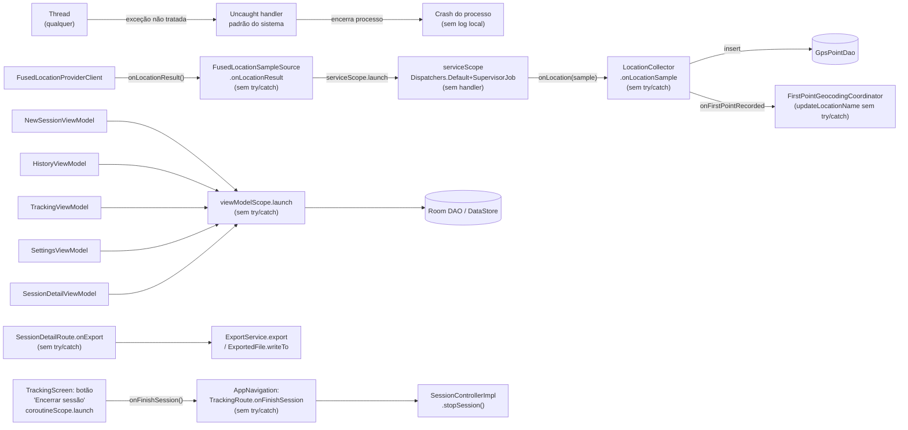
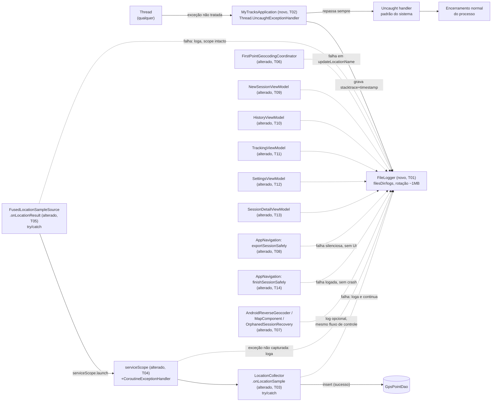

# Implementation Plan

## Request Summary
- Objective: Add crash containment (global `Thread.UncaughtExceptionHandler`) and local, dependency-free observability (a hand-rolled, rotating `FileLogger`) across the GPS collection pipeline, all five ViewModels, the export flow, the "Encerrar sessão" stop-session flow, and the three already-correct exception handlers — with zero change to any existing success-path behavior, return value, or thrown-exception type (AC-07).
- Scope:
  - In: `FileLogger` (RF-02/RF-03, size-rotated at ~1MB, exactly 1 backup, single critical section, thread/coroutine-safe, no external dependency), custom `Application` + global uncaught-exception handler (RF-01), try/catch + logging in `LocationCollector.onLocationSample` (RF-04), `FusedLocationSampleSource.onLocationResult` (RF-05), `LocationForegroundService.serviceScope`'s `CoroutineExceptionHandler` (RF-06), the 5 ViewModels' `viewModelScope.launch` DAO/DataStore call sites (RF-07), the `SessionDetailRoute.onExport` call site (RF-08), `FirstPointGeocodingCoordinator`'s unguarded `updateLocationName` call (RF-09), optional logging inside 3 existing correct catch blocks with zero control-flow change (RF-10), no crash-reporting/network dependency (RF-11), the `TrackingScreen` "Encerrar sessão" button's `stopSession()` call site (RF-12, added in SPEC v1.2).
  - Out: Crashlytics/Sentry/Timber or any external log-shipping; any new user-visible UI for logs; any change to an existing feature's success-path behavior/return value/thrown-exception type; remote log shipping; log encryption.
- Tier: complete (per router; note — SPEC.md's own Metadata line 6 still reads "Tier: standard", see Open Questions).
- Architecture references: `AGENTS.md`, `docs/agents/architecture.md`, `docs/agents/domain_rules.md`, `docs/agents/tech_stack.md`, `docs/agents/coding_guidelines.md`.

## Key design decision (governs every task below)

Per SPEC's FLEXIBLE clause ("either [full DI threading or a lightweight singleton] is acceptable since RIGID does not mandate a specific DI shape"), this plan uses:

- `com.mytracksapp.logging.Logger` — a plain interface (`fun log(level: LogLevel, tag: String, message: String, throwable: Throwable? = null)`), and `com.mytracksapp.logging.FileLogger` — an `object` implementing it (the production singleton), initialized once via `FileLogger.init(context)` from `MyTracksApplication.onCreate()`.
- Every existing class touched (`LocationCollector`, `FirstPointGeocodingCoordinator`, `AndroidReverseGeocoder`, `OrphanedSessionRecovery`, all 5 ViewModels) gets **one new trailing constructor parameter** `logger: Logger = FileLogger`. Because it is appended last with a default equal to the production singleton, **no existing call site (production or test) needs to change** — this is the mechanism that keeps RNF-01 ("no pre-existing test's assertions or expected behavior modified") true by construction, verified per-file in this repo (`LocationCollectorTest.kt`, `FirstPointGeocodingCoordinatorTest.kt`, `SessionDetailExportTest.kt` all call these constructors positionally, none naming a trailing arg past the existing last one).
- `MapComponent.kt` is a `@Composable` function, not a class — it calls the `FileLogger` singleton directly (RF-10's own AC is a code-review diff, not an injected-fake test, for this file).
- Two call sites live in `AppNavigation.kt`, not inside an injectable class: the export flow (RF-08) and, as of SPEC v1.2, the "Encerrar sessão" stop-session flow (RF-12). Both are handled the same way — extract the call-site logic into a small top-level `internal suspend fun` with a trailing `logger: Logger = FileLogger` default parameter, wrap the risky call(s) in try/catch, log, and don't rethrow — rather than adding a constructor parameter, since `AppNavigation.kt`'s composables have no class to attach one to.
- `FileLogger.log()` itself must never throw to its caller: any internal I/O failure during logging is caught and swallowed **inside** `log()`. RF-01 states this explicitly for the `Application` handler; this plan generalizes it as an internal `FileLogger` invariant so that every other catch block added under RF-04..RF-10/RF-12 (which itself calls `logger.log(...)` from inside a `catch`) can never turn into a *new* uncaught-throw site.
- `FileLogger.log()` is implemented as a plain synchronous (non-`suspend`) function using a single JVM monitor lock (`synchronized`), not a `kotlinx.coroutines.sync.Mutex` — it must be callable from `Thread.setDefaultUncaughtExceptionHandler`, which runs on a plain `Thread`, not inside a coroutine.
- ISO-8601 timestamps via `java.time.Instant.now().toString()`, consistent with existing `java.time` usage in `HistoryViewModel.kt`.
- Because of the above, **`ViewModelFactories.kt`, `MainActivity.kt`, and `AppNavigation.kt`'s DAO/DataStore wiring do not need to change** for logger wiring — only `MyTracksApplication.onCreate()` calls `FileLogger.init(...)` once.

## AS IS — Componentes impactados

Legenda: nenhum componente de logging existe hoje (`grep` confirma zero dependência `Timber`/`Crashlytics`/`Sentry`); uma exceção não tratada em qualquer thread cai direto no handler padrão do sistema sem deixar rastro local; o pipeline de GPS, os 5 ViewModels, o fluxo de exportação e o fluxo de encerramento de sessão (botão "Encerrar sessão") não possuem nenhuma barreira de captura própria para as chamadas destacadas.

## TO BE — Componentes propostos

Legenda: `NEW_App`+`NEW_FileLogger` realizam RF-01/RF-02/RF-03/RF-11 (T01, T02); `Collector`, `Callback`, `ServiceScope` (alterados) realizam RF-04/RF-05/RF-06 (T03, T04, T05); `Geocoding` realiza RF-09 (T06); os 5 `VM*` realizam RF-07 (T09-T13); `ExportRoute` realiza RF-08 (T08); `FinishRoute` realiza RF-12 (T14); `Existing` realiza RF-10 (T07) sem alterar nenhum tipo de exceção capturada ou desvio de fluxo pré-existente.

## Tasks

### T01 — FileLogger core: append-only writer, rotation, concurrency safety
- **Files**: `app/src/main/java/com/mytracksapp/logging/Logger.kt` (new — `LogLevel` enum + `Logger` interface), `app/src/main/java/com/mytracksapp/logging/FileLogger.kt` (new — `object FileLogger : Logger`)
- **Change**: Implement `FileLogger.init(context: Context)` (creates `context.filesDir/logs/`) and `FileLogger.log(level, tag, message, throwable)`: (a) ISO-8601 timestamp via `Instant.now().toString()`; (b) escape embedded newlines in `message`/stack trace (`\n` → literal `\n`, `\r` → literal `\r`) so one entry is always exactly one physical line; (c) a single `synchronized` critical section that checks `app.log`'s current size, rotates (`app.log` → overwrite `app.log.1`, start a fresh `app.log`) if size `>= 1_048_576` bytes **before** appending the triggering entry, then appends the formatted line via `FileOutputStream(file, /*append=*/true)` and calls `fd.sync()` before returning — the same critical section guards both the rotation decision and the write (RF-03's "not a separate, independently-locked check"); (d) `log()` never throws to its caller — any internal `IOException`/other failure during formatting/rotation/write is caught and swallowed inside `log()` itself (generalizes RF-01's explicit swallow rule so every RF-04..RF-10/RF-12 catch block that calls `logger.log(...)` can never become a new uncaught-throw site).
- **Covers**: RF-02, RF-03, RNF-02, RNF-03
- **Tests**: `app/src/test/java/com/mytracksapp/logging/FileLoggerTest.kt` (new) — (1) 50 concurrent `log()` calls launched from at least 4 distinct `Dispatchers` (`Default`, `IO`, 2x custom single-thread contexts) produce exactly 50 complete, non-interleaved lines; (2) a multi-line-stack-trace `Throwable` produces exactly one physical line with recoverable escape sequences; (3) a durability test reads the file immediately after `log()` returns (no explicit close) and observes the entry; (4) a test that writes past 1,048,576 bytes observes the pre-rotation file's final size `< 1,048,576 + one-entry-length` and a fresh active file receiving subsequent writes; (5) two successive rotations leave exactly one backup file whose content is the second rotation's rotated-out content (first backup's content gone); (6) a concurrency test writing near the threshold from multiple threads asserts exactly one rotation per threshold crossing; (7) a test asserting `log()` swallows an injected internal write failure (e.g., a read-only target dir) without throwing. `app/src/test/java/com/mytracksapp/logging/NoExternalLoggingDependencyTest.kt` (new) — reads `gradle/libs.versions.toml` and `app/build.gradle.kts` text content, asserts no match for `Timber`/`Crashlytics`/`Sentry`/any Firebase Crashlytics plugin (RF-02/RF-11 evidence).
- **Risk**: Medium — new core infra; concurrency/rotation correctness bugs would corrupt or lose diagnostic data across the whole app (non-fatal to app function, but defeats the feature).
- **Dependencies**: none

### T02 — Custom `Application` + global `Thread.UncaughtExceptionHandler`
- **Files**: `app/src/main/java/com/mytracksapp/MyTracksApplication.kt` (new), `app/src/main/AndroidManifest.xml` (edit — add `android:name=".MyTracksApplication"` to the `<application>` tag, `AndroidManifest.xml:9-12`)
- **Change**: `MyTracksApplication.onCreate()` calls `FileLogger.init(applicationContext)`, then captures `Thread.getDefaultUncaughtExceptionHandler()` as `previousHandler` and installs a new handler via `Thread.setDefaultUncaughtExceptionHandler`. Factor the handler's logic into an internal, directly testable function, e.g. `internal fun buildUncaughtExceptionHandler(logger: Logger, previousHandler: Thread.UncaughtExceptionHandler?): Thread.UncaughtExceptionHandler`, whose body: `try { logger.log(ERROR, "UncaughtException", "<exception class>: <message>", throwable) } catch (loggingFailure: Throwable) { /* swallowed */ } ; previousHandler?.uncaughtException(thread, throwable)` — the delegation call sits **outside** any try/catch that could suppress it, so it is unconditional even if logging fails.
- **Covers**: RF-01
- **Tests**: `app/src/test/java/com/mytracksapp/MyTracksApplicationTest.kt` (new) — (1) construct `buildUncaughtExceptionHandler` with a fake `Logger` and a fake `previousHandler`, force an uncaught `RuntimeException` on a background thread, assert exactly one error-level log entry (class name, message, stack trace, timestamp) is recorded before the fake `previousHandler` is invoked with the same thread/throwable; (2) a second test makes the fake `Logger.log()` throw, asserts the fake `previousHandler` is still invoked with the same thread/throwable and no exception escapes the handler.
- **Risk**: High — crash-path code; a bug here changes process-termination behavior for every crash in the app.
- **Dependencies**: T01

### T03 — `LocationCollector.onLocationSample` try/catch
- **Files**: `app/src/main/java/com/mytracksapp/service/LocationCollector.kt`
- **Change**: Add trailing constructor parameter `logger: Logger = FileLogger`. Wrap the body of `onLocationSample` from `val previousTimestamp = ...` through the `onFirstPointRecorded(...)` call in `try { ... } catch (e: Exception) { logger.log(LogLevel.ERROR, "LocationCollector", "Failed to process GPS sample", e) }` — on failure, `lastAcceptedTimestamp` is left at its last successfully-accepted value (the failed sample's timestamp is never committed), `collecting` is untouched, and the function returns normally without re-throwing.
- **Covers**: RF-04
- **Tests**: `app/src/test/java/com/mytracksapp/service/LocationCollectorTest.kt` (existing file, add case) — a `FakeGpsPointDao` throws once for one of several samples; assert (a) the injected fake `Logger` received exactly one error-level entry containing the thrown exception, (b) no exception escapes `onLocationSample`/`start`, (c) every other sample is still persisted via `gpsPointDao.insert`.
- **Risk**: Medium — highest-traffic runtime path (every GPS fix); a control-flow mistake here could silently stop point collection.
- **Dependencies**: T01

### T04 — `LocationForegroundService.serviceScope` `CoroutineExceptionHandler`
- **Files**: `app/src/main/java/com/mytracksapp/service/LocationForegroundService.kt`
- **Change**: Extract handler construction into a small, directly testable top-level/internal function, e.g. `internal fun serviceScopeExceptionHandler(logger: Logger = FileLogger): CoroutineExceptionHandler = CoroutineExceptionHandler { _, throwable -> logger.log(LogLevel.ERROR, "LocationForegroundService", "Uncaught coroutine exception on serviceScope", throwable) }`. Change `serviceScope`'s definition from `CoroutineScope(Dispatchers.Default + serviceJob)` to `CoroutineScope(Dispatchers.Default + serviceJob + serviceScopeExceptionHandler())`.
- **Covers**: RF-06
- **Tests**: `app/src/test/java/com/mytracksapp/service/LocationForegroundServiceExceptionHandlingTest.kt` (new) — construct `CoroutineScope(Dispatchers.Default + SupervisorJob() + serviceScopeExceptionHandler(fakeLogger))` directly (no real `Service` instance needed), launch a coroutine that throws, assert exactly one error-level entry on the fake logger and that the scope/hosting test process does not terminate.
- **Risk**: Medium — governs the same scope used by RF-05; must not double-log exceptions RF-05 already contains internally (verified: RF-05's try/catch is fully inside the launched coroutine body, so a contained exception never reaches this handler).
- **Dependencies**: T01

### T05 — `FusedLocationSampleSource.onLocationResult` try/catch
- **Files**: `app/src/main/java/com/mytracksapp/service/LocationForegroundService.kt` (same file as T04 — sequential)
- **Change**: Add trailing constructor parameter `logger: Logger = FileLogger` to `FusedLocationSampleSource`. Extract the callback body into a small testable suspend function, e.g. `internal suspend fun deliverSample(sample: LocationSample, onLocation: suspend (LocationSample) -> Unit, logger: Logger)` that wraps `onLocation(sample)` in `try/catch (e: Exception) { logger.log(LogLevel.ERROR, "FusedLocationSampleSource", "Failed to deliver location sample", e) }`; call it from inside the existing `coroutineScope.launch { ... }` in `onLocationResult`. Because the catch is fully inside the launched coroutine's own body, the exception never reaches `serviceScope`'s `CoroutineExceptionHandler` (T04) and never cancels the scope.
- **Covers**: RF-05
- **Tests**: `app/src/test/java/com/mytracksapp/service/FusedLocationSampleSourceDeliveryTest.kt` (new, pure JVM — avoids constructing real Play Services `LocationCallback`/`LocationResult`, matching the existing "not directly unit tested" precedent noted in `AndroidReverseGeocoder.kt`'s doc for this class) — call `deliverSample` directly with an `onLocation` fake that throws for one invocation; assert (a) exactly one error-level entry on a fake logger, (b) a subsequent non-throwing invocation of `deliverSample` still completes and its effect is observed, (c) no exception is thrown out of `deliverSample` itself.
- **Risk**: Medium — same file as T04; blast radius covers the entire background GPS collection pipeline (highest-traffic runtime path).
- **Dependencies**: T01, T04

### T06 — `FirstPointGeocodingCoordinator` try/catch around `updateLocationName`
- **Files**: `app/src/main/java/com/mytracksapp/domain/geocoding/FirstPointGeocodingCoordinator.kt`
- **Change**: Add trailing constructor parameter `logger: Logger = FileLogger`. Wrap only the `trackingSessionDao.updateLocationName(sessionId, name)` call in `try { ... } catch (e: Exception) { logger.log(LogLevel.ERROR, "FirstPointGeocodingCoordinator", "Failed to persist geocoded location name", e) }`. The existing `runCatching { reverseGeocoder.reverseGeocode(...) }` block stays byte-identical.
- **Covers**: RF-09
- **Tests**: `app/src/test/java/com/mytracksapp/domain/geocoding/FirstPointGeocodingCoordinatorTest.kt` (existing file, add case) — a fake `TrackingSessionDao.updateLocationName` throws; assert exactly one error-level entry on the injected fake logger, no exception escapes the launched coroutine, and the existing test suite in this file passes unmodified.
- **Risk**: Low — single-call, single-file change; existing `runCatching` path untouched.
- **Dependencies**: T01

### T07 — Optional logging inside the 3 existing correct catch blocks (no control-flow change)
- **Files**: `app/src/main/java/com/mytracksapp/service/AndroidReverseGeocoder.kt`, `app/src/main/java/com/mytracksapp/ui/tracking/MapComponent.kt`, `app/src/main/java/com/mytracksapp/domain/session/OrphanedSessionRecovery.kt`
- **Change**: `AndroidReverseGeocoder`: add trailing constructor parameter `logger: Logger = FileLogger`; change `catch (_: IOException) { null }` to `catch (e: IOException) { logger.log(LogLevel.WARN, "AndroidReverseGeocoder", "Geocoder lookup failed", e); null }` — same returned value, same branch. `OrphanedSessionRecovery`: add trailing constructor parameter `logger: Logger = FileLogger`; add `logger.log(LogLevel.ERROR, "OrphanedSessionRecovery", "Failed to finalize orphaned session ${session.id}", e)` inside the existing empty `catch (e: Exception) { }` body — loop continuation/`recoveredCount` semantics untouched. `MapComponent.kt` (a `@Composable`, calls the `FileLogger` singleton directly per this plan's design decision): change `catch (_: IllegalStateException) { map.moveCamera(...) }` to `catch (e: IllegalStateException) { FileLogger.log(LogLevel.WARN, "MapComponent", "Bounds camera update failed, falling back to pan", e); map.moveCamera(...) }` — same fallback branch executes.
- **Covers**: RF-10
- **Tests**: `app/src/test/java/com/mytracksapp/domain/session/OrphanedSessionRecoveryTest.kt` (existing file, add case) — a fake DAO throws for one of several orphaned sessions; assert exactly one error-level entry on the injected fake logger, `recoveredCount` still reflects every other session recovered, and the existing test suite in this file passes unmodified. `AndroidReverseGeocoder` and `MapComponent` have no direct unit test today (`AndroidReverseGeocoder.kt`'s own doc: "not directly unit tested"; `MapComponent.kt` has no dedicated test file) — per RF-10's own AC wording, verification for these two is the code-review diff itself: every existing `catch` clause's exception type and post-catch control-flow path must remain byte-identical, with the only addition being the `FileLogger`/`logger.log(...)` call.
- **Risk**: Low — additive-only inside already-correct catch blocks; primary risk is an accidental control-flow edit, mitigated by explicit diff review.
- **Dependencies**: T01

### T08 — Export call-site failure containment (`SessionDetailRoute.onExport`)
- **Files**: `app/src/main/java/com/mytracksapp/ui/navigation/AppNavigation.kt`
- **Change**: Extract the export-handling logic into a small, directly testable function, e.g. `internal suspend fun exportSessionSafely(exportService: ExportService, sessionId: String, format: ExportFormat, exportsDir: File, logger: Logger = FileLogger)` that does `try { val file = exportService.export(sessionId, format); file.writeTo(exportsDir) } catch (e: Exception) { logger.log(LogLevel.ERROR, "SessionDetailExport", "Export failed for session $sessionId", e) }` — no rethrow, no UI-visible side effect. Wire `SessionDetailRoute.onExport` (`AppNavigation.kt:514-517`) to call it instead of inlining `exportService.export(...)`/`.writeTo(...)` directly.
- **Covers**: RF-08
- **Tests**: `app/src/test/java/com/mytracksapp/ui/navigation/ExportSessionSafelyTest.kt` (new, pure JVM — no Compose rule needed) — a fake `ExportService` throws each of `NoSuchElementException`/`IllegalStateException`/`IllegalArgumentException`/a generic export failure; assert exactly one error-level entry per case on a fake logger and no exception escapes `exportSessionSafely`. Regression check (not a modification): the existing `app/src/androidTest/java/com/mytracksapp/ui/history/SessionDetailExportTest.kt` supplies its own inline `onExport` lambda directly to `SessionDetailScreen` (bypassing `AppNavigation.kt` entirely), so this change does not touch its call path — confirm both its existing test methods still pass unmodified.
- **Risk**: Low-Medium — must not alter `ExportedFile`'s written content or `ExportService`'s thrown-exception types (RF-08's explicit constraint); mitigated by keeping `exportSessionSafely` a thin wrapper with no logic beyond try/catch.
- **Dependencies**: T01

### T09 — `NewSessionViewModel` failure containment
- **Files**: `app/src/main/java/com/mytracksapp/ui/newsession/NewSessionViewModel.kt`
- **Change**: Add trailing constructor parameter `logger: Logger = FileLogger`. Wrap the `init` block's `viewModelScope.launch { settingsRepository.userSettings.collect { ... } }` body, and `onConfirm()`'s `viewModelScope.launch { ... sessionController.startSession(...) ... }` body, each in `try { ... } catch (e: Exception) { logger.log(LogLevel.ERROR, "NewSessionViewModel", "...", e) }` — no `_uiState.update` occurs after a caught failure, so `uiState` stays at its last valid value.
- **Covers**: RF-07
- **Tests**: `app/src/test/java/com/mytracksapp/ui/newsession/NewSessionViewModelTest.kt` (new) — a fake `SettingsRepository`/`SessionController` throws; assert (a) one error-level entry referencing `NewSessionViewModel` on the injected fake logger, (b) no exception escapes the `viewModelScope.launch` block, (c) `uiState` remains at its last valid value.
- **Risk**: Low — isolated, single-file, no existing test to regress (none exists today).
- **Dependencies**: T01

### T10 — `HistoryViewModel` failure containment
- **Files**: `app/src/main/java/com/mytracksapp/ui/history/HistoryViewModel.kt`
- **Change**: Add trailing constructor parameter `logger: Logger = FileLogger`. Wrap the `init` block's `combine(...).collect { ... }` launch and `deleteSession()`'s `viewModelScope.launch { trackingSessionDao.deleteById(...) }` each in `try/catch (e: Exception) { logger.log(LogLevel.ERROR, "HistoryViewModel", "...", e) }`.
- **Covers**: RF-07
- **Tests**: `app/src/test/java/com/mytracksapp/ui/history/HistoryViewModelTest.kt` (existing file, add case) — a fake DAO throws; assert one error-level entry referencing `HistoryViewModel`, no exception escapes, `uiState` unchanged, and the existing test suite in this file passes unmodified.
- **Risk**: Low — isolated, single file.
- **Dependencies**: T01

### T11 — `TrackingViewModel` failure containment
- **Files**: `app/src/main/java/com/mytracksapp/ui/tracking/TrackingViewModel.kt`
- **Change**: Add trailing constructor parameter `logger: Logger = FileLogger`. Wrap the `init` block's `combine(...).collect { ... }` launch in `try/catch (e: Exception) { logger.log(LogLevel.ERROR, "TrackingViewModel", "...", e) }`.
- **Covers**: RF-07
- **Tests**: `app/src/test/java/com/mytracksapp/ui/tracking/TrackingViewModelTest.kt` (existing file, add case) — a fake DAO throws; assert one error-level entry referencing `TrackingViewModel`, no exception escapes, `uiState` unchanged, and the existing test suite in this file passes unmodified.
- **Risk**: Low — isolated, single file.
- **Dependencies**: T01

### T12 — `SettingsViewModel` failure containment (9 launch sites)
- **Files**: `app/src/main/java/com/mytracksapp/ui/settings/SettingsViewModel.kt`
- **Change**: Add trailing constructor parameter `logger: Logger = FileLogger`. Individually wrap each of the 9 `viewModelScope.launch { ... }` sites (`init`'s settings-collect, `onSamplingIntervalSelected`, `onSpeedUnitSelected`, `onDistanceUnitSelected`, `onStopRadiusCommit`, `onStopDurationCommit`, `onGpsPrecisionSelected`, `onKeepScreenOnToggled`, `onDefaultExportFormatSelected`, `clearHistory`) in its own `try/catch (e: Exception) { logger.log(LogLevel.ERROR, "SettingsViewModel", "...", e) }` — wrapping each site individually (not one blanket wrapper) so a failure persisting one preference never blocks or conflates with another.
- **Covers**: RF-07
- **Tests**: `app/src/test/java/com/mytracksapp/ui/settings/SettingsViewModelTest.kt` (new) — a fake `SettingsRepository`/`TrackingSessionDao` throws for one representative setter and for `clearHistory()`; assert one error-level entry referencing `SettingsViewModel` per case, no exception escapes any `viewModelScope.launch` block, and `uiState` remains at its last valid value.
- **Risk**: Medium — most launch sites of any touched file (9); higher chance of an incomplete wrap. Mitigated by a per-site checklist in code review.
- **Dependencies**: T01

### T13 — `SessionDetailViewModel` failure containment
- **Files**: `app/src/main/java/com/mytracksapp/ui/history/SessionDetailScreen.kt` (the `SessionDetailViewModel` class, lines ~151-198)
- **Change**: Add trailing constructor parameter `logger: Logger = FileLogger`. Wrap the `init` block's `combine(...).collect { ... }` launch in `try/catch (e: Exception) { logger.log(LogLevel.ERROR, "SessionDetailViewModel", "...", e) }`.
- **Covers**: RF-07
- **Tests**: `app/src/test/java/com/mytracksapp/ui/history/SessionDetailViewModelTest.kt` (new) — a fake DAO throws; assert one error-level entry referencing `SessionDetailViewModel`, no exception escapes, `uiState` unchanged. Regression check: `app/src/androidTest/java/com/mytracksapp/ui/history/SessionDetailExportTest.kt` constructs `SessionDetailViewModel(sessionId, trackingSessionDao, gpsPointDao, repository)` positionally (4 args) — confirm it still compiles and both its test methods pass unmodified now that a 5th, defaulted `logger` parameter exists.
- **Risk**: Low — isolated to one class in a larger file; the file's `SessionDetailScreen` composable and its tags are untouched.
- **Dependencies**: T01

### T14 — `TrackingScreen` "Encerrar sessão" `stopSession()` failure containment
- **Files**: `app/src/main/java/com/mytracksapp/ui/navigation/AppNavigation.kt` (same file as T08 — sequential)
- **Change**: The button's handler is `TrackingScreen.kt:360-369`'s `coroutineScope.launch { onFinishSession(uiState.sessionId); isFinishing = false }`, where `onFinishSession` is wired in `TrackingRoute` (`AppNavigation.kt:479-482`) as `{ finishedSessionId -> sessionController.stopSession(finishedSessionId); onSessionFinished() }` — the actual `SessionControllerImpl.stopSession()` call and the currently-missing try/catch both belong in `AppNavigation.kt`, not in `TrackingScreen.kt` itself (see Open Questions for the SPEC-vs-code location note). Extract a small, directly testable function, e.g. `internal suspend fun finishSessionSafely(sessionController: SessionController, sessionId: String, onSessionFinished: () -> Unit, logger: Logger = FileLogger)` that does `try { sessionController.stopSession(sessionId); onSessionFinished() } catch (e: Exception) { logger.log(LogLevel.ERROR, "TrackingSessionFinish", "Failed to stop session $sessionId", e) }` — no rethrow. Wire `TrackingRoute`'s `onFinishSession` lambda to call it instead of inlining `sessionController.stopSession(...)`/`onSessionFinished()` directly. On success, `stopSession()`'s side effects, its return value, and `onSessionFinished()`'s post-success navigation run exactly as before (byte-identical success path, satisfying RNF-01/AC-07); `TrackingScreen.kt`'s own `isFinishing = false` reset is untouched and unaffected since it lives outside this lambda.
- **Covers**: RF-12
- **Tests**: `app/src/test/java/com/mytracksapp/ui/navigation/FinishSessionSafelyTest.kt` (new, pure JVM — no Compose rule needed, same shape as `ExportSessionSafelyTest.kt`) — (1) a fake `SessionController.stopSession` throws; assert (a) exactly one error-level entry on a fake logger referencing this call site, (b) no exception escapes `finishSessionSafely`, (c) the fake `onSessionFinished` is NOT invoked (a stop failure must not trigger post-success navigation/state). (2) A non-throwing case asserts `onSessionFinished` IS invoked exactly once and the fake logger receives no entry, evidencing the success path is unmodified. No pre-existing test references the "Encerrar sessão" button or `onFinishSession` today (`grep` for `FINISH_BUTTON`/`onFinishSession`/`Encerrar sess` under `app/src/test` and `app/src/androidTest` returns nothing), so RNF-01 has no existing assertions at risk for this call site.
- **Risk**: Low — single-call-site, same low-risk shape as T08; must not alter `SessionControllerImpl.stopSession`'s thrown-exception type or `onSessionFinished`'s success-path invocation semantics.
- **Dependencies**: T01, T08 (same file, `AppNavigation.kt` — sequential)

## Execution Phases
| Phase | Tasks | Parallel-safe? |
|-------|-------|----------------|
| 1 | T01 | N/A (single foundational task; every other task depends on it) |
| 2 | T02, T03, T04, T06, T07, T08, T09, T10, T11, T12, T13 | Yes — 11 tasks, each touching disjoint files from every other task in this phase and from T01 |
| 3 | T05, T14 | Partially — T05 and T14 touch disjoint files (`LocationForegroundService.kt` vs `AppNavigation.kt`) so are parallel-safe with each other, but each must run after its same-file Phase-2 counterpart: T05 after T04, T14 after T08 |

## Contracts emitted
No SPEC `### Contracts` subsection is present for this feature (no REST/gRPC/async interface changes) — no `openapi.yaml`/`service.proto`/`asyncapi.yaml` emitted.

## Risks
| Risk | Blast radius | Mitigation | Rollback |
|------|-------------|------------|----------|
| `FileLogger` concurrency/rotation bug (deadlock, corrupted line, lost/double rotation) | Every log call site across the entire app (T02-T14 all depend on T01) | Single coarse-grained critical section per RIGID RF-03; dedicated 4+-dispatcher stress test and rotation-race test in T01 | T01 is two wholly new files; delete them and every dependent task's `logger` parameter reverts to unused/removable independently |
| RF-01 handler bug changes process-termination behavior | Every crash in the app, on every thread | Delegation to `previousHandler` sits outside any try/catch that could suppress it (T02); dedicated test forces the logger itself to throw and asserts delegation still happens | Revert `AndroidManifest.xml`'s `android:name` attribute + delete `MyTracksApplication.kt` (single, isolated diff) |
| `LocationForegroundService.kt` touched by two sequential tasks (T04 installs the scope-level handler, T05 adds the callback-level try/catch) | Entire background GPS collection pipeline — the app's highest-traffic runtime path | T05's try/catch is verified to sit fully inside the launched coroutine's own body so it never reaches T04's handler (no double-logging); both tasks tested independently before integration | Revert the file in one diff; T03/T06 (different files) are unaffected |
| `AppNavigation.kt` touched by two sequential tasks (T08 wraps the export call site, T14 wraps the stop-session call site) | Export flow and session-finish flow — both user-triggered, low-frequency, but their `TrackingRoute`/`SessionDetailRoute` composables live in the same file | Each task extracts its own independent thin wrapper function (`exportSessionSafely`, `finishSessionSafely`) touching disjoint lines/lambdas of the file; T14 sequenced after T08 to avoid a merge conflict, not because of any runtime interaction | Revert the file in one diff; T05 (different file) is unaffected |
| Constructor signature changes across 10 classes (trailing default `logger` parameter) | Compile-time across `app/src/main` and both test source sets | Parameter always appended as the strict last parameter with a default equal to the production singleton; verified against every existing constructor call site found via `grep` before finalizing each task | Each task is file-scoped; revert per-file independently without touching sibling tasks |
| `SettingsViewModel` (T12) has 9 independent launch sites in one file | Every settings-persistence action in the app | Each site wrapped individually (not one blanket try/catch) so a failure in one setter can't block/conflate with another; per-site test coverage | Revert the file in one diff |

## Open Questions
- SPEC.md's own Metadata (`## Metadata`, line 6) still reads `Tier: standard`, while the router-supplied tier for this planning pass is `complete` ("reclassified up from initial standard estimate"). This plan was produced at `complete` granularity (per-file, per-RF task decomposition; a dedicated Execution Phases table) per the router's instruction — impact if wrong: none functionally (a `standard`-tier plan would only omit some of this granularity, not change any task's content), but the SPEC document itself should be corrected to avoid future drift between its own header and how it's actually planned/executed.
- RF-12 (added in SPEC v1.2) describes the failing call as "the `viewModelScope.launch` coroutine started by the ... button's handler (`ui/tracking/TrackingScreen.kt:364`)". Reading the actual code: `TrackingScreen.kt:364` is a `rememberCoroutineScope()`-backed `coroutineScope.launch { ... }` (not `viewModelScope`), and the `SessionControllerImpl.stopSession()` call itself is one hop further, inside the `onFinishSession` lambda wired in `AppNavigation.kt`'s `TrackingRoute` (`AppNavigation.kt:479-482`) — `TrackingScreen.kt` never references `SessionControllerImpl` directly. Per this planning process's "architecture is source of truth over description text" rule, T14 plans against the verified code location (`AppNavigation.kt`) rather than the SPEC's literal line/scope-type reference. Impact if this reading is wrong: none for RF-12's AC (the observable behavior — one log entry, no escaped exception, unmodified success path — is identical regardless of which file hosts the try/catch), but confirm with the SPEC author whether `TrackingScreen.kt:364`/"`viewModelScope`" was intended literally (e.g., a future refactor moving this call into `TrackingViewModel`) or was describing the effective behavior loosely.
- `FileLogger.log()`'s behavior when called before `FileLogger.init(context)` (e.g., a stray non-test production call path, or a test that forgets to inject a fake `Logger`) is not specified by any RF. This plan assumes a safe no-op (see Assumptions) but the exact behavior should be confirmed and documented in `FileLogger`'s own KDoc during implementation.

## Assumptions
- `FileLogger` is implemented as a singleton `object` behind a `Logger` interface, with every touched class gaining a single trailing, defaulted constructor parameter (`logger: Logger = FileLogger`) rather than being threaded explicitly through `MainActivity.kt`/`AppNavigation.kt`/`ViewModelFactories.kt` — explicitly sanctioned by SPEC's FLEXIBLE section ("either is acceptable since RIGID does not mandate a specific DI shape"), chosen here specifically because it lets RNF-01 hold by construction (a trailing default parameter cannot break an existing positional/named constructor call) — verified against every constructor call site this plan touches (`LocationCollectorTest.kt`, `LocationForegroundServiceStartGuardTest.kt`, `FirstPointGeocodingCoordinatorTest.kt`, `SessionDetailExportTest.kt`).
- For the two `AppNavigation.kt` call sites that have no enclosing class (RF-08's export flow, RF-12's stop-session flow), the equivalent mechanism is a top-level `internal suspend fun` with its own trailing `logger: Logger = FileLogger` default parameter, following the same "append-only, defaulted" shape for the same RNF-01-by-construction reason.
- `FileLogger.log()` never throws to its own caller (internal failures are caught and swallowed inside `log()`) — generalized from RF-01's explicit rule for the `Application` handler to every other RF-04..RF-10/RF-12 catch block, so that adding a `logger.log(...)` call inside an existing/new `catch` block can never itself introduce a new uncaught exception. [Inferred from RF-01's stated precedent — not itself a separately-numbered RF, flagged for implementer confirmation.]
- `FileLogger.log()` before `FileLogger.init()` is a safe no-op (does not throw, does not write) — supports plain JVM unit tests of classes like `LocationCollector`/the ViewModels that inject a fake `Logger` and never call `FileLogger.init()`, and covers any theoretical early-process call before `MyTracksApplication.onCreate()` completes. [UNVERIFIED — implementation detail, confirm during T01.]
- ISO-8601 timestamps use `java.time.Instant.now().toString()`, matching the existing `java.time` usage pattern already present in `HistoryViewModel.kt` (no `java.time` desugaring library needed — `minSdk 29` has native support).
- RF-04 through RF-10 and RF-12 are treated as the complete output of SPEC's broader "project-wide review pass" language in Scope — `AppNavigation.kt`'s two `DrawerState` open/close `launch` sites (pure UI state, no DAO/IO risk) remain out of scope, consistent with the previous planning pass's finding.
