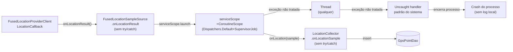
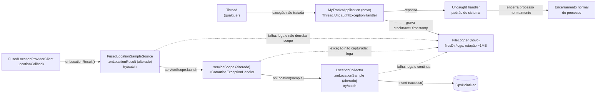

# SPEC: exception-handling-and-error-logging

## Metadata
- Source: developer description via /plan
- Service: my-tracks-app (single-module Android app, `com.mytracksapp`)
- Tier: complete
- Version: 1.3
- Architecture references: `AGENTS.md`, `docs/agents/architecture.md`, `docs/agents/domain_rules.md`, `docs/agents/tech_stack.md`, `docs/agents/coding_guidelines.md`

## Context

My Tracks App has zero logging/observability infrastructure today: no `Timber`/`Crashlytics`/`Sentry` dependency in `gradle/libs.versions.toml` (verified — grep found none), no custom `Application` subclass (`AndroidManifest.xml`'s `<application>` tag has no `android:name` attribute, `app/src/main/AndroidManifest.xml:9-12`), and no `Thread.UncaughtExceptionHandler`/`Thread.setDefaultUncaughtExceptionHandler` call anywhere in `app/src/main` (verified via grep). Per `docs/agents/coding_guidelines.md` §1, the project uses a manual composition root (`MainActivity.kt`) with no DI framework — any new cross-cutting component (a custom `Application`, a `FileLogger`) must be wired by hand, consistent with that convention, not via a DI container.

The GPS collection pipeline (`docs/agents/architecture.md` "Macro flow: background GPS collection") has two concrete gaps confirmed by reading the code:
- `LocationCollector.onLocationSample` (`app/src/main/java/com/mytracksapp/service/LocationCollector.kt:96`) has no try/catch around `gpsPointDao.insert(...)` or `onFirstPointRecorded(...)` — any exception there propagates uncaught into the coroutine that invoked it.
- `FusedLocationSampleSource.onLocationResult` (`app/src/main/java/com/mytracksapp/service/LocationForegroundService.kt:67`) launches `coroutineScope.launch { onLocation(...) }` with no try/catch.
- `LocationForegroundService.serviceScope` (`app/src/main/java/com/mytracksapp/service/LocationForegroundService.kt:106-107`) is `CoroutineScope(Dispatchers.Default + SupervisorJob())` — `SupervisorJob` isolates sibling-coroutine failures from each other but installs no `CoroutineExceptionHandler`, so an uncaught exception in any `serviceScope.launch` block is only reported to the thread's default uncaught-exception handler (today: nothing, per the gap above), never logged.

Two call sites already handle exceptions correctly and must not have their control flow changed: `AndroidReverseGeocoder.kt:24-27` (`catch (_: IOException)`, swallows and returns `null`) and `MapComponent.kt:180-182` (`catch (_: IllegalStateException)`, falls back to a plain camera pan). A third existing correct handler was found during codebase review: `OrphanedSessionRecovery.kt:50-59` wraps each session's finalization in its own `try/catch (e: Exception)`. One gap was also found during review that the confirmed ACs' examples don't name explicitly: `FirstPointGeocodingCoordinator.onFirstPointRecorded` (`app/src/main/java/com/mytracksapp/domain/geocoding/FirstPointGeocodingCoordinator.kt:42-49`) wraps only `reverseGeocoder.reverseGeocode(...)` in `runCatching` — the subsequent `trackingSessionDao.updateLocationName(sessionId, name)` call is unguarded and, in production, runs on `serviceScope`.

This feature is a safety net (crash containment + local observability), not a product change (AC-07): every existing thrown/caught exception's caller-visible behavior on the success path must remain identical; only previously-uncaught paths gain containment + logging.

## AS IS — Estado atual

Legenda: nenhum componente de logging existe hoje; uma exceção não tratada em qualquer thread cai direto no handler padrão do sistema sem deixar rastro local, e o pipeline de GPS (`FusedLocationSampleSource.onLocationResult`, `LocationCollector.onLocationSample`, `serviceScope`) não possui nenhuma barreira de captura própria.

## TO BE — Estado proposto

Legenda: `NEW_App` realiza RF-01; `NEW_FileLogger` realiza RF-02; `Collector` (alterado) realiza RF-03; `Callback` (alterado) realiza RF-04; `ServiceScope` (alterado) realiza RF-05 — a coleta de GPS continua tentando os próximos pontos mesmo após uma falha isolada.

## Scope
- **In**: custom `Application` + global `Thread.UncaughtExceptionHandler`; `FileLogger` (size-rotated, thread/coroutine-safe, no external dependency); try/catch + `FileLogger` logging added to `LocationCollector.onLocationSample`, `FusedLocationSampleSource.onLocationResult`, and `LocationForegroundService.serviceScope`'s `CoroutineExceptionHandler`; a review-and-patch pass over every `viewModelScope.launch`/`serviceScope.launch`/other coroutine launch, Room DAO call, DataStore call, `Geocoder` call, `MapView` call, and GPX/CSV export call site in `app/src/main` that currently has no exception containment.
- **Out**: any external crash-reporting/log-aggregation library (Crashlytics, Sentry, Timber); any new user-visible UI/UX (toast, dialog, settings screen) for viewing or exporting logs; any change to an existing feature's success-path behavior, return value, or thrown-exception type; remote/network log shipping; log encryption.

## RIGID (Non-Negotiable)

### Functional Requirements

- RF-01 [Event-Driven]: WHEN an exception propagates uncaught to a thread's exception handler anywhere in the app process, THE SYSTEM SHALL, via a custom `Application` subclass registered as the manifest's `android:name` (currently absent — `AndroidManifest.xml:9-12`) that installs itself as `Thread.setDefaultUncaughtExceptionHandler` at `Application.onCreate()`, write a log entry (exception class, message, full stack trace, ISO-8601 timestamp) through `FileLogger` and then invoke the previously-registered default `UncaughtExceptionHandler` for the same thread/throwable. If the `FileLogger` write attempt itself throws, THE SYSTEM SHALL swallow that secondary exception and unconditionally proceed to invoke the previously-registered default `UncaughtExceptionHandler` — a logging failure SHALL NOT block or delay process-termination behavior.
  - AC: Forcing an uncaught `RuntimeException` on a background thread in a test/harness results in (a) exactly one new log entry under the log directory containing the exception class name, message, full stack trace, and a timestamp, written before the default handler runs, AND (b) the default handler is invoked with the same thread and throwable, so process-termination behavior is unchanged from today. A second test that forces `FileLogger`'s write to throw during uncaught-exception handling asserts the previously-registered default `UncaughtExceptionHandler` is still invoked with the same thread/throwable, with no exception escaping the custom handler.

- RF-02 [Event-Driven]: WHEN any call site invokes `FileLogger`'s logging entry point with a level, tag, message, and optional `Throwable`, THE SYSTEM SHALL append exactly one well-formed log line (ISO-8601 timestamp, level, tag, message, optional stack trace) to the current on-disk log file and flush that write to disk immediately (not merely buffered in memory or deferred to a periodic flush) before the call returns, safely under concurrent invocation from multiple threads and coroutines, with no external logging dependency added to `gradle/libs.versions.toml` or `app/build.gradle.kts`. One log entry SHALL always correspond to exactly one physical line in the file: if the message or stack trace contains embedded newlines (e.g. a multi-line stack trace), THE SYSTEM SHALL escape them (e.g. `\n` rendered as the literal two-character sequence `\n`, or an equivalent escaping scheme) so the file remains one-entry-per-line and grep/parse-friendly.
  - AC: A test that fires 50 concurrent `FileLogger` calls from at least 4 distinct coroutine dispatchers produces exactly 50 complete, non-interleaved, non-corrupted log lines in the resulting file(s); a diff of `gradle/libs.versions.toml` and `app/build.gradle.kts` before/after this feature shows zero new dependencies matching `Timber`, `Crashlytics`, `Sentry`, or any Firebase Crashlytics plugin. A test that logs a `Throwable` with a multi-line stack trace asserts the resulting file contains exactly one physical line for that entry (no raw newline characters), with the stack trace's line breaks recoverable via the documented escape sequence. A durability test that logs an entry and immediately reads the file (without an explicit close) observes the entry already present on disk.

- RF-03 [State-Driven]: WHILE the active log file's size is at or above 1,048,576 bytes (~1MB) at the moment a new log write is requested, THE SYSTEM SHALL rotate — close/rename the current active file to become the single rotated backup file and begin a new active file — as part of that same write call, before the triggering entry is appended, so no single log file grows unbounded. Retention SHALL be exactly one rotated backup file (active `app.log` + previous `app.log.1`): on each rotation, any pre-existing `app.log.1` SHALL be discarded/overwritten by the just-rotated file, so total on-disk log storage never exceeds two files. This size-check-and-rotate operation SHALL execute inside the same synchronized/mutex-protected critical section as the write itself — the same critical section RNF-02 requires for concurrent-writer safety — and NOT as a separate, independently-locked check, so that a rotation decision and the write it guards are atomic with respect to other concurrent writers (preventing a lost or double-rotated backup file).
  - AC: A test that writes enough entries to cross the 1MB threshold observes the pre-rotation file's final size `< 1,048,576 + (one entry's byte length)` and a distinct new active file receiving all subsequent writes. A test that triggers two successive rotations asserts exactly one backup file exists after each rotation (never more than one), and that the backup file's content after the second rotation is the content rotated out at that second rotation (the first backup's content is gone). A concurrency test with multiple threads/coroutines writing near the rotation threshold simultaneously asserts exactly one rotation occurs per threshold crossing (no lost writes, no double-rotated/missing backup file).

- RF-04 [Unwanted Behavior]: IF an exception is thrown while `LocationCollector.onLocationSample` (`service/LocationCollector.kt:96`) processes an individual accepted GPS sample (drift computation, `gpsPointDao.insert`, or `onFirstPointRecorded`), THEN THE SYSTEM SHALL catch it inside `onLocationSample`, log it via `FileLogger` at an error-equivalent level tagged to identify `LocationCollector`, and return normally without re-throwing, leaving `collecting` unchanged so subsequent samples are still processed.
  - AC: A unit test makes `gpsPointDao.insert` throw once for one sample among several; the test asserts (a) `FileLogger` received exactly one error-level entry containing the thrown exception, (b) no exception escapes `onLocationSample`, and (c) every other (non-throwing) sample in the same test run is still persisted via `gpsPointDao.insert`.

- RF-05 [Unwanted Behavior]: IF an exception is thrown inside the coroutine `FusedLocationSampleSource.onLocationResult` (`service/LocationForegroundService.kt:67`) launches to translate a Play Services `LocationResult` and invoke `onLocation`, THEN THE SYSTEM SHALL catch it inside that launched coroutine, log it via `FileLogger`, and not cancel or otherwise affect the `CoroutineScope` the coroutine was launched on. This `CoroutineScope` is, in production, the identical `serviceScope` instance that RF-06's `CoroutineExceptionHandler` is installed on: `FusedLocationSampleSource` is constructed at `LocationForegroundService.kt:141-143` with `coroutineScope = serviceScope`, the same `serviceScope` defined at `LocationForegroundService.kt:107` — RF-05 and RF-06 govern the same scope, not two independent ones.
  - AC: A test that makes the `onLocation` callback throw for one invocation asserts (a) exactly one `FileLogger` error-level entry is recorded, (b) the scope the coroutine ran on remains active (a subsequent, non-throwing invocation still completes and its effects are observed), and (c) no exception is thrown out of `FusedLocationSampleSource.start`'s registered `LocationCallback`.

- RF-06 [Event-Driven]: WHEN any coroutine launched on `LocationForegroundService.serviceScope` (`service/LocationForegroundService.kt:106-107`) throws an exception that is not already caught within that coroutine's own body, THE SYSTEM SHALL route it to a `CoroutineExceptionHandler` installed in `serviceScope`'s `CoroutineContext` (alongside the existing `SupervisorJob`) that logs the exception via `FileLogger`.
  - AC: A test coroutine launched via `serviceScope.launch` that throws an uncaught exception results in exactly one `FileLogger` error-level entry, verified by asserting the installed `CoroutineExceptionHandler` is invoked with that exception, and the hosting test process/service does not terminate as a result.

- RF-07 [Conditional]: IF a `viewModelScope.launch` block in `NewSessionViewModel`, `HistoryViewModel`, `TrackingViewModel`, `SettingsViewModel`, or `SessionDetailViewModel` (`ui/history/SessionDetailScreen.kt:162`) performing a Room DAO or `SettingsRepository`/DataStore call throws an exception, THEN THE SYSTEM SHALL catch it at that launch site, log it via `FileLogger` tagged with the owning ViewModel's name, and leave the ViewModel's exposed `StateFlow`/`UiState` on its last valid value rather than propagating the exception to crash the app.
  - AC: For each of the five listed ViewModels, a unit test that makes the underlying DAO/DataStore call throw asserts (a) one `FileLogger` error-level entry referencing that ViewModel, (b) no exception escapes the `viewModelScope.launch` block, and (c) every pre-existing unit test for that ViewModel's success path passes unmodified.

- RF-08 [Conditional]: IF the export flow invoked from `AppNavigation.kt`'s `SessionDetailRoute.onExport` (`app/src/main/java/com/mytracksapp/ui/navigation/AppNavigation.kt:514-517`, called from the `coroutineScope.launch` at `ui/history/SessionDetailScreen.kt:326`) throws any exception from `ExportService.export` or `ExportedFile.writeTo` — including the pre-existing intentional `NoSuchElementException`/`IllegalStateException`/`IllegalArgumentException` domain signals — THEN THE SYSTEM SHALL catch it at that call site and log it via `FileLogger`, without changing `ExportService`'s or the exporters' thrown-exception types, and without altering the success-path return value or written file content. This is a silent failure by design: the caught exception SHALL produce no user-visible change and no new UI/error affordance (no toast, dialog, snackbar, or navigation change) — the only observable effect SHALL be the `FileLogger` entry, consistent with AC-07's "no product/behavior change" framing.
  - AC: A test that forces `ExportService.export` (or `writeTo`) to throw asserts exactly one `FileLogger` error-level entry and no uncaught exception reaching the Compose UI thread; the existing instrumented tests `SessionDetailExportTest.tappingExportWithCsvAsDefaultFormatExportsCsvDirectlyWithNoDialog` and `...ExportsGpxDirectlyWithNoDialog` continue to pass unmodified. The same forced-failure test additionally asserts no new UI element (toast/dialog/snackbar) is shown and no navigation occurs as a result of the caught exception, beyond whatever occurred on this screen before this feature.

- RF-09 [Conditional]: IF `FirstPointGeocodingCoordinator.onFirstPointRecorded`'s launched coroutine (`domain/geocoding/FirstPointGeocodingCoordinator.kt:42-49`) throws while calling `trackingSessionDao.updateLocationName` (the one call in that block not already covered by the existing `runCatching { reverseGeocoder.reverseGeocode(...) }`), THEN THE SYSTEM SHALL catch it and log it via `FileLogger`, preserving the existing `runCatching`-wrapped reverse-geocode behavior unchanged.
  - AC: A test that makes `trackingSessionDao.updateLocationName` throw asserts exactly one `FileLogger` error-level entry, no exception escapes the launched coroutine, and the existing `FirstPointGeocodingCoordinatorTest` suite passes unmodified.

- RF-10 [Constraint / Unwanted Behavior]: WHERE an existing try/catch already correctly contains an exception — `AndroidReverseGeocoder.kt:24-27` (`catch (_: IOException)`), `MapComponent.kt:180-182` (`catch (_: IllegalStateException)`), and `OrphanedSessionRecovery.kt:50-59` (`catch (e: Exception)`) — THE SYSTEM SHALL NOT change the caught exception type or the resulting control flow (return value, fallback branch taken, loop continuation); a `FileLogger` call MAY be added inside the existing catch block only.
  - AC: A code review diff of these three files shows every existing `catch` clause's exception type and post-catch control-flow path byte-identical to before this feature; the only permitted additions inside each catch block are `FileLogger` calls.

- RF-11 [Unwanted Behavior]: THE SYSTEM SHALL NOT introduce any dependency on an external crash-reporting or remote-log-aggregation service (Crashlytics, Sentry, or equivalent); all log output SHALL be written only to local app-private storage (e.g., `context.filesDir`) recoverable via `adb pull`/`adb shell run-as`, with no network call made by `FileLogger` or the uncaught-exception handler.
  - AC: A test/inspection confirms `FileLogger` and the `Application`'s uncaught-exception handler perform no network I/O (no `HttpURLConnection`/OkHttp/Retrofit/Firebase usage) and write exclusively under `context.filesDir`; `gradle/libs.versions.toml` contains no crash-reporting dependency after this feature (same evidence as RF-02's AC).

- RF-12 [Conditional]: IF the `rememberCoroutineScope()`-launched coroutine started by the "Encerrar sessão" (end session) button's handler (`TrackingRoute.onFinishSession` in `AppNavigation.kt:479-482`) throws while calling `SessionControllerImpl.stopSession()`, THEN THE SYSTEM SHALL catch it at that launch site and log it via `FileLogger`, without changing the success-path behavior of `stopSession()` (its return value, side effects, or the screen's post-success navigation/state), consistent with RNF-01's zero-functional-change guarantee — the same class of gap RF-04/RF-05 address elsewhere in the pipeline.
  - AC: A unit/instrumented test that makes `SessionControllerImpl.stopSession()` throw asserts (a) exactly one `FileLogger` error-level entry referencing this call site, (b) no exception escapes the `viewModelScope.launch` block, and (c) every pre-existing test covering the "Encerrar sessão" success path passes unmodified.

### Non-Functional Requirements

- RNF-01: No pre-existing automated test (JVM unit test under `app/src/test` or instrumented test under `app/src/androidTest`) SHALL have its assertions or expected behavior modified by this feature — only new tests may be added, and existing tests' pass/fail outcomes SHALL be identical before and after.
- RNF-02: `FileLogger` writes SHALL be safe for concurrent invocation from at least 4 distinct coroutine dispatchers/threads with zero corrupted or interleaved log lines, as defined in RF-02's AC.
- RNF-03: The active log file governed by RF-03 SHALL never exceed 1,048,576 bytes (1 MiB) plus one entry's byte length at the moment rotation is triggered. Total on-disk log storage (active file + the single retained rotated backup file) SHALL never exceed approximately 2x the rotation threshold (~2 MiB) plus one entry's byte length, per RF-03's exactly-one-backup retention policy.

## FLEXIBLE (Implementation Suggestions)
- Suggested new files: `app/src/main/java/com/mytracksapp/MyTracksApplication.kt` (custom `Application`), `app/src/main/java/com/mytracksapp/logging/FileLogger.kt` (or under a new `logging/` or `infra/` package, consistent with the existing layered package-by-feature layout in `docs/agents/architecture.md`).
- Suggested log directory/naming: `context.filesDir/logs/app.log` (active) + `app.log.1` (rotated backup) — file/directory naming is an implementation detail; the retention count (exactly one backup) is RIGID per RF-03.
- Suggested `FileLogger` API shape: an object/singleton with `fun log(level: LogLevel, tag: String, message: String, throwable: Throwable? = null)`, backed by a `Mutex` or `synchronized` block plus a `FileOutputStream`/`FileWriter` append that flushes (and, if needed, syncs the underlying `FD`) on every write per RF-02's durability requirement — not a periodically-flushed buffer — matching the project's "no external dependency, hand-rolled" convention (`docs/agents/coding_guidelines.md` §3).
- `LogLevel` enum suggestion: `DEBUG, INFO, WARN, ERROR` — exact members are an implementation detail, not frozen by RIGID.
- Construct `FileLogger` once in `MainActivity.kt`/`MyTracksApplication.kt` (composition root, per `docs/agents/coding_guidelines.md` §1) and thread it into `LocationForegroundService`, ViewModels' factories (`ui/ViewModelFactories.kt`), and `AppNavigation.kt` route wrappers the same way `SettingsRepository`/DAOs are threaded today — or use a lightweight top-level singleton if per-instance wiring proves too invasive for a pure safety-net feature; either is acceptable since RIGID does not mandate a specific DI shape.
- Tag convention suggestion: fully-qualified simple class name (e.g., `"LocationCollector"`, `"SessionDetailViewModel"`) for grep-ability in `adb pull`'d logs.

## Acceptance Criteria Summary
| ID | Criterion | Testable? |
|----|-----------|-----------|
| RF-01 | Uncaught exception logged then delegated to default handler, process terminates normally | Yes |
| RF-02 | FileLogger writes well-formed concurrent-safe entries, zero new external dependency | Yes |
| RF-03 | Log file rotates at ~1MB threshold, exactly one backup retained, rotation is race-safe with concurrent writes | Yes |
| RF-04 | LocationCollector.onLocationSample failures logged, collection continues | Yes |
| RF-05 | FusedLocationSampleSource.onLocationResult failures logged, scope unaffected | Yes |
| RF-06 | serviceScope CoroutineExceptionHandler logs uncaught coroutine exceptions | Yes |
| RF-07 | ViewModel DAO/DataStore coroutine failures logged, UI state preserved, existing tests unmodified | Yes |
| RF-08 | Export call-site failures logged without changing thrown types or success path | Yes |
| RF-09 | FirstPointGeocodingCoordinator's unguarded updateLocationName call logged on failure | Yes |
| RF-10 | Existing correct catch blocks (AndroidReverseGeocoder, MapComponent, OrphanedSessionRecovery) unchanged except optional logging | Yes |
| RF-11 | No crash-reporting dependency, no network I/O, logs local-only | Yes |
| RF-12 | TrackingScreen "Encerrar sessão" stopSession() failure logged, success path unchanged | Yes |
| RNF-01 | Zero regression in existing test suites | Yes |
| RNF-02 | FileLogger concurrency safety | Yes |
| RNF-03 | Log file size bound | Yes |
