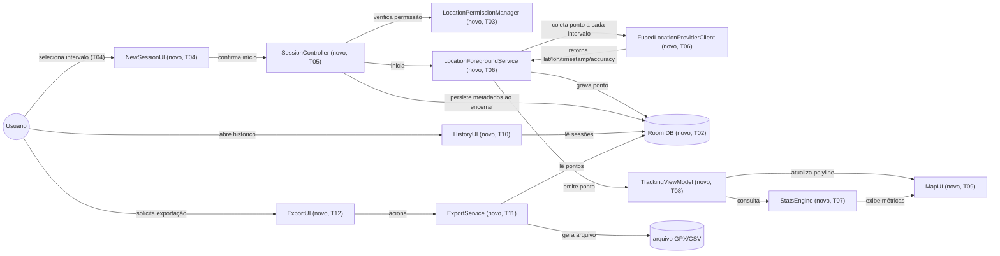

# Implementation Plan

## Request Summary
- Objective: protótipo Android nativo (Kotlin, minSdk 29) para avaliar rastreamento GPS com intervalo configurável — coleta via foreground service, exibição de rota/métricas em mapa, persistência local de sessões e exportação GPX/CSV — sem comprometer a arquitetura a um caso de uso final específico.
- Scope: in = seleção de intervalo (9 valores fixos), coleta via foreground service API29+, polyline em mapa, velocidade instantânea/média, classificação parado/em movimento (150m/5min), persistência local (Room), histórico de sessões, exportação GPX+CSV. Out = escolha do caso de uso final, sync em nuvem, multiusuário, mapas offline, otimização adaptativa de intervalo/bateria, edição manual de segmentos, suporte < API 29.
- Tier: standard
- Architecture references: missing — nenhum `AGENTS.md` / `docs/agents/*.md` / `.github/copilot-instructions.md` no repositório. Repositório confirmado vazio (apenas `.spec/`) na exploração desta sessão. Desenvolvedor confirmou prosseguir sem referência; a decomposição abaixo propõe uma arquitetura em camadas (`ui/` → `domain/` → `data/` + `service/`) a partir do zero, **não validada contra nenhum documento de arquitetura existente**. Esta ausência é uma lacuna registrada, não uma aprovação implícita — ver Open Questions.

## AS IS — Componentes impactados

_AS IS não aplicável — feature greenfield._ Exploração do repositório (`find .spec -type f`, `ls -la`) confirma que só existe `.spec/features/gps-tracking-prototype/SPEC.md`; não há código-fonte, módulo Android, nem `.spec/init/*`.

## TO BE — Componentes propostos

Todos os nós são novos, cada um anotado com a task que o produz. `NewSessionUI` (T04) e `SessionController` (T05) cobrem RF-01/UI-01; `LocationPermissionManager` (T03) cobre RF-03; `LocationForegroundService`/`LocationProvider` (T06) cobrem RF-02/RF-03/RNF-01/RNF-03; `LocalDB` (T02) sustenta RF-02/RF-07; `StatsEngine` (T07) cobre RF-04/RF-05/RF-06; `TrackingViewModel` (T08) e `MapUI` (T09) cobrem UI-02/UI-03/RNF-04; `HistoryUI` (T10) cobre UI-04/UI-03(detalhe); `ExportUI` (T12) e `ExportService` (T11) cobrem RF-08/UI-05/CT-01/CT-02. `FusedLocationProviderClient` teve o sufixo `?` removido: disponibilidade de Google Play Services confirmada pelo desenvolvedor no(s) dispositivo(s) de teste (decisão registrada em 2026-09-22). `MapUI` (T09) é implementado com Google Maps SDK for Android (decisão registrada em 2026-09-22, substitui a alternativa OSMDroid antes em aberto).

## Tasks

### T01 — Project scaffolding (Gradle, manifest base, minSdk 29)
- **Files**: `build.gradle.kts` (root), `app/build.gradle.kts`, `settings.gradle.kts`, `gradle/libs.versions.toml`, `app/src/main/AndroidManifest.xml` (skeleton: `minSdkVersion=29`, sem permissão `INTERNET`)
- **Change**: criar módulo `:app` Kotlin com `minSdkVersion=29`; declarar dependências base (Room, Play Services Location, Google Maps SDK for Android `com.google.android.gms:play-services-maps`, Jetpack Compose ou Views, coroutines/lifecycle); manifest inicial sem qualquer permissão de rede. Google Maps SDK for Android requer uma chave de API do Google Cloud (Maps SDK for Android habilitado no projeto GCP) — configuração da chave é responsabilidade de T09 (não commitar valor real da chave).
- **Covers**: RNF-01, RNF-05, RNF-02 (ausência de permissão de rede/dependência de transmissão remota)
- **Acceptance criteria**: `./gradlew assembleDebug` conclui com sucesso; `app/build.gradle.kts` declara `minSdk = 29`; `AndroidManifest.xml` não contém `<uses-permission android:name="android.permission.INTERNET"/>`.
- **Tests**: N/A (tarefa de configuração) — validado via build bem-sucedido (`./gradlew assembleDebug`), não teste automatizado.
- **Risk**: Low — decisão de estrutura de módulo único, reversível.
- **Dependencies**: none

### T02 — Data layer: Room entities & DAOs
- **Files**: `app/src/main/java/com/mytracksapp/data/local/entity/TrackingSessionEntity.kt`, `app/src/main/java/com/mytracksapp/data/local/entity/GpsPointEntity.kt`, `app/src/main/java/com/mytracksapp/data/local/dao/TrackingSessionDao.kt`, `app/src/main/java/com/mytracksapp/data/local/dao/GpsPointDao.kt`, `app/src/main/java/com/mytracksapp/data/local/AppDatabase.kt`
- **Change**: definir `TrackingSessionEntity` (id, intervalo configurado, início, fim, tempo parado, tempo em movimento, velocidade média) e `GpsPointEntity` (id, sessionId FK, lat, lon, timestamp, accuracy, drift observado); DAOs com insert/query por sessão como `Flow`.
- **Covers**: RF-02, RF-04, RF-07
- **Acceptance criteria**: inserir uma sessão com N pontos e reler do banco retorna N pontos com todos os campos intactos (contagem persistida == contagem inserida, conforme AC de RF-07).
- **Tests**: `app/src/androidTest/java/com/mytracksapp/data/local/TrackingSessionDaoTest.kt` — insert + query roundtrip de sessão e pontos.
- **Risk**: Medium — schema é base de todas as camadas superiores; mudança tardia tem alto custo de retrabalho.
- **Dependencies**: T01

### T03 — Location permission handling (API 29+ background location)
- **Files**: `app/src/main/java/com/mytracksapp/permission/LocationPermissionManager.kt`
- **Change**: encapsular verificação de `ACCESS_FINE_LOCATION` + `ACCESS_BACKGROUND_LOCATION` (API 29+); expor `isBackgroundLocationGranted(): Boolean` e fluxo de solicitação.
- **Covers**: RF-03
- **Acceptance criteria**: em API 29+, `isBackgroundLocationGranted()` retorna `false` quando a permissão não foi concedida, sem exceção lançada.
- **Tests**: `app/src/test/java/com/mytracksapp/permission/LocationPermissionManagerTest.kt` — API 29+ sem `ACCESS_BACKGROUND_LOCATION` concedida retorna `false`.
- **Risk**: High — bug aqui viola RF-03 silenciosamente (coleta indevida sem permissão); central para compliance com restrições de background location do Android 10+.
- **Dependencies**: T01

### T04 — New Session UI (seleção de intervalo, 9 valores fixos)
- **Files**: `app/src/main/java/com/mytracksapp/domain/model/SamplingInterval.kt`, `app/src/main/java/com/mytracksapp/ui/newsession/NewSessionScreen.kt`, `app/src/main/java/com/mytracksapp/ui/newsession/NewSessionViewModel.kt`
- **Change**: enum `SamplingInterval` com exatamente os 9 valores `{3,5,10,15,30,45,60,120,180}` segundos; tela apresenta as 9 opções como seleção (sem campo de entrada livre); ao confirmar, delega a `SessionController` (T05) com verificação de permissão (T03) antes de iniciar.
- **Covers**: RF-01, UI-01
- **Acceptance criteria**: nenhum valor fora do conjunto `{3,5,10,15,30,45,60,120,180}` é representável pelo tipo `SamplingInterval`; a tela não expõe nenhum campo de texto/numérico livre para o intervalo.
- **Tests**: `app/src/test/java/com/mytracksapp/domain/model/SamplingIntervalTest.kt` — apenas os 9 valores existem como membros válidos; `app/src/androidTest/java/com/mytracksapp/ui/newsession/NewSessionScreenTest.kt` — 9 opções renderizadas, nenhum input livre presente.
- **Risk**: Low — lógica de apresentação isolada, sem efeitos colaterais de coleta.
- **Dependencies**: T01, T03

### T05 — SessionController (orquestração do ciclo de vida da sessão)
- **Files**: `app/src/main/java/com/mytracksapp/domain/session/SessionController.kt`
- **Change**: orquestrar criação de `TrackingSessionEntity` somente se intervalo pertence ao conjunto válido (RF-01) e permissão de background location concedida (RF-03); iniciar/parar `LocationForegroundService`; ao encerrar, disparar cálculo final de métricas (via `StatsEngine`, T07) e persistir metadados (RF-07).
- **Covers**: RF-01, RF-03, RF-07
- **Acceptance criteria**: chamada de início com intervalo fora do conjunto válido não cria sessão nem grava no banco; chamada de início sem permissão de background location concedida não cria sessão, não inicia o serviço e nenhum ponto é gravado.
- **Tests**: `app/src/test/java/com/mytracksapp/domain/session/SessionControllerTest.kt` — intervalo inválido não cria sessão; permissão ausente bloqueia início e não grava nenhum ponto (dublês de `PermissionManager`/DAO).
- **Risk**: High — ponto central de orquestração; falha aqui pode violar RF-01, RF-03 ou RF-07 simultaneamente.
- **Dependencies**: T02, T03, T04

### T06 — LocationForegroundService (coleta periódica de pontos GPS)
- **Files**: `app/src/main/java/com/mytracksapp/service/LocationForegroundService.kt`, `app/src/main/java/com/mytracksapp/service/LocationCollector.kt`, `app/src/main/AndroidManifest.xml` (extensão: `<service>` com `foregroundServiceType="location"`, permissões `ACCESS_FINE_LOCATION`, `ACCESS_BACKGROUND_LOCATION`, `FOREGROUND_SERVICE`, `FOREGROUND_SERVICE_LOCATION`)
- **Change**: usar `FusedLocationProviderClient` (Google Play Services confirmado disponível no(s) dispositivo(s) de teste do desenvolvedor — decisão registrada em 2026-09-22, sem fallback para `LocationManager` puro neste protótipo; ver Assumptions) com `LocationRequest` configurado pelo intervalo da sessão; a cada callback, gravar `GpsPointEntity` (lat, lon, timestamp real observado, accuracy, desvio = timestamp real − intervalo configurado); recusar coleta se não houver sessão ativa.
- **Covers**: RF-02, RF-03, RNF-01, RNF-03
- **Acceptance criteria**: para pares de pontos consecutivos com sinal disponível, o intervalo real observado é registrado junto ao ponto (desvio calculável a posteriori); nenhum ponto é gravado quando não há sessão ativa.
- **Tests**: `app/src/test/java/com/mytracksapp/service/LocationCollectorTest.kt` — provedor de localização falso emite pontos, cada ponto persistido carrega o desvio observado; `app/src/test/java/com/mytracksapp/service/LocationForegroundServiceStartGuardTest.kt` — serviço recusa coleta sem sessão ativa/permissão.
- **Risk**: High — restrições de background location do Android 10+ e Doze mode não são totalmente reproduzíveis em teste automatizado; comportamento real depende de dispositivo físico (ver T13).
- **Dependencies**: T02, T03, T05

### T07 — StatsEngine (velocidade, tempo total, classificação parado/em movimento)
- **Files**: `app/src/main/java/com/mytracksapp/domain/stats/StatsEngine.kt`, `app/src/main/java/com/mytracksapp/domain/stats/DistanceCalculator.kt`, `app/src/main/java/com/mytracksapp/domain/stats/SegmentClassifier.kt`
- **Change**: calcular velocidade instantânea (distância geodésica / Δtimestamp) e velocidade média (distância total / tempo total) a cada novo ponto; calcular tempo total decorrido (último − primeiro timestamp); classificar segmentos contínuos dentro de raio ≤150m por >300s consecutivos como "parado", restante como "em movimento", garantindo soma == tempo total.
- **Covers**: RF-04, RF-05, RF-06
- **Acceptance criteria**: para uma sessão sintética com timestamps/coordenadas conhecidos, velocidade instantânea e média batem com cálculo de referência; para qualquer sessão, tempo("parado") + tempo("em movimento") == tempo total decorrido; um segmento só é "parado" se todos os pontos nele estão dentro de raio ≤150m por período >300s consecutivos (casos-limite exatamente 150m/300s cobertos).
- **Tests**: `app/src/test/java/com/mytracksapp/domain/stats/StatsEngineTest.kt` — pares de pontos conhecidos produzem velocidade instantânea/média esperada; `app/src/test/java/com/mytracksapp/domain/stats/SegmentClassifierTest.kt` — casos-limite de raio/duração e invariante da soma de tempos.
- **Risk**: Medium — corretude algorítmica em casos-limite impacta diretamente métricas exibidas ao usuário (UI-03) e o CSV exportado (CT-02, campo `segment_status`).
- **Dependencies**: T02

### T08 — TrackingViewModel (estado reativo de polyline e métricas ao vivo)
- **Files**: `app/src/main/java/com/mytracksapp/ui/tracking/TrackingViewModel.kt`
- **Change**: observar `Flow<List<GpsPointEntity>>` da sessão ativa (Room), delegar a `StatsEngine` (T07) o recálculo a cada nova emissão, expor estado de UI (polyline + 5 métricas) para `MapUI` (T09).
- **Covers**: UI-02, UI-03, RNF-04
- **Acceptance criteria**: após um novo ponto ser persistido no Room, o estado exposto pelo ViewModel reflete esse ponto (último vértice da polyline + métricas recalculadas) no ciclo de coleta subsequente do `Flow`, sem SLA numérico de latência.
- **Tests**: `app/src/test/java/com/mytracksapp/ui/tracking/TrackingViewModelTest.kt` — dado um fluxo simulado de emissões de `GpsPointEntity`, o estado exposto atualiza polyline/métricas a cada emissão.
- **Risk**: Medium — ponto de integração entre camada de dados e UI; race conditions em `Flow` podem causar métricas defasadas.
- **Dependencies**: T02, T06, T07

### T09 — MapUI (tela de sessão ativa: polyline + métricas)
- **Files**: `app/src/main/java/com/mytracksapp/ui/tracking/TrackingScreen.kt`, `app/src/main/java/com/mytracksapp/ui/tracking/MapComponent.kt`, `app/src/main/AndroidManifest.xml` (extensão: `<meta-data android:name="com.google.android.geo.API_KEY" android:value="@string/google_maps_key"/>`), `app/src/main/res/values/google_maps_api.xml` (novo — placeholder de chave, valor real não versionado)
- **Change**: renderizar mapa com **Google Maps SDK for Android** (`com.google.android.gms.maps.MapView`/`GoogleMap`) — decisão registrada em 2026-09-22, substitui a alternativa OSMDroid antes em aberto — com polyline atualizada a partir do estado do `TrackingViewModel`; exibir simultaneamente as 5 métricas de UI-03. Dependência declarada em T01 (`play-services-maps`); chave de API do Google Cloud configurada via `google_maps_api.xml`/manifest, não commitada em texto real.
- **Covers**: UI-02, UI-03
- **Acceptance criteria**: a cada novo ponto no estado do ViewModel, a polyline exibida passa a incluir esse ponto como último vértice; as 5 métricas (velocidade instantânea, velocidade média, tempo total, tempo parado, tempo em movimento) estão visíveis simultaneamente sem navegação adicional; `MapComponent.kt` referencia a API do Google Maps SDK (`com.google.android.gms.maps.*`).
- **Tests**: `app/src/androidTest/java/com/mytracksapp/ui/tracking/TrackingScreenTest.kt` — polyline atualiza ao adicionar ponto ao estado; as 5 métricas aparecem simultaneamente na tela.
- **Risk**: Low — escolha de SDK de mapa resolvida (Google Maps SDK for Android); risco residual limitado à configuração correta da chave de API do Google Cloud, isolado a `MapComponent.kt`/manifest.
- **Dependencies**: T08

### T10 — HistoryUI (lista de sessões passadas + detalhe)
- **Files**: `app/src/main/java/com/mytracksapp/ui/history/HistoryListScreen.kt`, `app/src/main/java/com/mytracksapp/ui/history/HistoryViewModel.kt`, `app/src/main/java/com/mytracksapp/ui/history/SessionDetailScreen.kt`
- **Change**: listar sessões persistidas (id, data/hora de início, intervalo configurado); tela de detalhe reexibe as 5 métricas de UI-03 para sessão encerrada, lendo dados já persistidos (RF-07) e recalculados/lidos via `StatsEngine`.
- **Covers**: UI-04, UI-03 (tela de detalhe)
- **Acceptance criteria**: toda sessão persistida por RF-07 aparece na lista com id, data/hora de início e intervalo preenchidos; a tela de detalhe exibe as 5 métricas de UI-03 sem navegação adicional.
- **Tests**: `app/src/test/java/com/mytracksapp/ui/history/HistoryViewModelTest.kt` — sessões persistidas mapeadas para itens de lista com os 3 campos mínimos; `app/src/androidTest/java/com/mytracksapp/ui/history/SessionDetailScreenTest.kt` — 5 métricas visíveis na tela de detalhe.
- **Risk**: Low — leitura read-only sobre dados já persistidos e validados por T02/T07.
- **Dependencies**: T02, T07

### T11 — ExportService (geração de arquivo GPX/CSV)
- **Files**: `app/src/main/java/com/mytracksapp/domain/export/ExportService.kt`, `app/src/main/java/com/mytracksapp/domain/export/GpxExporter.kt`, `app/src/main/java/com/mytracksapp/domain/export/CsvExporter.kt`
- **Change**: gerar arquivo GPX (`<gpx><trk><trkseg><trkpt lat lon><time>…</time></trkpt></trkseg></trk></gpx>`, um `<trkpt>` por ponto, `<time>` ISO-8601) conforme `gpx-export.xsd`; gerar arquivo CSV com colunas `session_id` (string UUID, `format: uuid` — mesmo formato da chave primária de `TrackingSessionEntity`, decisão registrada em 2026-09-22), `timestamp`, `latitude`, `longitude`, `accuracy`, `speed_instant`, `segment_status` (literais exatos `moving`/`stopped`, decisão registrada em 2026-09-22 — mapear o estado interno do `SegmentClassifier` para esses dois literais em inglês na serialização) conforme `csv-export-schema.json`, uma linha por ponto.
- **Covers**: RF-08, CT-01, CT-02
- **Acceptance criteria**: arquivo GPX gerado é válido contra `gpx-export.xsd` e contém exatamente um `<trkpt>` por ponto coletado da sessão; arquivo CSV gerado contém exatamente uma linha por ponto coletado com os 7 campos mínimos de `csv-export-schema.json`, na ordem especificada, com `session_id` em formato UUID string e `segment_status` restrito aos literais `moving`/`stopped`; ambos os formatos disponíveis para qualquer sessão com status "encerrada".
- **Tests**: `app/src/test/java/com/mytracksapp/domain/export/GpxExporterTest.kt` — arquivo gerado validado estruturalmente contra `gpx-export.xsd`; `app/src/test/java/com/mytracksapp/domain/export/CsvExporterTest.kt` — arquivo gerado validado contra `csv-export-schema.json` (nome/ordem/tipo de campos, incluindo enum de `segment_status` e formato UUID de `session_id`).
- **Risk**: Medium — corretude aqui é literalmente o contrato externo (CT-01/CT-02) consumido por ferramentas de análise fora do app; qualquer desvio quebra compatibilidade silenciosamente se não testado.
- **Dependencies**: T02, T07

### T12 — Export UI (seletor de formato GPX/CSV)
- **Files**: `app/src/main/java/com/mytracksapp/ui/history/SessionDetailScreen.kt` (extensão: ação de exportação), `app/src/main/java/com/mytracksapp/ui/export/ExportFormatDialog.kt`
- **Change**: adicionar ação de exportação na tela de detalhe de sessão encerrada; ao acionar, exibir seletor com opções GPX/CSV; disparar `ExportService` (T11) com o formato escolhido.
- **Covers**: UI-05, RF-08
- **Acceptance criteria**: a ação de exportação está disponível apenas para sessões com status "encerrada"; ao ser acionada, apresenta um seletor com as opções GPX e CSV e dispara a geração do arquivo no formato escolhido.
- **Tests**: `app/src/androidTest/java/com/mytracksapp/ui/export/ExportFormatDialogTest.kt` — ação visível apenas para sessão encerrada; seleção de cada formato invoca `ExportService` com o argumento de formato correspondente.
- **Risk**: Low — camada de apresentação fina sobre T10/T11 já validados.
- **Dependencies**: T10, T11

### T13 — Validação de integração e comportamento em Doze mode (RF-02/RNF-02/RNF-03/RNF-04)
- **Files**: `app/src/androidTest/java/com/mytracksapp/e2e/TrackingSessionE2ETest.kt`, `docs/testing/manual-doze-mode-validation.md`
- **Change**: teste instrumentado de ciclo completo de sessão (criar → coletar N pontos simulados → encerrar → verificar persistência) cobrindo a integração T05/T06/T08/T09; documentar checklist de teste manual em dispositivo físico atravessando janela de Doze mode, registrando desvio observado por ponto e confirmando ausência de tráfego de rede (monitor de rede do dispositivo) durante a sessão.
- **Covers**: RF-02, RNF-02, RNF-03, RNF-04
- **Acceptance criteria**: teste instrumentado passa cobrindo criação→coleta→encerramento→persistência de uma sessão completa; checklist manual documentado permite a um executor humano confirmar, em dispositivo físico, que (a) pontos continuam sendo registrados (com desvio crescente aceitável, sem bound numérico) durante Doze mode, e (b) nenhuma chamada de rede é observada durante a sessão.
- **Tests**: o próprio `TrackingSessionE2ETest.kt` (automatizado) + checklist manual (não automatizável — comportamento de Doze mode depende de hardware/tempo real).
- **Risk**: High — comportamento de Doze mode/otimização de bateria não é totalmente reproduzível em CI; validação real depende de execução manual em dispositivo físico.
- **Dependencies**: T06, T08, T09

## Execution Phases
| Phase | Tasks | Parallel-safe? |
|-------|-------|----------------|
| 1 | T01 | N/A (single task) |
| 2 | T02, T03 | Yes — arquivos disjuntos, ambos dependem apenas de T01 |
| 3 | T04, T07 | Yes — arquivos disjuntos (`ui/newsession/*` vs. `domain/stats/*`) |
| 4 | T05, T10, T11 | Yes — arquivos disjuntos (`domain/session/*` vs. `ui/history/*` vs. `domain/export/*`) |
| 5 | T06, T12 | Yes — arquivos disjuntos (`service/*` vs. `ui/export/*` + extensão de `SessionDetailScreen.kt` já criado em T10) |
| 6 | T08 | No — depende de T06 (fase anterior) |
| 7 | T09 | No — depende de T08 |
| 8 | T13 | No — depende de T06, T08, T09 |

## Contracts emitted
| Artifact | Path | RFs covered | Compatibility |
|---|---|---|---|
| GPX export schema (XSD, perfil estrito de GPX 1.1) | `.spec/features/gps-tracking-prototype/gpx-export.xsd` | RF-08, CT-01 | Nenhum schema GPX pré-existente no repositório (greenfield) — primeira definição formal; namespace oficial `http://www.topografix.com/GPX/1/1`, subconjunto estrito (`lat`/`lon`/`time`) conforme texto literal de CT-01, sem elementos opcionais não respaldados por RIGID. |
| CSV export schema (Table Schema / Frictionless Data) | `.spec/features/gps-tracking-prototype/csv-export-schema.json` | RF-08, CT-02 | Nenhum contrato CSV pré-existente no repositório — primeira definição formal; preserva os 7 campos mínimos de CT-02 na ordem especificada; `session_id` fixado como string UUID (`format: uuid`) e `segment_status` fixado como enum `["moving", "stopped"]` — decisões do desenvolvedor registradas em 2026-09-22 (ver T11). |

## Risks
| Risk | Blast radius | Mitigation | Rollback |
|------|-------------|------------|----------|
| Foreground service sofre kill/drift por Doze mode/otimização de bateria (RF-02, RNF-03) | Gaps de coleta durante sessões longas; usuário percebe rota incompleta | Registrar desvio observado por ponto (T06); checklist manual de validação em dispositivo físico atravessando Doze (T13); nenhum SLA numérico prometido (RNF-03 é explicitamente best-effort) | Nenhum rollback necessário — comportamento é o especificado; dados coletados permanecem válidos e utilizáveis mesmo com gaps |
| Permissão de background location tratada incorretamente permite coleta sem consentimento (RF-03) | Violação de requisito RIGID e de política de privacidade da plataforma (Android 10+) | Checagem centralizada em `SessionController` (T05) antes de qualquer início de serviço; testes unitários dedicados (T03, T05, T06) cobrindo o caminho de bloqueio | Bloquear release até os testes de bloqueio de permissão passarem; nenhuma migração de dados envolvida |
| Chave de API do Google Cloud (Maps SDK for Android) ausente/inválida em runtime — SDK decidido (Google Maps, ver Assumptions), risco residual de configuração | Mapa não renderiza em `MapUI` (T09), bloqueando UI-02/UI-03 | Documentar setup da chave (`google_maps_api.xml`) antes de compilar T09; isolar a dependência de mapa atrás de uma interface mínima para permitir troca sem impacto em `TrackingViewModel` | Trocar implementação de `MapComponent.kt` sem alterar `TrackingViewModel`/`StatsEngine` (camadas já isoladas por design) |
| Casos-limite da regra 150m/5min (RF-06) calculados incorretamente | Métricas de "parado"/"em movimento" exibidas incorretamente ao usuário (UI-03) e exportadas incorretamente (CT-02, campo `segment_status`) | Testes unitários dedicados a casos-limite exatos (150m, 300s) em T07; invariante `parado + em_movimento == tempo total` verificado em teste | Corrigir `SegmentClassifier` isoladamente — não afeta dados brutos persistidos (`GpsPointEntity`), apenas cálculo derivado |
| Exportação (GPX/CSV) diverge do contrato formal (CT-01/CT-02) | Arquivos exportados inutilizáveis por ferramentas externas de análise de GPS | Testes de conformidade estrutural contra `gpx-export.xsd`/`csv-export-schema.json` em T11 | Bloquear a feature de exportação sem impacto nos dados de sessão já persistidos (nenhuma perda de dados) |

## Open Questions
- **Referência de arquitetura ausente**: não há `AGENTS.md`/`docs/agents/*.md` no repositório. A decomposição em camadas (`ui/` → `domain/` → `data/`/`service/`) proposta neste PLAN é uma sugestão inicial, não uma arquitetura validada contra convenção de equipe. Impacto: se o time já tiver uma convenção de módulos não documentada, este PLAN pode divergir dela — recomenda-se criar um `AGENTS.md` inicial a partir da estrutura implementada em T01–T02 assim que estabilizada.

## Assumptions
- Nome de pacote assumido como `com.mytracksapp` para todos os caminhos de arquivo Kotlin listados neste PLAN — SPEC não especifica; [UNVERIFIED], ajustável sem impacto na decomposição de tasks.
- Estrutura de módulo único `:app` com pacotes por camada (`ui/`, `domain/`, `data/`, `service/`, `permission/`) assumida na ausência de `AGENTS.md`; [UNVERIFIED] contra qualquer convenção de equipe não documentada.
- UI implementada em Jetpack Compose (não Views/XML) — SPEC não mandata; escolha de implementador dentro do espaço FLEXIBLE de stack (RNF-05 fixa apenas Kotlin nativo, não o framework de UI). [UNVERIFIED]
- Classificação de segmentos (RF-06) computada sob demanda a partir do stream de `GpsPointEntity`, em vez de materializada como tabela `SegmentClassification` separada — SPEC permite ambas as abordagens (seção FLEXIBLE, linha 103); escolhida por simplicidade no protótipo. [UNVERIFIED] impacto em performance para sessões muito longas, fora do escopo deste protótipo.
- **Decisão confirmada (2026-09-22)**: `FusedLocationProviderClient` (Google Play Services) disponível no(s) dispositivo(s) de teste do desenvolvedor — confirmado, não mais `[UNVERIFIED]`. T06 prossegue sem fallback para `LocationManager` puro neste protótipo.
- **Decisão confirmada (2026-09-22)**: SDK de mapa definido como Google Maps SDK for Android (não OSMDroid) — dependência `com.google.android.gms:play-services-maps` declarada em T01; requer chave de API do Google Cloud configurada em T09 (`google_maps_api.xml`, não commitada em texto real).
- **Decisão confirmada (2026-09-22)**: `session_id` no CSV exportado (CT-02) é string UUID (`format: uuid` em `csv-export-schema.json`), mesmo formato da chave primária de `TrackingSessionEntity`.
- **Decisão confirmada (2026-09-22)**: `segment_status` no CSV exportado (CT-02) usa exatamente os literais em inglês `moving`/`stopped` (enum fechado em `csv-export-schema.json`).
- Nenhum pipeline de CI existe no repositório (confirmado por exploração — apenas `.spec/` presente); os comandos de teste referenciados em cada task assumem execução local via Gradle (`./gradlew test`, `./gradlew connectedAndroidTest`).
