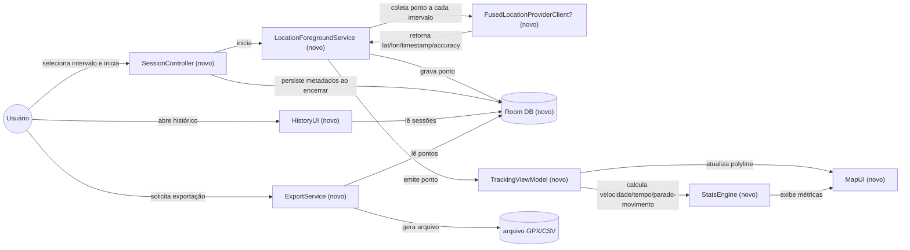

# SPEC: gps-tracking-prototype

## Metadata
- Source: developer description via /plan
- Service: my-tracks-app (Android prototype, standalone, sem backend)
- Tier: standard
- Version: 1.1
- Architecture references: missing — nenhum AGENTS.md / docs/agents/ / .github/copilot-instructions.md encontrado no repositório. Desenvolvedor confirmou prosseguir sem essa referência; a arquitetura proposta na seção TO BE é uma sugestão inicial (from scratch), não uma diretriz confirmada.

## Context
Protótipo Android (minSdk API 29) para avaliar, na prática, o comportamento de rastreamento GPS com intervalo de amostragem configurável — consumo de bateria, precisão do GPS e usabilidade — antes de comprometer a arquitetura a um caso de uso final específico (regata/vela vs. app de prestador de serviço que registra deslocamento). Não há artefatos de init chain (`.spec/init/*`) nem código-fonte existente: feature greenfield. O app deve funcionar via foreground service compatível com as restrições de background location do Android 10+ (API 29+), exibir a rota em mapa, calcular métricas de velocidade e de tempo parado/em movimento, persistir sessões localmente e permitir exportação para análise externa.

Decisão de stack: Android nativo em Kotlin, confirmada e fechada pelo desenvolvedor (não sujeita a avaliação cross-platform). Essa decisão impacta diretamente o desenho técnico do foreground service e das APIs de localização — ver RNF-05.

## AS IS — Estado atual

_AS IS não aplicável — feature greenfield._

## TO BE — Estado proposto

Todos os nós são novos (`(novo)`), pois não existe implementação prévia. `SessionController` e `LocationForegroundService` realizam RF-01, RF-02 e RF-03; `LocationProvider`/`LocalDB` sustentam RF-02 e RF-07; `TrackingViewModel`/`MapUI` realizam UI-01, UI-02, UI-03; `StatsEngine` realiza RF-04, RF-05, RF-06; `HistoryUI` realiza UI-04; `ExportService` realiza RF-08, CT-01 e CT-02. `FusedLocationProviderClient` recebe sufixo `?` por ser uma proposta de API da plataforma ainda não verificada em código.

## Scope
- **In**: seleção de intervalo de amostragem (9 valores fixos); coleta de pontos GPS via foreground service compatível com API 29+; exibição de rota como polyline em mapa; cálculo de velocidade instantânea e média; cálculo de tempo total, tempo "parado" e tempo "em movimento" por regra de 150m/5min; persistência local de sessões e pontos; lista de sessões passadas; exportação de sessão concluída (GPX/CSV).
- **Out**: escolha do caso de uso final (regata/vela vs. prestador de serviço) — decisão explicitamente adiada até após o protótipo; sincronização em nuvem ou backend remoto; suporte multiusuário/compartilhamento em tempo real; mapas offline; otimizações adaptativas de intervalo/bateria; edição manual de segmentos parado/em movimento; suporte a Android < API 29.

## RIGID (Non-Negotiable)

### Functional Requirements
- RF-01 [Event-Driven]: WHEN o usuário seleciona um intervalo de amostragem dentre {3, 5, 10, 15, 30, 45, 60, 120, 180} segundos e confirma o início, THE SYSTEM SHALL criar uma nova sessão de rastreamento com esse intervalo antes de iniciar qualquer coleta de ponto GPS.
  - AC: uma sessão só é criada se o intervalo selecionado pertencer exatamente ao conjunto definido; qualquer valor fora do conjunto é rejeitado e nenhuma sessão é criada.

- RF-02 [State-Driven]: WHILE uma sessão de rastreamento estiver ativa, THE SYSTEM SHALL registrar um ponto GPS (latitude, longitude, timestamp, acurácia) a cada intervalo de amostragem configurado, executando a coleta via foreground service.
  - AC: para cada par de pontos consecutivos registrados durante uma sessão ativa com sinal GPS disponível, um novo ponto é registrado em aproximadamente o intervalo configurado (coleta best-effort, sujeita a desvio por Doze mode/otimização de bateria — ver RNF-03); o desvio observado (diferença real entre timestamps menos intervalo configurado) é registrado junto ao ponto, mas não há verificação de igualdade estrita entre o intervalo real e o configurado; nenhum ponto é registrado fora de uma sessão ativa.

- RF-03 [Unwanted/Conditional]: IF o dispositivo executa Android API 29+ e a permissão `ACCESS_BACKGROUND_LOCATION` não foi concedida, THEN THE SYSTEM SHALL impedir o início da coleta de pontos em segundo plano e informar o usuário sobre a permissão necessária.
  - AC: tentativa de iniciar sessão sem a permissão de localização em segundo plano concedida resulta em bloqueio da coleta e exibição de mensagem explicativa; nenhum ponto é gravado.

- RF-04 [Event-Driven]: WHEN a sessão de rastreamento é encerrada pelo usuário, THE SYSTEM SHALL calcular o tempo total decorrido da sessão.
  - AC: tempo total decorrido exibido é igual à diferença entre o timestamp do primeiro e do último ponto coletado na sessão.

- RF-05 [Event-Driven]: WHEN dois pontos GPS consecutivos existem em uma sessão, THE SYSTEM SHALL calcular a velocidade instantânea entre eles e recalcular a velocidade média da sessão.
  - AC: velocidade instantânea de cada par consecutivo = distância geodésica entre os pontos / diferença de timestamp; velocidade média da sessão = distância total percorrida / tempo total decorrido; ambos os valores são recalculados a cada novo ponto coletado.

- RF-06 [State-Driven]: WHILE uma sessão está ativa ou já encerrada, THE SYSTEM SHALL classificar cada segmento contínuo em que o dispositivo permanece dentro de um raio de 150 metros por mais de 5 minutos consecutivos como "parado", e classificar o tempo restante da sessão como "em movimento".
  - AC: para qualquer sessão, a soma do tempo classificado como "parado" com o tempo classificado como "em movimento" é igual ao tempo total decorrido (RF-04); um segmento só é "parado" se todos os pontos nele estiverem contidos num círculo de raio ≤150m por >300s consecutivos.

- RF-07 [Event-Driven]: WHEN o usuário encerra a sessão, THE SYSTEM SHALL persistir localmente os metadados da sessão (intervalo configurado, horário de início/fim, tempo parado/em movimento, velocidade média) e todos os pontos coletados, tornando-os disponíveis na lista de sessões passadas.
  - AC: após reiniciar o aplicativo, a sessão encerrada aparece na lista de sessões passadas com todos os pontos e metadados intactos (contagem de pontos persistidos == contagem de pontos coletados durante a sessão).

- RF-08 [Event-Driven]: WHEN o usuário solicita a exportação de uma sessão concluída e escolhe um formato (GPX ou CSV), THE SYSTEM SHALL gerar um arquivo contendo todos os pontos da sessão no formato escolhido. Ambos os formatos (GPX e CSV) são obrigatórios no MVP; a escolha do formato ocorre no momento da exportação.
  - AC: o arquivo exportado contém todos os pontos da sessão (lat, lon, timestamp, acurácia) e é estruturalmente válido conforme o contrato do formato escolhido (CT-01 para GPX, CT-02 para CSV); ambos os formatos estão disponíveis para qualquer sessão encerrada.

### UI Requirements
- UI-01 [Event-Driven]: WHEN o usuário abre a tela de nova sessão, THE SYSTEM SHALL apresentar os 9 valores de intervalo permitidos {3, 5, 10, 15, 30, 45, 60, 120, 180} segundos como opções selecionáveis, sem permitir entrada de valor arbitrário.
  - AC: as 9 opções são exibidas e nenhum campo de entrada livre para o intervalo está disponível na tela.

- UI-02 [State-Driven]: WHILE a sessão está ativa, THE SYSTEM SHALL exibir a rota percorrida como polyline em um mapa, atualizada conforme os pontos são coletados.
  - AC: a cada novo ponto persistido, a polyline exibida passa a incluir esse ponto como último vértice.

- UI-03 [State-Driven]: WHILE a sessão está ativa ou em tela de detalhe de uma sessão encerrada, THE SYSTEM SHALL exibir simultaneamente velocidade instantânea, velocidade média da sessão, tempo total decorrido, tempo classificado como "parado" e tempo classificado como "em movimento".
  - AC: os 5 valores estão visíveis na tela sem necessidade de navegação adicional, tanto durante a sessão ativa quanto na tela de detalhe do histórico.

- UI-04 [Event-Driven]: WHEN o usuário acessa a lista de sessões passadas, THE SYSTEM SHALL exibir cada sessão encerrada com, no mínimo, identificador, data/hora de início e intervalo de amostragem configurado.
  - AC: toda sessão persistida (RF-07) aparece como um item da lista com esses três campos preenchidos.

- UI-05 [Event-Driven]: WHEN o usuário seleciona uma sessão concluída no histórico, THE SYSTEM SHALL apresentar uma ação de exportação que exibe um seletor de formato (GPX/CSV) no momento da exportação, conforme RF-08.
  - AC: a ação de exportação está disponível para toda sessão com status "encerrada"; ao ser acionada, apresenta um seletor com as opções GPX e CSV e dispara a geração do arquivo (RF-08) no formato escolhido.

### Contracts
- CT-01: Arquivo exportado em formato GPX — estrutura `<gpx><trk><trkseg><trkpt lat="…" lon="…"><time>…</time></trkpt></trkseg></trk></gpx>` compatível com GPX 1.1, um `<trkpt>` por ponto coletado, com `<time>` em ISO-8601.
- CT-02: Arquivo exportado em formato CSV — uma linha por ponto coletado, contendo no mínimo: `session_id, timestamp, latitude, longitude, accuracy, speed_instant, segment_status`.

### Non-Functional Requirements
- RNF-01: THE SYSTEM SHALL suportar exclusivamente dispositivos Android API 29 (Android 10) ou superior (minSdkVersion = 29), conforme restrição explícita do escopo.
- RNF-02: THE SYSTEM SHALL manter todos os dados de localização e sessões armazenados localmente no dispositivo, sem transmissão a serviços externos ou nuvem durante a fase de protótipo (nenhuma AC do escopo confirmado exige sincronização remota).
- RNF-03: THE SYSTEM SHALL tratar o intervalo de amostragem configurado como best-effort: o intervalo real entre pontos consecutivos pode sofrer desvio (drift) devido a Doze mode, otimização de bateria e escalonamento do SO em background, sem um limite de tolerância documentado/garantido. Cada ponto coletado deve registrar o timestamp real observado, permitindo calcular o desvio a posteriori.
- RNF-04: THE SYSTEM SHALL refletir um novo ponto GPS coletado (polyline em UI-02 e métricas em UI-03) no próximo ciclo de atualização da UI após a gravação do ponto no banco local, sem SLA numérico de latência definido — fluxo de dados: gravação no Room DB seguida de atualização do ViewModel/UI, conforme já descrito na seção TO BE.
  - AC: após um ponto ser persistido no banco local, a polyline e as métricas exibidas passam a refletir esse ponto no ciclo de atualização de UI subsequente (sem verificação de tempo máximo em milissegundos).
- RNF-05: THE SYSTEM SHALL ser implementado em Android nativo (Kotlin), decisão de stack confirmada e fechada pelo desenvolvedor — não sujeita a avaliação cross-platform (ex. Flutter/React Native) neste ou em ciclos futuros do protótipo.

## FLEXIBLE (Implementation Suggestions)
- Stack: Android nativo em Kotlin (decisão confirmada — ver RNF-05), dado o controle fino necessário sobre foreground service e Location APIs em API 29+. Detalhes de bibliotecas, versões e estrutura de módulos permanecem de livre escolha do implementador.
- Persistência local sugerida: Room (SQLite) com entidades `TrackingSession`, `GpsPoint` (FK para sessão) e `SegmentClassification` (início, fim, status parado/em movimento) — classificação em RF-06 pode ser materializada como tabela derivada ou calculada sob demanda a partir dos pontos.
- Coleta de localização sugerida: `FusedLocationProviderClient` (Google Play Services) com `LocationRequest` configurado pelo intervalo escolhido; foreground service declarado com `foregroundServiceType="location"` no manifest.
- Mapa sugerido: Google Maps SDK ou OSMDroid para exibição da polyline (decisão a validar conforme disponibilidade de Google Play Services no dispositivo de teste).
- Nomes de colunas do CSV (CT-02) e extensões do GPX (CT-01) são sugestões; podem ser refinados durante o /plan sem impacto no RIGID, desde que os campos mínimos (lat, lon, timestamp, accuracy, speed, segment_status) sejam preservados.
- Cálculo de distância geodésica sugerido: fórmula de Haversine ou `Location.distanceTo()` da API Android.

## Acceptance Criteria Summary
| ID | Criterion | Testable? |
|----|-----------|-----------|
| RF-01 | Sessão só inicia com intervalo pertencente ao conjunto {3,5,10,15,30,45,60,120,180}s | Sim |
| RF-02 | Pontos coletados a aproximadamente cada intervalo configurado (best-effort, drift observado registrado) durante sessão ativa | Sim (best-effort — ver RNF-03) |
| RF-03 | Início bloqueado sem permissão de background location em API 29+ | Sim |
| RF-04 | Tempo total decorrido = fim - início da sessão | Sim |
| RF-05 | Velocidade instantânea e média recalculadas a cada novo ponto | Sim |
| RF-06 | Soma tempo parado + em movimento == tempo total; regra 150m/5min | Sim |
| RF-07 | Sessão e pontos persistidos e visíveis após restart do app | Sim |
| RF-08 | Exportação gera arquivo com todos os pontos no formato escolhido pelo usuário (GPX e CSV, ambos obrigatórios no MVP) | Sim |
| UI-01 | 9 opções de intervalo exibidas, sem entrada livre | Sim |
| UI-02 | Polyline atualizada a cada novo ponto | Sim |
| UI-03 | 5 métricas exibidas simultaneamente | Sim |
| UI-04 | Lista de sessões exibe id, data/hora início, intervalo | Sim |
| UI-05 | Ação de exportação com seletor de formato (GPX/CSV) disponível para sessão encerrada | Sim |
| RNF-01 | minSdkVersion = 29 | Sim |
| RNF-02 | Nenhuma transmissão externa de dados de localização | Sim |
| RNF-03 | Intervalo best-effort, sem tolerância garantida; desvio observado registrado por ponto | Sim (best-effort, sem bound numérico) |
| RNF-04 | UI reflete novo ponto no próximo ciclo de atualização, sem SLA numérico | Sim (sem bound numérico) |
| RNF-05 | Stack nativo Kotlin (decisão fechada) | Sim |
