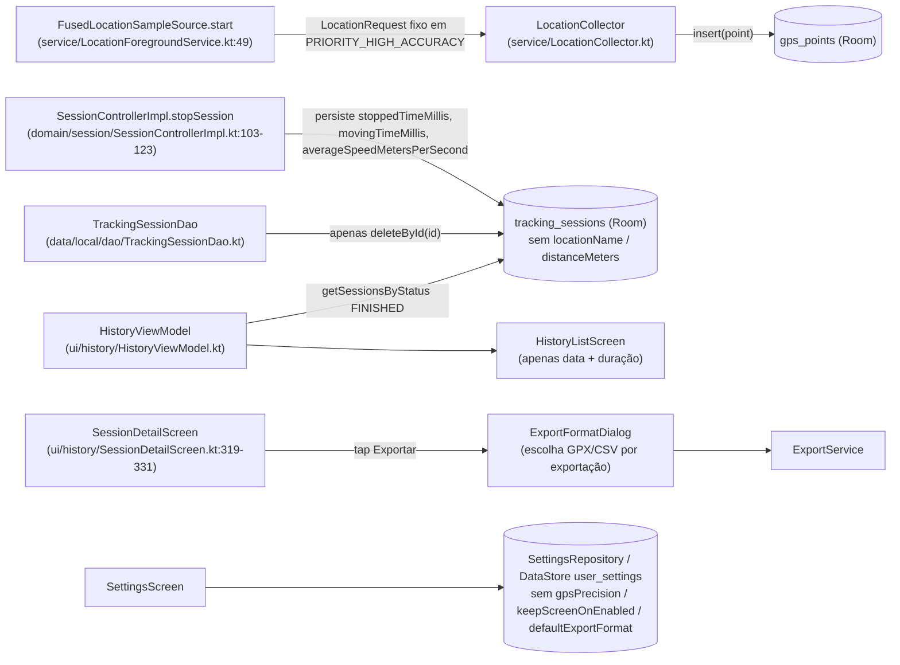
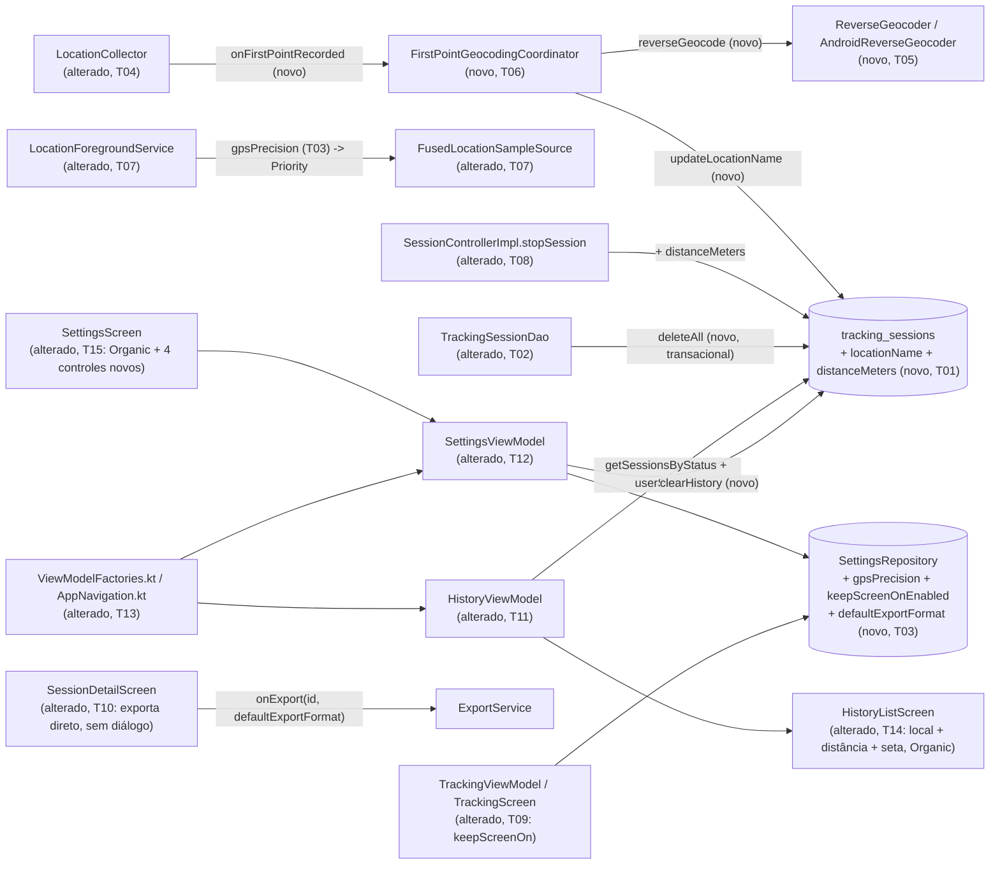

# Implementation Plan

## Request Summary
- Objective: redesign `HistoryListScreen` and `SettingsScreen` in the Organic design system, and add 4 new data/behavior capabilities (per-session reverse-geocoded location name, configurable GPS precision, keep-screen-on during an active session, default export format with no per-export dialog) plus a "clear all history" destructive action.
- Scope:
  - **In**: RF-01..RF-07, RF-10..RF-13, UI-01..UI-05, UI-07..UI-09, CT-01..CT-04, RNF-01..RNF-04 (see SPEC.md v1.1).
  - **Out**: retroactive geocoding/backfill for pre-existing sessions; automatic geocoding retry; API 30+ background-location two-step permission flow; any `TrackingScreen`/`SessionDetailScreen` change beyond keep-screen-on wiring (T09) and `SessionDetailScreen`'s "Exportar" using the default format (T10); the long-pause-alert toggle shown in the design mockup (explicitly removed by developer decision before this PLAN — RF-09 does not exist in SPEC.md v1.1).
- Tier: standard
- Architecture references: **missing** — no `AGENTS.md`, `docs/agents/`, or `.github/copilot-instructions.md` exists in this repository (confirmed: only `.spec/`, `app/`, `design_handoff_my_tracks/` at root). Developer explicitly confirmed proceeding without one, consistent with the prior `gps-tracking-prototype` feature in this same repo. This PLAN treats the current, verified source layout (package structure, existing conventions documented inline via KDoc across the codebase — e.g. "no DI framework anywhere, plain constructor injection", "Android-free where the logic is unit-testable") as the de facto architecture to preserve, and calls out below wherever a task's design choice was driven by that precedent rather than a written rule.

## AS IS — Componentes impactados

Hoje: nenhum ponto GPS dispara geocodificação; a precisão do `LocationRequest` está fixa no código; não existe `keepScreenOn`; toda exportação por sessão passa por `ExportFormatDialog`; não há exclusão em massa de sessões; o card de Histórico mostra apenas data e duração.

## TO BE — Componentes propostos

`FPC`/`RG`/`TS2.locationName` realizam RF-01/RF-02/RF-03 (T04-T07); `TS2.distanceMeters` realiza RF-13/CT-02 (T08); `TSD2.deleteAll` realiza RF-12/CT-04/RNF-03 (T02); `SR2`'s 3 novos campos realizam RF-04/RF-06/RF-10/CT-03 (T03); `TVM2` realiza RF-07/RNF-04 (T09); `SDS2` realiza RF-11 (T10); `HLS2` realiza UI-01/UI-02/UI-03/UI-09 (T11+T14); `SETS2` realiza UI-04/UI-05/UI-07/UI-08/UI-09 (T12+T15); `WIRE2` realiza the dependency plumbing both viewmodels need (T13).

## Tasks

### T01 — TrackingSessionEntity: add `locationName`/`distanceMeters`; bump DB version
- **Files**: `app/src/main/java/com/mytracksapp/data/local/entity/TrackingSessionEntity.kt`, `app/src/main/java/com/mytracksapp/data/local/AppDatabase.kt`
- **Change**: Add `val locationName: String? = null` and `val distanceMeters: Double = 0.0` to `TrackingSessionEntity`. Bump `@Database(version = 1, ...)` to `version = 2` and add `.fallbackToDestructiveMigration()` to the `Room.databaseBuilder(...)` chain in `AppDatabase.getInstance` (per SPEC's FLEXIBLE suggestion — `exportSchema = false`, no prior `Migration`, prototype stage with no shipped users, so a destructive migration is acceptable; a real `Migration` is not required). Instrumented tests use `Room.inMemoryDatabaseBuilder`, unaffected by this choice.
- **Covers**: CT-01, CT-02
- **Tests**: `app/src/androidTest/java/com/mytracksapp/data/local/TrackingSessionDaoTest.kt` — extend `insertSessionWithNPoints_readBack_returnsAllPointsWithFieldsIntact` (or add a new test) asserting `locationName`/`distanceMeters` round-trip through Room with their correct defaults (`null`/`0.0`) when omitted.
- **Risk**: Low — additive nullable/defaulted fields; destructive migration only affects real on-device DBs during development (explicitly acceptable per SPEC's FLEXIBLE section).
- **Dependencies**: none

### T02 — TrackingSessionDao: mass delete + location-name update
- **Files**: `app/src/main/java/com/mytracksapp/data/local/dao/TrackingSessionDao.kt`, plus every hand-written fake implementing this interface: `app/src/test/java/com/mytracksapp/domain/session/SessionControllerTest.kt` (`FakeTrackingSessionDao`), `app/src/test/java/com/mytracksapp/ui/history/HistoryViewModelTest.kt` (`FakeTrackingSessionDao`), `app/src/androidTest/java/com/mytracksapp/ui/history/HistoryListScreenTest.kt` (`FakeMutableTrackingSessionDao`), `app/src/androidTest/java/com/mytracksapp/ui/history/SessionDetailScreenTest.kt` (2 anonymous `object : TrackingSessionDao`), `app/src/androidTest/java/com/mytracksapp/ui/export/ExportFormatDialogTest.kt` (`FakeTrackingSessionDao`)
- **Change**: Add `@Transaction @Query("DELETE FROM tracking_sessions") suspend fun deleteAll()` (relies on `GpsPointEntity`'s existing `onDelete = CASCADE` to also remove every GPS point — no extra logic needed; `@Transaction` reinforces RNF-03's atomicity even though a single `DELETE` is already atomic in SQLite, making the intent explicit for future edits). Add `@Query("UPDATE tracking_sessions SET locationName = :locationName WHERE id = :sessionId") suspend fun updateLocationName(sessionId: String, locationName: String?)` — a targeted single-column update (not a full-row `@Update`) so it never races with `SessionControllerImpl.stopSession()`'s own concurrent full-row `update()` call. Every hand-written fake listed above must add compiling overrides for both new abstract members (mirroring each file's existing style — `error("not used in this test")` where the test never exercises them, or a working in-memory implementation where a test in this PLAN needs one).
- **Covers**: CT-04, RF-01 (persistence hook for the geocoded name), RF-12, RNF-03
- **Tests**: `TrackingSessionDaoTest.kt` — new test inserting N sessions with M GPS points each, calling `deleteAll()`, and asserting both `tracking_sessions` and `gps_points` are empty afterward (RF-12/RNF-03); new test calling `updateLocationName` and asserting only that column changed, other fields untouched (concurrent-safety intent).
- **Risk**: Medium — interface fan-out touches 5 test files beyond production code; a missed fake breaks compilation of an unrelated test suite. Mitigate by running the full `./gradlew test connectedAndroidTest` (or module-scoped equivalent) immediately after this task, before starting any dependent task.
- **Dependencies**: T01 (entity must already have `locationName` for `updateLocationName` to reference a real column)

### T03 — SettingsRepository/UserSettings: 3 new preferences
- **Files**: `app/src/main/java/com/mytracksapp/domain/model/GpsPrecision.kt` (new), `app/src/main/java/com/mytracksapp/data/settings/SettingsRepository.kt`, `app/src/androidTest/java/com/mytracksapp/data/settings/SettingsRepositoryTest.kt`
- **Change**: New enum `GpsPrecision { HIGH_ACCURACY, BALANCED }` (mirrors `SamplingInterval`'s plain-enum style) in a new file alongside `SamplingInterval`. Add to `UserSettings`: `gpsPrecision: GpsPrecision = GpsPrecision.HIGH_ACCURACY` (preserves today's hardcoded `PRIORITY_HIGH_ACCURACY` behavior for anyone who never touches the new setting — see Assumptions), `keepScreenOnEnabled: Boolean = true` (RF-06's explicit default), `defaultExportFormat: ExportFormat = ExportFormat.GPX` (RF-10's explicit default; reuse the existing `com.mytracksapp.domain.export.ExportFormat` enum — do not create a duplicate). Add matching `Keys` entries (`stringPreferencesKey`/`booleanPreferencesKey`) and `setGpsPrecision`/`setKeepScreenOnEnabled`/`setDefaultExportFormat` suspend setters, following the exact `edit { it[Keys.X] = ... }` pattern already used by the other 5 setters. Extend `Preferences.toUserSettings()` with the same `?.let { runCatching { valueOf(...) } }.getOrNull() ?: defaults.x` fallback pattern already used for `speedUnit`/`distanceUnit`.
- **Covers**: CT-03, RF-04, RF-06, RF-10
- **Tests**: `SettingsRepositoryTest.kt` — extend with 3 new test groups mirroring the existing ones: default value when never persisted, persistence round-trip after `set...`, survival across a fresh `SettingsRepository` instance pointed at the same `dataStoreName` (simulating an app restart, exactly as the existing tests already do for `samplingInterval`/`speedUnit`).
- **Risk**: Low — purely additive, follows an established, already-tested pattern in this exact file.
- **Dependencies**: none

### T04 — LocationCollector: fire-once "first point recorded" callback
- **Files**: `app/src/main/java/com/mytracksapp/service/LocationCollector.kt`, `app/src/test/java/com/mytracksapp/service/LocationCollectorTest.kt`
- **Change**: Add a constructor parameter `onFirstPointRecorded: (latitude: Double, longitude: Double) -> Unit = {}` (non-suspend, fire-and-forget — the caller decides how/whether to dispatch async work, keeping `LocationCollector` itself trivially fast per RNF-01). In `onLocationSample`, invoke it exactly once, only when `previousTimestamp` (captured before this point's `lastAcceptedTimestamp` update) is `null` — i.e., only for the session's true first accepted point, never on any subsequent point, and never again after a restart of collection for the same session instance (a fresh `LocationCollector` object is constructed per `onStartCommand`, matching one first-point trigger per RF-01's "exatamente uma tentativa").
- **Covers**: RF-01 (trigger point), RNF-01
- **Tests**: `LocationCollectorTest.kt` — new test asserting the callback fires exactly once with the first point's exact `(latitude, longitude)`; new test asserting it does NOT fire again for the 2nd/3rd points in the same session; new test asserting it never fires if `start()` returns `false` (no active session / no permission).
- **Risk**: Low — additive, defaulted parameter; no existing call site breaks.
- **Dependencies**: none

### T05 — ReverseGeocoder abstraction + Android implementation
- **Files**: `app/src/main/java/com/mytracksapp/domain/geocoding/ReverseGeocoder.kt` (new), `app/src/main/java/com/mytracksapp/service/AndroidReverseGeocoder.kt` (new)
- **Change**: New Android-free interface `ReverseGeocoder { suspend fun reverseGeocode(latitude: Double, longitude: Double): String? }` in a new `domain.geocoding` package (mirrors `LocationServiceController`'s "Android-free interface, Android-touching adapter elsewhere" convention already documented in `SessionControllerImpl.kt`). `AndroidReverseGeocoder(context: Context) : ReverseGeocoder` wraps `android.location.Geocoder(context, Locale.getDefault()).getFromLocation(latitude, longitude, 1)` inside `withContext(Dispatchers.IO)`, catching `IOException` (no network / no result) and treating a `null`/empty address list as failure — both map to returning `null`. On success, returns a single best-effort display string (`address.locality ?: address.subAdminArea ?: address.adminArea ?: address.featureName`, trimmed; blank result also maps to `null`). No retry logic anywhere in this class — RF-03 is satisfied structurally by this method being called at most once per invocation (the caller, T06, only ever calls it once per session).
- **Covers**: RF-01 (mechanism), RF-02
- **Tests**: none in this task — `AndroidReverseGeocoder` is a thin Android-SDK-touching adapter with no fake-able seam for `android.location.Geocoder` (a final Android framework class), consistent with this codebase's existing precedent of leaving `FusedLocationSampleSource` itself untested directly (its logic is validated through the Android-free class it feeds, here `FirstPointGeocodingCoordinator` in T06). The "single attempt, graceful failure, no retry" *logic* RF-01/02/03 actually require is unit-tested in T06 against a fake `ReverseGeocoder`.
- **Risk**: Low — isolated new files, no existing code touched.
- **Dependencies**: none

### T06 — FirstPointGeocodingCoordinator (geocode-once orchestration)
- **Files**: `app/src/main/java/com/mytracksapp/domain/geocoding/FirstPointGeocodingCoordinator.kt` (new), `app/src/test/java/com/mytracksapp/domain/geocoding/FirstPointGeocodingCoordinatorTest.kt` (new)
- **Change**: New Android-free class `FirstPointGeocodingCoordinator(private val reverseGeocoder: ReverseGeocoder, private val trackingSessionDao: TrackingSessionDao, private val coroutineScope: CoroutineScope)` exposing `fun onFirstPointRecorded(sessionId: String, latitude: Double, longitude: Double)`. Implementation: `coroutineScope.launch { val name = runCatching { reverseGeocoder.reverseGeocode(latitude, longitude) }.getOrNull()?.takeIf { it.isNotBlank() }; if (name != null) trackingSessionDao.updateLocationName(sessionId, name) }`. On any exception, `null` result, or blank result, this deliberately does nothing — the session's `locationName` stays at its `null` default (already satisfies RF-02's "permanece vazio" without an explicit write). Because this is invoked at most once per session (guaranteed by T04's LocationCollector contract) and never re-invoked afterward (no caller anywhere re-triggers it for an already-attempted session), RF-03's "nenhuma nova tentativa automática" holds structurally.
- **Covers**: RF-01, RF-02, RF-03, RNF-01 (the `coroutineScope.launch` returns immediately; the actual geocoding runs independently of the collection path)
- **Tests**: `FirstPointGeocodingCoordinatorTest.kt` (new, plain JVM, fakes for `ReverseGeocoder`/`TrackingSessionDao`) — success path calls `updateLocationName` with the geocoded name exactly once; `ReverseGeocoder` throwing an exception results in zero `updateLocationName` calls and no propagated exception; `ReverseGeocoder` returning `null`/blank results in zero `updateLocationName` calls; calling `onFirstPointRecorded` does not block the caller (assert via a `TestCoroutineScope`/`runTest` that the call returns before the fake `ReverseGeocoder`'s (artificially delayed) suspend function completes).
- **Risk**: Low — new, isolated, Android-free class with full unit coverage.
- **Dependencies**: T02 (needs `TrackingSessionDao.updateLocationName`), T05 (needs `ReverseGeocoder` interface)

### T07 — Wire geocoding + GPS precision into LocationForegroundService
- **Files**: `app/src/main/java/com/mytracksapp/service/LocationForegroundService.kt`, `app/src/test/java/com/mytracksapp/service/FusedLocationSampleSourceTest.kt` (new, mapping-only)
- **Change**: (1) Add a `priority: Int` constructor parameter to `FusedLocationSampleSource` (default `Priority.PRIORITY_HIGH_ACCURACY` to avoid breaking any other call site), used in place of the hardcoded value in `LocationRequest.Builder(priority, intervalMillis)`. (2) Add a small pure top-level function `fun GpsPrecision.toLocationRequestPriority(): Int = when (this) { GpsPrecision.HIGH_ACCURACY -> Priority.PRIORITY_HIGH_ACCURACY; GpsPrecision.BALANCED -> Priority.PRIORITY_BALANCED_POWER_ACCURACY }` in this same file (co-located with `Priority`'s existing import). (3) In `onStartCommand`: keep `startForeground(...)` as the first synchronous call (unchanged — avoids any ANR-adjacent delay), then move the settings-dependent construction (`FusedLocationSampleSource`, `LocationCollector`, the new `AndroidReverseGeocoder`/`FirstPointGeocodingCoordinator` from T05/T06) inside the existing `serviceScope.launch { ... }` block, reading `SettingsRepository(applicationContext).userSettings.first().gpsPrecision` once there (RNF-02: captured once per session start, before any point is requested, never re-read mid-session) and passing `onFirstPointRecorded = coordinator::onFirstPointRecorded` into `LocationCollector`'s new T04 parameter.
- **Covers**: RF-01, RF-02, RF-03, RF-05, RNF-01, RNF-02
- **Tests**: `FusedLocationSampleSourceTest.kt` (new) — plain JVM unit test asserting `GpsPrecision.HIGH_ACCURACY.toLocationRequestPriority() == Priority.PRIORITY_HIGH_ACCURACY` and `GpsPrecision.BALANCED.toLocationRequestPriority() == Priority.PRIORITY_BALANCED_POWER_ACCURACY` (both are plain integer constants from the Play Services `Priority` object, resolvable without a device/emulator, exactly like `SamplingInterval.seconds` today). The full `onStartCommand` wiring itself is not directly unit-tested (no existing test harness for the `Service` class does this today either — its correctness relies on `LocationCollectorTest`/`LocationForegroundServiceStartGuardTest`/`FirstPointGeocodingCoordinatorTest` already covering every piece it assembles).
- **Risk**: Medium — restructures `onStartCommand`'s control flow (moving construction into the launched coroutine); mitigate by keeping `startForeground()` and the `sessionId`/`interval` null-guard exactly where they are today (before the `launch`), only moving the settings-dependent object construction.
- **Dependencies**: T03 (GpsPrecision + SettingsRepository field), T04 (LocationCollector's new parameter), T06 (FirstPointGeocodingCoordinator)

### T08 — Persist total distance on session stop
- **Files**: `app/src/main/java/com/mytracksapp/domain/session/SessionControllerImpl.kt`, `app/src/test/java/com/mytracksapp/domain/session/SessionControllerTest.kt`, `app/src/androidTest/java/com/mytracksapp/e2e/TrackingSessionE2ETest.kt`
- **Change**: In `stopSession`, compute `val distanceMeters = StatsEngine.totalDistanceMeters(points)` (points are already fetched for the existing classification/average-speed computation — no new query) and include `distanceMeters = distanceMeters` in the `existing.copy(...)` call alongside `stoppedTimeMillis`/`movingTimeMillis`/`averageSpeedMetersPerSecond`.
- **Covers**: RF-13, CT-02
- **Tests**: `SessionControllerTest.kt` — extend `stopping a session ... persists them as FINISHED` to assert `stored.distanceMeters` equals `StatsEngine.totalDistanceMeters(points)` for the test's known 2-point fixture. `TrackingSessionE2ETest.kt` — extend the full-lifecycle test to assert `finishedSession.distanceMeters` matches `StatsEngine.totalDistanceMeters(finalPoints)` recomputed independently, mirroring the existing pattern for `averageSpeedMetersPerSecond`.
- **Risk**: Low — single additional field on an already-computed value, in an already-covered code path.
- **Dependencies**: T01 (entity field), T02 (this task edits the same `SessionControllerTest.kt` T02 also touches — sequenced after it to avoid conflicting edits)

### T09 — Keep screen active during a tracking session
- **Files**: `app/src/main/java/com/mytracksapp/ui/tracking/TrackingViewModel.kt`, `app/src/main/java/com/mytracksapp/ui/tracking/TrackingScreen.kt`, `app/src/test/java/com/mytracksapp/ui/tracking/TrackingViewModelTest.kt`, `app/src/androidTest/java/com/mytracksapp/ui/tracking/TrackingScreenTest.kt`
- **Change**: Add `keepScreenOnEnabled: Boolean = true` to `TrackingUiState`, populated from the existing `settingsRepository.userSettings` combine in `TrackingViewModel.init` (the flow is already collected there — this is one more field on the same `.copy(...)`). In `TrackingScreen`, add a `DisposableEffect(uiState.keepScreenOnEnabled)` using `LocalView.current` to set `keepScreenOn = uiState.keepScreenOnEnabled` on entry/whenever the preference changes while this screen is composed, and reset `keepScreenOn = false` in `onDispose` — scoping the effect strictly to this screen's composition lifecycle (RNF-04: no other screen is touched, and leaving the screen always restores the OS default).
- **Covers**: RF-07, RNF-04 (RF-06's persistence itself is covered by T03)
- **Tests**: `TrackingViewModelTest.kt` — assert `uiState.keepScreenOnEnabled` reflects `SettingsRepository`'s current value and reacts to a live change. `TrackingScreenTest.kt` — instrumented test asserting `composeTestRule.activity.window.decorView` (or the composed `View`) has `keepScreenOn == true` when the setting is enabled, and `== false` after the screen leaves composition (e.g., via `composeTestRule.setContent {}` swapping content, mirroring how other lifecycle-scoped effects are tested elsewhere in this suite).
- **Risk**: Medium — `FLAG_KEEP_SCREEN_ON`/`View.keepScreenOn` interacts with the real window; must verify `onDispose` reliably resets it so Histórico/Configurações/`SessionDetailScreen` are never affected (RNF-04's explicit constraint).
- **Dependencies**: T03 (`keepScreenOnEnabled` preference)

### T10 — SessionDetailScreen exports directly with the default format
- **Files**: `app/src/main/java/com/mytracksapp/ui/history/SessionDetailScreen.kt`, `app/src/androidTest/java/com/mytracksapp/ui/export/ExportFormatDialogTest.kt`, `app/src/androidTest/java/com/mytracksapp/ui/history/SessionDetailScreenTest.kt`, `app/src/androidTest/java/com/mytracksapp/ui/history/SessionDetailExportTest.kt` (new)
- **Change**: Add `defaultExportFormat: ExportFormat = ExportFormat.GPX` to `SessionDetailUiState`, populated from the existing `settingsRepository.userSettings` combine in `SessionDetailViewModel.init` (same combine already in place, one more field). In `SessionDetailScreen`, remove `showExportDialog` state and the `ExportFormatDialog` composable call; the export button's `onClick` becomes `{ coroutineScope.launch { onExport(uiState.sessionId, uiState.defaultExportFormat) } }` directly (RF-11: no intermediate dialog for this per-session export path). `ExportFormatDialog.kt`/`ExportFormatDialogTestTags` are kept as a standalone, no-longer-wired-into-production composable (SPEC does not require deleting it — see Assumptions).
- **Covers**: RF-11
- **Tests**: Redistribute `ExportFormatDialogTest.kt`'s current tests (all of which drive `SessionDetailScreen`, not the dialog in isolation): move `exportActionIsHiddenForAnActiveNonFinishedSession`/`exportActionIsVisibleForAFinishedSession` into `SessionDetailScreenTest.kt` (they test the export button's visibility, unrelated to the dialog). Create `SessionDetailExportTest.kt` (new) with the direct-export behavior: tapping the export action with `defaultExportFormat = CSV` invokes `onExport(sessionId, ExportFormat.CSV)` with zero intermediate UI, and `ExportFormatDialogTestTags.DIALOG` never appears in the node tree at any point during the interaction. Slim `ExportFormatDialogTest.kt` down to unit-test the standalone `ExportFormatDialog` composable directly (renders GPX/CSV/Cancel, invokes `onFormatSelected`/`onDismissRequest`) — it no longer references `SessionDetailScreen` at all.
- **Risk**: Medium — this task invalidates most of an existing, currently-passing test file's premise; must be done as one deliberate rewrite, not a partial edit, to avoid leaving stale assertions that silently pass against removed behavior.
- **Dependencies**: T03 (`defaultExportFormat` preference), T02 (this task edits `SessionDetailScreenTest.kt`/`ExportFormatDialogTest.kt`, both also touched by T02 — sequenced after it)

### T11 — HistoryViewModel: location name, distance, unit-aware formatting
- **Files**: `app/src/main/java/com/mytracksapp/ui/history/HistoryViewModel.kt`, `app/src/test/java/com/mytracksapp/ui/history/HistoryViewModelTest.kt`
- **Change**: Add a `settingsRepository: SettingsRepository` constructor parameter. Replace the current single-flow `collect` with a `combine(trackingSessionDao.getSessionsByStatus(FINISHED), settingsRepository.userSettings) { sessions, settings -> ... }` (mirrors the exact pattern already used in `SessionDetailViewModel`/`TrackingViewModel`). Add `locationName: String?` and `distanceMeters: Double` to `HistoryListItem`, plus a `formattedLocationName: String` computed property (returns `locationName` when non-blank, else a generic placeholder string — e.g. `"Local não identificado"`, exact copy non-blocking per SPEC's UI-01 AC which only requires "non-empty, never literally blank/null") and a `distanceUnit`-aware `formattedDistance(unit: DistanceUnit): String` helper (or store the resolved `distanceUnit` directly on the item, reusing `DistanceFormatter.toDisplayValue` + `unit.displaySuffix`, matching `SessionDetailScreen`'s existing formatting call site).
- **Covers**: RF-13 (data availability for History), UI-01, UI-02 (data side)
- **Tests**: `HistoryViewModelTest.kt` — extend the fake `TrackingSessionDao` fixtures with `locationName`/`distanceMeters` values and assert they surface unmapped on `HistoryListItem`; a session with `locationName = null` maps to the generic placeholder via `formattedLocationName`; changing `SettingsRepository`'s `distanceUnit` live re-renders the formatted distance (same "settings react live" pattern already proven for `SessionDetailViewModel`).
- **Risk**: Low — additive fields, established combine pattern already proven twice elsewhere in this codebase.
- **Dependencies**: T01 (entity fields), T02 (this task edits `HistoryViewModelTest.kt`, also touched by T02 — sequenced after it), T03 (`SettingsRepository`)

### T12 — SettingsViewModel: GPS precision, keep-screen-on, export format, clear history
- **Files**: `app/src/main/java/com/mytracksapp/ui/settings/SettingsViewModel.kt`, `app/src/androidTest/java/com/mytracksapp/ui/settings/SettingsViewModelTest.kt` (new)
- **Change**: Add a `trackingSessionDao: TrackingSessionDao` constructor parameter. Add `gpsPrecision`, `keepScreenOnEnabled`, `defaultExportFormat` to `SettingsUiState`, populated from the existing `settingsRepository.userSettings.collect` in `init` (same collect already in place, three more fields — these are enum/boolean-backed and persist immediately on selection, exactly like `samplingInterval`/`speedUnit`/`distanceUnit` today, per UI-04/UI-05/UI-07's "no Save button" requirement). Add `onGpsPrecisionSelected`, `onKeepScreenOnToggled`, `onDefaultExportFormatSelected` — each a one-line `viewModelScope.launch { settingsRepository.setX(value) }`, mirroring `onSamplingIntervalSelected`. Add `fun clearHistory() { viewModelScope.launch { trackingSessionDao.deleteAll() } }` — the caller (the screen, T15) is responsible for confirming with the user before calling this, exactly matching `HistoryViewModel.deleteSession`'s existing "caller confirms first" contract.
- **Covers**: RF-04, RF-06, RF-10, RF-12 (state/data side); enables UI-04, UI-05, UI-07, UI-08
- **Tests**: `SettingsViewModelTest.kt` (new, androidTest — needs a real `SettingsRepository`/DataStore like `SettingsScreenTest.kt` does, but exercises the `ViewModel` directly without Compose, using a fake `TrackingSessionDao` for `clearHistory`) — selecting each of the 3 new options persists immediately via `SettingsRepository`; `clearHistory()` calls `trackingSessionDao.deleteAll()` exactly once.
- **Risk**: Low — additive, mirrors 3 already-proven patterns in the same file plus `HistoryViewModel`'s existing delete-with-caller-confirmation contract.
- **Dependencies**: T02 (`TrackingSessionDao.deleteAll`), T03 (3 new preferences)

### T13 — Wire new ViewModel dependencies into factories and navigation
- **Files**: `app/src/main/java/com/mytracksapp/ui/ViewModelFactories.kt`, `app/src/main/java/com/mytracksapp/ui/navigation/AppNavigation.kt`
- **Change**: Update `HistoryViewModelFactory` to also take `settingsRepository: SettingsRepository` and pass it to `HistoryViewModel(...)`. Update `SettingsViewModelFactory` to also take `trackingSessionDao: TrackingSessionDao` and pass it to `SettingsViewModel(...)`. Update `HistoryRoute`'s and `SettingsRoute`'s call sites in `AppNavigation.kt` to pass the already-available `settingsRepository`/`trackingSessionDao` (both are already threaded into `MyTracksApp`'s top-level parameters — no new dependency needs to be constructed in `MainActivity.kt`).
- **Covers**: enables T11/T12's new constructor parameters to actually reach production
- **Tests**: none new (pure wiring; covered transitively by any instrumented test that exercises `MyTracksApp`/`HistoryRoute`/`SettingsRoute`, and directly by T11/T12/T14/T15's own tests which construct the ViewModels explicitly rather than through these factories).
- **Risk**: Low — mechanical constructor-signature threading, no new logic.
- **Dependencies**: T11, T12

### T14 — HistoryListScreen: Organic redesign + location/distance/arrow
- **Files**: `app/src/main/java/com/mytracksapp/ui/history/HistoryListScreen.kt`, `app/src/androidTest/java/com/mytracksapp/ui/history/HistoryListScreenTest.kt`
- **Change**: Restyle the card per `design_handoff_my_tracks/my-tracks-design.html`'s "Histórico" section and `organic-styles.css` tokens (already available via `com.mytracksapp.ui.theme.*`, the same tokens `TrackingScreen`/`SessionDetailScreen` already use — `ColorSurface`/`Neutral700`/`headingFontFamily`/`bodyFontFamily`/`MaterialTheme.shapes.large`): card background `ColorSurface`, `radius-lg`, `locationName` (from T11) as the 15px/700 headline, a secondary 13px `Neutral700` line reading "`{data}` · Duração: `{duração}` · `{distância}`" (UI-02's exact reading order: date, duration, distance), and a trailing chevron/arrow icon (`Icons.Filled.ChevronRight` or `KeyboardArrowRight`) signaling tap-ability (UI-03). Preserve the existing swipe-to-delete gesture, confirmation dialog, and all existing test tags unchanged — only the row's visual content and the two new sub-elements are added; add new test tags for the location-name text, distance text, and arrow icon (e.g. `itemLocationName(sessionId)`, `itemDistance(sessionId)`, `ARROW_ICON` per-row via `itemArrow(sessionId)`).
- **Covers**: UI-01, UI-02, UI-03, UI-09
- **Tests**: `HistoryListScreenTest.kt` — extend `rowShowsDurationAndFormattedDateButNeverTheRawSessionId`-style tests to also assert the location name (or its generic placeholder when absent), the distance text, and the arrow icon are all displayed; keep the existing swipe/click/empty-state tests passing unmodified (they assert on the row container, not its internal layout).
- **Risk**: Low-Medium — a visual rewrite of an already-tested screen; the swipe-to-dismiss/`AlertDialog` logic must be preserved byte-for-byte in behavior even as the row's inner `Column`/`Row` layout changes.
- **Dependencies**: T02 (this task edits `HistoryListScreenTest.kt`, also touched by T02 — sequenced after it), T11 (`HistoryListItem`'s new fields)

### T15 — SettingsScreen: Organic redesign + 4 new controls
- **Files**: `app/src/main/java/com/mytracksapp/ui/settings/SettingsScreen.kt`, `app/src/androidTest/java/com/mytracksapp/ui/settings/SettingsScreenTest.kt`
- **Change**: Restyle per `design_handoff_my_tracks/my-tracks-design.html`'s "Configurações" section (section labels 13px/700 uppercase `Neutral600`, `.seg`/`.seg-opt`-style segmented controls reusing `PillShape`/theme colors, pill switches per `organic-styles.css`'s 44×26/20dp spec) while preserving every existing control's behavior unchanged: the 10-value `SamplingInterval` selector (UI-09's explicit "not the mockup's 5-value subset" requirement), speed/distance unit segmented controls, and the two numeric stop-radius/stop-duration fields with their commit-on-Done/focus-loss semantics — none of these lose functionality or test tags. Add 4 new sections, in the mockup's order: (1) "Precisão do GPS" segmented control (`GpsPrecision.HIGH_ACCURACY`/`BALANCED`, immediate persistence via `onGpsPrecisionSelected`, UI-04); (2) "Manter tela ativa durante a sessão" pill switch (immediate persistence via `onKeepScreenOnToggled`, UI-05 — the mockup's second toggle, "Alerta de pausa longa", is intentionally NOT rendered, per this feature's explicit scope); (3) "Formato de exportação" control showing the current value (GPX/CSV) with immediate persistence via `onDefaultExportFormatSelected` (UI-07); (4) a destructive "Limpar histórico de trilhas" action that opens a confirmation `AlertDialog` (same visual/interaction pattern as `HistoryListScreenTestTags.DELETE_CONFIRM_DIALOG`) before calling `viewModel.clearHistory()` only on explicit confirmation (UI-08).
- **Covers**: UI-04, UI-05, UI-07, UI-08, UI-09
- **Tests**: `SettingsScreenTest.kt` — extend with: selecting each `GpsPrecision` option persists immediately; toggling the keep-screen-on switch persists immediately; selecting GPX/CSV in the export-format control persists immediately; tapping "Limpar histórico de trilhas" opens the confirmation dialog and does NOT call `deleteAll()` until the confirm button is tapped (mirroring `HistoryListScreenTest.kt`'s existing swipe/confirm/cancel test trio, now using a fake `TrackingSessionDao` injected via the T12 `SettingsViewModel` constructor); the existing sampling-interval/unit/stop-radius/stop-duration tests continue to pass unmodified against the restyled layout.
- **Risk**: Medium — largest single-screen change in this PLAN (visual rewrite + 4 new interactive controls in one file); mitigate by keeping every existing control's Composable subtree and test tags untouched, only restyling their containers and appending the 4 new sections after them.
- **Dependencies**: T03 (preferences), T12 (`SettingsViewModel`'s new state/actions)

## Execution Phases

| Phase | Tasks | Parallel-safe? |
|-------|-------|----------------|
| 1 | T01, T03, T04, T05 | Yes — 4 mutually file-disjoint, dependency-free tasks |
| 2 | T02, T09 | Yes — T02 (DAO+fakes) and T09 (TrackingViewModel/TrackingScreen) touch entirely disjoint files; both only need Phase 1 |
| 3 | T06, T08, T10, T11, T12 | Yes — 5 mutually file-disjoint tasks; each depends only on Phase 1/2 outputs (T02, T03, T05 as applicable) |
| 4 | T07, T13, T14, T15 | Yes — 4 mutually file-disjoint tasks; each depends only on Phase 1-3 outputs (T03/T04/T06 for T07; T11/T12 for T13; T02/T11 for T14; T03/T12 for T15) |

## Risks

| Risk | Blast radius | Mitigation | Rollback |
|------|-------------|------------|----------|
| `AppDatabase` destructive migration (T01) wipes any existing on-device history when the schema version bumps | All installed dev/test devices' local history | Explicitly accepted per SPEC's FLEXIBLE section at prototype stage, no shipped users; document the version bump in the task's commit | Revert the version bump and entity fields |
| `TrackingSessionDao` interface fan-out (T02) touches 5 hand-written fakes across unit + instrumented suites | Full test suite compiles as one unit; a missed fake breaks unrelated tests | T02 explicitly enumerates every fake file to update; run the full test suite immediately after T02, before any dependent task starts | Revert T02's interface change |
| Removing `ExportFormatDialog` from `SessionDetailScreen`'s flow (T10) invalidates most of `ExportFormatDialogTest.kt`'s existing premise | Test suite only, no production risk | T10 explicitly redistributes/rewrites the affected tests in the same task (not left dangling) | Revert T10 |
| `LocationForegroundService.onStartCommand` restructuring (T07) moves settings-dependent object construction inside the launched coroutine | Session start reliability (RF-01/RF-05) | Keep `startForeground()` and the session id/interval null-guard exactly where they are today, synchronously, before the `launch`; only the already-async-safe construction moves | Revert to the prior synchronous construction with a hardcoded `PRIORITY_HIGH_ACCURACY` |
| `View.keepScreenOn` (T09) is a real, global window flag; an `onDispose` that fails to reset it would leak the effect to Histórico/Configurações/`SessionDetailScreen`, violating RNF-04 | User's device battery/screen behavior outside the tracking screen | `DisposableEffect`'s `onDispose` explicitly sets `keepScreenOn = false`; instrumented test in T09 asserts the flag is cleared once the screen leaves composition | Remove the `DisposableEffect`, falling back to OS-default screen timeout everywhere (safe default) |
| "Limpar histórico de trilhas" (T12/T15/RF-12) is an irreversible destructive action by design | User's entire tracking history | Mandatory confirmation dialog (UI-08) reusing the already-established `HistoryListScreenTestTags.DELETE_CONFIRM_DIALOG` visual/interaction pattern; `@Transaction`-wrapped `deleteAll()` (RNF-03) so a mid-operation failure never leaves a partially-cleared DB | None by design (accepted risk of the feature itself, not a defect) |

## Open Questions

- **No `AGENTS.md`/architecture doc exists.** Per process this must be flagged rather than silently assumed away — the developer has explicitly confirmed proceeding without one (same precedent as the prior `gps-tracking-prototype` feature in this repo), so this is not treated as a blocker, but no task in this PLAN can be described as "architecture-validated" in the sense of a written, authoritative source; conventions cited throughout (e.g. "no DI framework", "Android-free where testable") are inferred from the existing, verified source code and its own KDoc, not from a governance document.
- **`GpsPrecision`'s default value is not specified by RF-04** (unlike RF-06's explicit `true` default and RF-10's explicit `GPX` default). T03 assumes `HIGH_ACCURACY` to preserve today's hardcoded, unconditional `PRIORITY_HIGH_ACCURACY` behavior for any user who never touches the new control — flagging for developer confirmation since a different default (e.g. `BALANCED`, favoring battery) would also be a defensible reading of "no default stated."
- **Should `ExportFormatDialog.kt`/`ExportFormatDialogTestTags` be deleted** once no production screen wires it in anymore (T10), or kept as a standalone, currently-unused component? SPEC's Scope/RIGID never mandates removal (only that the per-session export path stop showing it) — T10 keeps it as the least-destructive, most-reversible choice; flagging in case the developer prefers dead-code removal instead.

## Assumptions

- `GpsPrecision` default = `HIGH_ACCURACY` — see Open Questions; chosen to match the current unconditional `Priority.PRIORITY_HIGH_ACCURACY` in `FusedLocationSampleSource.start` (verified at `LocationForegroundService.kt:49`), so existing behavior is unchanged until a user explicitly opts into "Equilibrada".
- `AppDatabase`'s schema-version bump uses `fallbackToDestructiveMigration()` rather than a hand-written `Migration` — explicitly offered as acceptable by SPEC's FLEXIBLE section given the prototype stage (`exportSchema = false`, no prior migration ever written).
- The generic location-name placeholder string (UI-01's "rótulo padrão/genérico") is left as an implementation-time copy decision (e.g. "Local não identificado") — the RIGID AC only requires it be non-blank/non-null, not a specific literal string.
- `TrackingScreen`'s own "Exportar" button remains an unchanged no-op `Toast` — RF-11's real export-without-dialog requirement is scoped to `SessionDetailScreen` only (the only screen where export actually calls `ExportService` today; confirmed by SPEC's own Scope section: "qualquer mudança em TrackingScreen ... além do necessário para manter-tela-ativa e para o botão 'Exportar' usar o formato padrão" — `TrackingScreen`'s button never reaches `ExportService` today, so there is no dialog-removal work applicable there).
- The design mockup's second toggle, "Alerta de pausa longa", is intentionally NOT implemented anywhere in this PLAN — the feature was explicitly removed by developer decision before SPEC.md v1.1 was finalized (confirmed: SPEC's RIGID section has no RF-09, unlike RF-07/RF-10's neighbors), so T15 renders only the "Manter tela ativa" toggle from that mockup section.
- Reverse geocoding (T05) relies on the `INTERNET`/`ACCESS_NETWORK_STATE` permissions already merged transitively via the Google Maps SDK dependency (confirmed in SPEC's Context section); no new `AndroidManifest.xml` permission declaration is added by this PLAN.
- `ExportFormatDialog.kt` is kept, not deleted, once unwired from `SessionDetailScreen` (T10) — see Open Questions.
