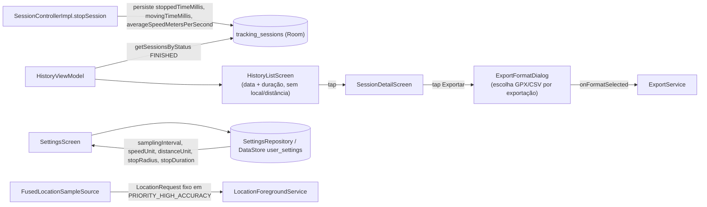
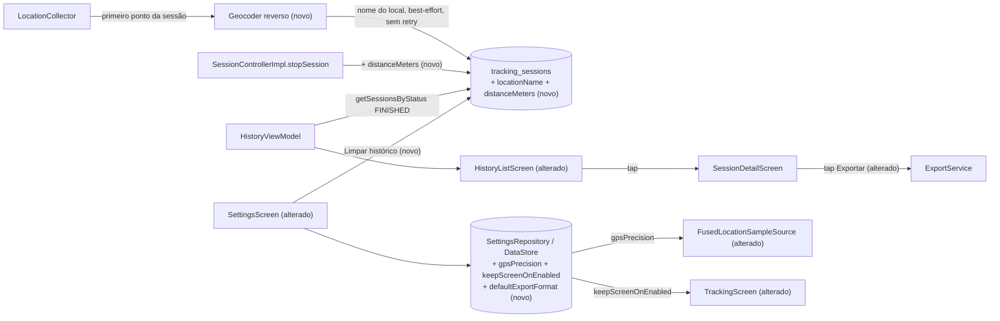

# SPEC: history-settings-redesign

## Metadata
- Source: developer description via /plan
- Service: my-tracks-app (Android/Kotlin/Compose, single repo)
- Tier: standard
- Version: 1.1
- Architecture references: missing — no `AGENTS.md`, `docs/agents/`, or `.github/copilot-instructions.md` found in the repository (verified: only `.spec/`, `app/`, `design_handoff_my_tracks/` exist at root). Developer confirmed proceeding without one; per process this is still flagged below rather than silently assumed.

## Context
My Tracks já implementou um protótipo completo de rastreamento GPS (`.spec/features/gps-tracking-prototype/SPEC.md`) e, em fases de acompanhamento não documentadas formalmente, adicionou: `SettingsRepository` (DataStore Preferences) com `UserSettings(samplingInterval, speedUnit, distanceUnit, stopRadiusMeters, stopDurationMillis)`; swipe-to-delete por sessão em `HistoryListScreen`; e o design system "Organic" (paleta terracota/sage, fontes Caprasimo/Figtree) já aplicado a `TrackingScreen` (e, em uma frente separada deste plano, a `SessionDetailScreen`).

Esta feature redesenha **Histórico** (`HistoryListScreen`) e **Configurações** (`SettingsScreen`) no design Organic e adiciona 4 capacidades novas de dados/comportamento: (1) nome de local via geocodificação reversa por sessão, (2) precisão de GPS configurável, (3) manter tela ativa durante a sessão, (4) formato de exportação padrão sem diálogo por exportação, além de uma ação de limpar todo o histórico.

Investigação do código confirma lacunas que este SPEC precisa fechar:
- `TrackingSessionEntity` (verified at `app/src/main/java/com/mytracksapp/data/local/entity/TrackingSessionEntity.kt:35-45`) não tem campo de nome de local nem de distância total persistida — apenas `stoppedTimeMillis`, `movingTimeMillis`, `averageSpeedMetersPerSecond` são gravados em `SessionControllerImpl.stopSession()` (verified at `app/src/main/java/com/mytracksapp/domain/session/SessionControllerImpl.kt:113-122`).
- `HistoryListItem`/`HistoryViewModel` (verified at `app/src/main/java/com/mytracksapp/ui/history/HistoryViewModel.kt:24-47`) hoje só exibem data + duração; não há nome de local nem distância.
- `LocationForegroundService.kt`'s `FusedLocationSampleSource.start()` constrói `LocationRequest.Builder(Priority.PRIORITY_HIGH_ACCURACY, intervalMillis)` com a prioridade **fixa** no código (verified at `app/src/main/java/com/mytracksapp/service/LocationForegroundService.kt:49`), não configurável hoje.
- Não existe nenhum uso de `FLAG_KEEP_SCREEN_ON`/`keepScreenOn` no código (grep sem resultados) — a funcionalidade de manter tela ativa é inteiramente nova.
- `ExportFormatDialog` (verified at `app/src/main/java/com/mytracksapp/ui/export/ExportFormatDialog.kt`) hoje é exibido a cada toque em "Exportar" em `SessionDetailScreen` (verified at `app/src/main/java/com/mytracksapp/ui/history/SessionDetailScreen.kt:319-331, 430-438`) — este SPEC retira esse diálogo do caminho de exportação por sessão.
- `TrackingSessionDao` (verified at `app/src/main/java/com/mytracksapp/data/local/dao/TrackingSessionDao.kt`) só tem `deleteById(sessionId)`; não há operação de exclusão em massa. O FK `GpsPointEntity -> TrackingSessionEntity` já usa `onDelete = ForeignKey.CASCADE` (verified at `app/src/main/java/com/mytracksapp/data/local/entity/GpsPointEntity.kt:31-36`), então uma exclusão em massa de sessões já arrasta os pontos GPS associados sem lógica adicional.
- O `AndroidManifest.xml` (verified at `app/src/main/AndroidManifest.xml:4-7`) não declara `INTERNET` explicitamente; a dependência do Google Maps SDK já mescla `INTERNET`/`ACCESS_NETWORK_STATE` transitivamente (fato já confirmado em fase anterior) — a geocodificação reversa (AC1) depende dessa permissão transitiva, e este SPEC não adiciona uma declaração explícita nova.
- `design_handoff_my_tracks/README.md` e `my-tracks-design.html` descrevem o layout exato de Histórico e Configurações no design Organic (cartões, segmented controls, switches pill, cartão de dados) — usados como referência de UI/interação abaixo; os valores ilustrativos do mockup (ex.: dropdown de intervalo do GPS com apenas 5 opções) NÃO substituem o conjunto real de 10 valores de `SamplingInterval` (verified at `app/src/main/java/com/mytracksapp/domain/model/SamplingInterval.kt:16-27`).

## AS IS — Estado atual

Histórico hoje mostra apenas data e duração por sessão (sem local, sem distância, sem seta explícita). Configurações não tem controles de precisão de GPS, tela ativa, alerta de pausa ou formato padrão de exportação; exportar sempre abre um diálogo de escolha de formato.

## TO BE — Estado proposto

`NEW_GEO` realiza RF-01/RF-02/RF-03; `locationName`/`distanceMeters` em `DB2` realizam CT-01/CT-02/RF-13. `HistoryListScreen (alterado)` realiza UI-01/UI-02/UI-03/UI-09. `SettingsScreen (alterado)` e `SettingsRepository` realizam RF-04 a RF-12 e UI-04 a UI-09.

## Scope
- **In**: redesign visual (Organic) de Histórico e Configurações; nome de local por sessão (geocodificação reversa best-effort); exibição de distância total no card de Histórico; seleção de precisão de GPS; toggle de manter tela ativa; seleção de formato de exportação padrão e remoção do diálogo por exportação individual; ação de limpar todo o histórico com confirmação.
- **Out**: geocodificação reversa retroativa para sessões já existentes antes desta feature (campo fica vazio/rótulo genérico para elas, sem backfill); qualquer retry automático de geocodificação; correção do fluxo de permissão de localização em segundo plano (API 30+, já documentado como limitação conhecida em `AppNavigation.kt`); qualquer mudança em `TrackingScreen`/`SessionDetailScreen` além do necessário para manter-tela-ativa e para o botão "Exportar" usar o formato padrão.

## RIGID (Non-Negotiable)

### Functional Requirements

- RF-01 [Event-Driven]: QUANDO o primeiro ponto GPS de uma sessão é registrado, o sistema DEVE iniciar uma única tentativa de geocodificação reversa (Android Geocoder) a partir das coordenadas desse ponto, de forma assíncrona (sem bloquear a coleta de pontos subsequentes nem o encerramento da sessão).
  - AC: para toda sessão com ao menos 1 ponto GPS, existe exatamente uma tentativa de geocodificação reversa disparada a partir do primeiro ponto, e a coleta de pontos GPS continua normalmente antes, durante e depois dessa tentativa.

- RF-02 [Unwanted Behavior]: SE a tentativa de geocodificação reversa falhar (sem rede, sem sinal, ou o provedor não retornar um resultado), ENTÃO o sistema NÃO DEVE impedir, atrasar ou interromper a gravação de pontos GPS da sessão, e o nome de local da sessão permanece vazio.
  - AC: uma sessão gravada sem conectividade de rede disponível encerra normalmente, com todos os seus pontos GPS persistidos, e seu `locationName` é `null`/vazio.

- RF-03 [Constraint / Unwanted Behavior]: o sistema NÃO DEVE realizar nenhuma nova tentativa automática de geocodificação reversa para uma sessão cuja tentativa inicial já falhou.
  - AC: após uma falha na tentativa inicial, nenhuma chamada adicional ao Geocoder ocorre para a mesma sessão em nenhum momento posterior (reabertura do app, reabertura da tela de detalhe, etc.).

- RF-04 [State-Driven]: o sistema DEVE persistir a preferência "Precisão do GPS" do usuário, com os dois valores possíveis "Alta (mais bateria)" e "Equilibrada", sobrevivendo a reinícios do app.
  - AC: selecionar uma das duas opções em Configurações e reiniciar o app preserva a opção selecionada.

- RF-05 [Conditional]: SE a preferência de precisão de GPS estiver definida como "Alta (mais bateria)" QUANDO uma nova sessão de coleta iniciar, ENTÃO o `LocationRequest` construído para essa sessão DEVE usar `Priority.PRIORITY_HIGH_ACCURACY`; SE estiver definida como "Equilibrada", ENTÃO DEVE usar `Priority.PRIORITY_BALANCED_POWER_ACCURACY` (classe `Priority` já importada em `LocationForegroundService.kt:18`; `PRIORITY_BALANCED_POWER_ACCURACY` é membro documentado do mesmo enum, ainda não referenciado no código). A mudança de preferência NÃO se aplica retroativamente a uma sessão de coleta já em andamento.
  - AC: com precisão "Equilibrada" configurada, iniciar uma nova sessão resulta em um `LocationRequest` com `PRIORITY_BALANCED_POWER_ACCURACY`; alterar a preferência enquanto uma sessão já está coletando não altera o `LocationRequest` daquela sessão em andamento.

- RF-06 [State-Driven]: o sistema DEVE persistir a preferência "Manter tela ativa durante a sessão" (booleana), com valor padrão `true` quando nunca configurada, sobrevivendo a reinícios do app.
  - AC: em uma instalação nova (sem preferência persistida), o valor efetivo é `true`; alterar e reiniciar o app preserva o valor escolhido.

- RF-07 [State-Driven]: ENQUANTO uma sessão de coleta estiver ativa E a preferência "Manter tela ativa durante a sessão" estiver ativada, a tela de sessão ativa DEVE impedir o apagamento automático da tela do dispositivo; ENQUANTO a preferência estiver desativada, o comportamento padrão do sistema operacional se aplica sem interferência do app.
  - AC: com a preferência ativada, a tela do dispositivo permanece acesa continuamente durante uma sessão ativa exibida em primeiro plano, mesmo além do timeout de tela configurado no sistema; com a preferência desativada, o timeout de tela do sistema ocorre normalmente durante a mesma sessão.

- RF-10 [State-Driven]: o sistema DEVE persistir a preferência "Formato de exportação padrão", com os dois valores possíveis GPX e CSV, valor padrão GPX quando nunca configurada, sobrevivendo a reinícios do app.
  - AC: em uma instalação nova, o valor efetivo é GPX; alterar e reiniciar o app preserva o valor escolhido.

- RF-11 [Event-Driven]: QUANDO o usuário aciona a ação "Exportar" em qualquer tela que a exponha, o sistema DEVE exportar diretamente a sessão no formato configurado em "Formato de exportação padrão", sem exibir nenhum diálogo de escolha de formato para aquela exportação individual.
  - AC: com "Formato de exportação padrão" = CSV, tocar em "Exportar" em `SessionDetailScreen` produz um arquivo `.csv` sem qualquer diálogo intermediário aparecer; nenhum teste/fluxo aciona `ExportFormatDialog` a partir do toque em "Exportar" de uma sessão.

- RF-12 [Event-Driven]: QUANDO o usuário confirma a ação "Limpar histórico de trilhas" (após o diálogo de confirmação exigido), o sistema DEVE remover permanentemente todas as sessões de rastreamento persistidas e, por cascata de chave estrangeira já existente, todos os pontos GPS associados a elas.
  - AC: após confirmar "Limpar histórico de trilhas" com N sessões existentes, a tabela `tracking_sessions` e a tabela `gps_points` ficam ambas vazias; sem confirmação (diálogo cancelado/descartado), nenhuma sessão ou ponto é removido.

- RF-13 [State-Driven]: o sistema DEVE disponibilizar a distância total percorrida de cada sessão finalizada para exibição na lista de Histórico, sem exigir navegação até o detalhe da sessão.
  - AC: para toda sessão com status `FINISHED` e ao menos 2 pontos GPS, o valor de distância total exibido no card de Histórico é igual ao valor calculado por `StatsEngine.totalDistanceMeters` sobre os pontos daquela sessão (convertido para a unidade de distância configurada).

### UI Requirements

- UI-01 [State-Driven]: o card de cada sessão em Histórico DEVE exibir o nome do local em destaque quando disponível; QUANDO o nome de local estiver ausente, DEVE exibir um rótulo padrão/genérico no mesmo lugar (nunca um espaço em branco ou um valor nulo renderizado).
  - AC: um card de sessão sem `locationName` mostra um texto genérico não vazio na posição de destaque; um card com `locationName` preenchido mostra exatamente esse valor.

- UI-02 [State-Driven]: o card de cada sessão em Histórico DEVE exibir, em uma linha secundária abaixo do nome do local, a data, a duração total e a distância total da sessão.
  - AC: a linha secundária de todo card contém as três informações (data, duração, distância) simultaneamente, nessa ordem de leitura.

- UI-03 [State-Driven]: cada card de sessão em Histórico DEVE exibir um indicador visual (seta) sinalizando que é clicável e que o toque abre o detalhe da sessão.
  - AC: todo card renderizado em Histórico contém um ícone de seta visível; tocar em qualquer parte do card navega para `SessionDetailScreen` daquela sessão (comportamento de clique já existente, preservado).

- UI-04 [State-Driven]: Configurações DEVE oferecer um controle (segmented control, per `design_handoff_my_tracks/my-tracks-design.html`) para escolher a "Precisão do GPS" entre "Alta (mais bateria)" e "Equilibrada", refletindo e persistindo a seleção imediatamente ao toque (sem botão "Salvar"), consistente com o padrão já usado pelos demais seletores de Configurações.
  - AC: tocar em cada uma das duas opções persiste imediatamente a preferência correspondente e atualiza o estado visual selecionado.

- UI-05 [State-Driven]: Configurações DEVE oferecer um switch "Manter tela ativa durante a sessão" (estilo pill, per `organic-styles.css`), refletindo e persistindo o estado imediatamente ao toque.
  - AC: alternar o switch persiste imediatamente o novo valor booleano e atualiza o estado visual do switch.

- UI-07 [State-Driven]: Configurações DEVE oferecer um controle para escolher o "Formato de exportação" padrão entre GPX e CSV, exibindo o valor atualmente selecionado, refletindo e persistindo a seleção imediatamente ao toque.
  - AC: selecionar GPX ou CSV nesse controle persiste imediatamente a preferência e atualiza o valor exibido.

- UI-08 [Event-Driven]: Configurações DEVE oferecer a ação destrutiva "Limpar histórico de trilhas"; QUANDO acionada, o sistema DEVE exibir um diálogo de confirmação explícita (mesmo padrão visual/interação do diálogo de exclusão de sessão individual já existente em `HistoryListScreenTestTags.DELETE_CONFIRM_DIALOG`) antes de executar a exclusão.
  - AC: tocar em "Limpar histórico de trilhas" sempre abre um diálogo de confirmação primeiro; a exclusão (RF-12) só ocorre após o botão de confirmação desse diálogo ser tocado, nunca ao simples toque na ação.

- UI-09 [State-Driven]: `HistoryListScreen` e `SettingsScreen` DEVEM ser redesenhadas usando os tokens visuais do design system Organic já adotados por `TrackingScreen`/`SessionDetailScreen` (cores terracota/sage, fontes Caprasimo/Figtree, raios/espaçamentos de `organic-styles.css`), seguindo o layout descrito em `design_handoff_my_tracks/my-tracks-design.html` para as telas "Histórico" e "Configurações" — preservando o conjunto real de 10 valores de `SamplingInterval` (não o subconjunto ilustrativo de 5 valores do mockup).
  - AC: nenhum elemento visual de `HistoryListScreen`/`SettingsScreen` usa cores/fontes fora da paleta Organic já definida em `com.mytracksapp.ui.theme`; o seletor de intervalo de amostragem em Configurações continua oferecendo os 10 valores de `SamplingInterval.entries`.

### Contracts

- CT-01: `TrackingSessionEntity` (Room, `app/src/main/java/com/mytracksapp/data/local/entity/TrackingSessionEntity.kt`) recebe um novo campo `locationName: String?` (nulo até uma tentativa de geocodificação bem-sucedida), persistido por RF-01/RF-02.
- CT-02: `TrackingSessionEntity` recebe um novo campo de distância total persistida (ex.: `distanceMeters: Double`), calculado e gravado em `SessionControllerImpl.stopSession()` (mesmo ponto onde `stoppedTimeMillis`/`movingTimeMillis`/`averageSpeedMetersPerSecond` já são gravados, verified at `SessionControllerImpl.kt:114-122`), satisfazendo RF-13.
- CT-03: `UserSettings`/`SettingsRepository` (`app/src/main/java/com/mytracksapp/data/settings/SettingsRepository.kt`) recebem 3 novos campos/chaves de preferência, aditivos ao formato existente: precisão de GPS (2 valores), manter-tela-ativa (booleano, padrão `true`) e formato de exportação padrão (2 valores, padrão GPX) — satisfazendo RF-04, RF-06, RF-10.
- CT-04: `TrackingSessionDao` (`app/src/main/java/com/mytracksapp/data/local/dao/TrackingSessionDao.kt`) recebe uma operação de exclusão em massa de todas as sessões, apoiada na cascata de FK já existente (`GpsPointEntity`'s `onDelete = ForeignKey.CASCADE`, verified at `GpsPointEntity.kt:31-36`) para também remover todos os pontos GPS, satisfazendo RF-12.

### Non-Functional Requirements

- RNF-01: a tentativa de geocodificação reversa (RF-01) NÃO DEVE bloquear a thread responsável por registrar pontos GPS nem atrasar o retorno de `SessionControllerImpl.startSession`/`stopSession` — a tentativa executa de forma assíncrona, e seu resultado (sucesso ou falha) chega de forma independente do fluxo de coleta/encerramento da sessão.
- RNF-02: a mudança da preferência de precisão de GPS (RF-05) é efetivada de forma determinística no próximo `LocationRequest` construído após o início da próxima sessão de coleta — não há janela de tempo ou sessão intermediária em que a preferência antiga ainda se aplique a uma nova sessão.
- RNF-03: a operação "Limpar histórico de trilhas" (RF-12) é atômica: ou todas as sessões e todos os pontos GPS são removidos, ou nenhum é — uma falha a meio da operação nunca deixa o banco em estado parcialmente limpo.
- RNF-04: o efeito de "Manter tela ativa durante a sessão" (RF-07) é restrito à tela de sessão ativa em coleta; nenhuma outra tela do app (Histórico, Configurações, detalhe de sessão finalizada, Nova sessão) tem seu comportamento de apagamento de tela alterado por essa preferência.

## FLEXIBLE (Implementation Suggestions)

- Adicionar `locationName: String? = null` e `distanceMeters: Double = 0.0` a `TrackingSessionEntity`; como `AppDatabase` está em `version = 1` sem estratégia de migração (`exportSchema = false`, nenhuma `Migration`/`fallbackToDestructiveMigration()` declarada — verified at `AppDatabase.kt:12-16`), decidir entre escrever uma `Migration` real ou usar `fallbackToDestructiveMigration()` (aceitável dado o estágio de protótipo) fica a critério da fase de implementação.
- Geocodificação via `android.location.Geocoder(context, Locale.getDefault())`, disparada em `Dispatchers.IO`, com `try/catch` em torno de `IOException`/resultado vazio; gravar o resultado (ou `null` em caso de falha) uma única vez via `TrackingSessionDao.update`.
- Novo enum `GpsPrecision { HIGH_ACCURACY, BALANCED }` em `UserSettings`, mapeado para `Priority.PRIORITY_HIGH_ACCURACY`/`Priority.PRIORITY_BALANCED_POWER_ACCURACY` no ponto onde `FusedLocationSampleSource` constrói o `LocationRequest`.
- Aplicar manter-tela-ativa via `View.keepScreenOn = true` (ou `Activity.window.addFlags(WindowManager.LayoutParams.FLAG_KEEP_SCREEN_ON)`) escopado ao ciclo de vida da composição de `TrackingScreen`, removendo o flag ao sair da tela.
- Reaproveitar o estilo visual de `ExportFormatDialog` (ou um segmented control mais simples, no padrão `.seg`/`.seg-opt` de `organic-styles.css`) dentro de `SettingsScreen` para a escolha do formato padrão; em `SessionDetailScreen`, substituir o toque em "Exportar" por uma chamada direta a `ExportService.export(sessionId, settings.defaultExportFormat)`, removendo o estado `showExportDialog`/a chamada a `ExportFormatDialog` desse caminho.
- Adicionar `TrackingSessionDao.deleteAll()` (`@Query("DELETE FROM tracking_sessions")`), possivelmente envolto em `@Transaction` para reforçar a atomicidade de RNF-03.
- Preferir persistir `distanceMeters` em `stopSession()` (mirroring `stoppedTimeMillis`/`movingTimeMillis`) a recalcular por sessão via `GpsPointDao` a cada renderização da lista de Histórico (evita N+1 consultas).
- Diálogo de confirmação de "Limpar histórico" reaproveitando literalmente o padrão de `AlertDialog` já usado em `HistoryListScreenTestTags.DELETE_CONFIRM_DIALOG` (título, corpo, botão destrutivo, cancelar), agora hospedado em `SettingsScreen`.
- Seguir `design_handoff_my_tracks/organic-styles.css` + `my-tracks-design.html` para cores, raios, espaçamentos, segmented controls e switches pill; reaproveitar os componentes visuais já extraídos de `TrackingScreen`/`SessionDetailScreen` (`ui.theme.*`) em vez de recriá-los.

## Acceptance Criteria Summary

| ID | Criterion | Testable? |
|----|-----------|-----------|
| RF-01 | Geocodificação disparada 1x a partir do 1º ponto GPS, assíncrona | Sim |
| RF-02 | Falha de geocodificação não impede gravação da sessão | Sim |
| RF-03 | Nenhum retry automático após falha inicial | Sim |
| RF-04 | Precisão de GPS persistida entre reinícios | Sim |
| RF-05 | Precisão efetivada no `LocationRequest` da próxima sessão | Sim |
| RF-06 | Manter-tela-ativa persistido, padrão `true` | Sim |
| RF-07 | Tela não apaga durante sessão ativa quando ativado | Sim |
| RF-10 | Formato de exportação padrão persistido, padrão GPX | Sim |
| RF-11 | "Exportar" usa formato configurado sem diálogo | Sim |
| RF-12 | "Limpar histórico" remove todas sessões + pontos, com confirmação | Sim |
| RF-13 | Distância total disponível por sessão para exibição | Sim |
| UI-01 | Nome de local em destaque ou rótulo genérico | Sim |
| UI-02 | Linha secundária: data + duração + distância | Sim |
| UI-03 | Seta indicando card clicável | Sim |
| UI-04 | Seletor de precisão de GPS em Configurações | Sim |
| UI-05 | Switch manter-tela-ativa em Configurações | Sim |
| UI-07 | Seletor de formato de exportação padrão em Configurações | Sim |
| UI-08 | Ação "Limpar histórico" com confirmação obrigatória | Sim |
| UI-09 | Redesign Organic de Histórico/Configurações, 10 intervalos preservados | Sim |
