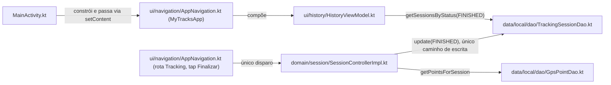
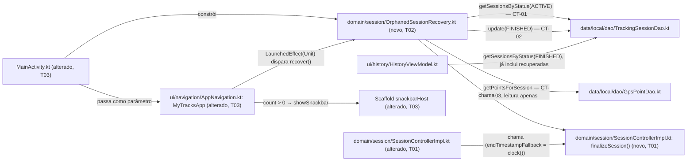

# Implementation Plan

## Request Summary
- Objective: at every cold start, detect every `TrackingSessionEntity` with `status = ACTIVE`
  (necessarily orphaned — the foreground collection service cannot be running yet at this point in
  the process lifecycle) and finalize each one to `FINISHED` using exactly the same metric
  computation `SessionControllerImpl.stopSession` already runs, without touching `GpsPointEntity`
  and without restarting collection, then surface a non-blocking count to the user.
- Scope:
  - In: cold-start detection of all `ACTIVE` rows (including rows already orphaned before this
    feature existed); reuse of `stopSession`'s finalization math; zero-point fallback
    (`endTimestamp = startTimestamp`, all 4 metrics zeroed); multiple simultaneous orphans in one
    pass; background/non-blocking execution; a transient Snackbar notification.
  - Out: restarting `LocationForegroundService` / resuming live collection; any undo/cancel UI for
    the automatic finalization; any new screen/route; any change to `GpsPointEntity` or its DAO.
- Tier: standard
- Architecture references: `AGENTS.md`, `docs/agents/architecture.md`, `docs/agents/domain_rules.md`
  (all cited inline below; verified directly against `SessionControllerImpl.kt`,
  `TrackingSessionDao.kt`, `GpsPointDao.kt`, `MainActivity.kt`, `ui/navigation/AppNavigation.kt`,
  `HistoryViewModel.kt`)

## AS IS — Componentes impactados



Nenhum componente hoje lê `status = ACTIVE` no cold start; `SessionControllerImpl.stopSession` é o
único caminho que já existe para produzir uma linha `FINISHED`, e só é acionado pelo tap manual em
"Finalizar" (`AppNavigation.kt:446-452`). Linhas `ACTIVE` órfãs (processo morto pelo SO) ficam
permanentemente fora do alcance de `HistoryViewModel`, que só consulta `FINISHED`
(`HistoryViewModel.kt:108`).

## TO BE — Componentes propostos



`OrphanedSessionRecovery` (novo, T02) é uma classe Android-free construída em `MainActivity` junto
aos demais objetos (T03), recebendo apenas `TrackingSessionDao`/`GpsPointDao` — as mesmas
dependências que `MyTracksApp` já recebe hoje. `finalizeSession` (novo, T01) é extraído de
`SessionControllerImpl.stopSession` para que as duas rotas de finalização nunca divirjam (RF-03). O
disparo acontece via `LaunchedEffect(Unit)` dentro de `MyTracksApp` (T03), não em
`MainActivity.onCreate`, para não bloquear `setContent` (RNF-01) e para permanecer testável pelo
mesmo padrão `composeTestRule.setContent { ... }` já usado pelos testes de tela existentes.

## Tasks

### T01 — Extract `finalizeSession` as the single source of truth for RF-03's math
- **Files**: `app/src/main/java/com/mytracksapp/domain/session/SessionControllerImpl.kt`
- **Change**: Extract `stopSession`'s finalization block (`SegmentClassifier.classify` +
  `StatsEngine.totalDistanceMeters`/`averageSpeedMetersPerSecond` + the `existing.copy(...)`
  construction, verified at `SessionControllerImpl.kt:110-124`) into a pure, `internal` top-level
  function in the same file/package: `finalizeSession(existing: TrackingSessionEntity, points:
  List<GpsPointEntity>, endTimestampFallback: Long): TrackingSessionEntity`. It does not call any
  DAO — the caller still owns the `trackingSessionDao.update(...)` write. `stopSession` becomes:
  read `existing`/`points`, then `trackingSessionDao.update(finalizeSession(existing, points,
  endTimestampFallback = clock()))` — behavior identical to today (`clock()` fallback preserved for
  the manual-stop path per `SessionControllerImpl.kt:113`).
- **Covers**: RF-03 (per `docs/agents/domain_rules.md`'s "Session stop — stop-then-finalize" —
  this extraction is what keeps the recovery routine from becoming "a second, divergent
  implementation", per SPEC Context)
- **Tests**: `app/src/test/java/com/mytracksapp/domain/session/SessionControllerTest.kt` — existing
  suite must pass unmodified after the refactor (regression); add/confirm one assertion that
  `stopSession`'s persisted `TrackingSessionEntity` (all 6 derived fields) is identical before and
  after the extraction, for both a with-points and a zero-points case.
- **Acceptance criteria**: `SessionControllerTest` passes with no behavior change; `finalizeSession`
  is callable from `OrphanedSessionRecovery.kt` (same module, `internal` visibility) without being
  made `public`.
- **Risk**: Medium — refactor of an already-shipped, tested production path (`stopSession`);
  mitigated by keeping the full existing test suite as the regression gate.
- **Dependencies**: none

### T02 — New `OrphanedSessionRecovery` domain class
- **Files**: `app/src/main/java/com/mytracksapp/domain/session/OrphanedSessionRecovery.kt` (new)
- **Change**: Android-free class (same style as `SessionControllerImpl` — no `Context`, testable
  with fake DAOs), constructed with `TrackingSessionDao`/`GpsPointDao` only:
  ```
  class OrphanedSessionRecovery(
      private val trackingSessionDao: TrackingSessionDao,
      private val gpsPointDao: GpsPointDao,
  ) {
      suspend fun recover(): Int
  }
  ```
  `recover()`: reads `trackingSessionDao.getSessionsByStatus(SessionStatus.ACTIVE).first()` (CT-01);
  for each row, reads `gpsPointDao.getPointsForSession(session.id).first()` (CT-03, read-only,
  RF-04); calls T01's `finalizeSession(session, points, endTimestampFallback =
  session.startTimestamp)` — the RF-02-mandated divergence from `stopSession`'s `clock()` fallback;
  persists via `trackingSessionDao.update(...)` (CT-02); computes each session's metrics from only
  its own points (RF-05); returns the count of sessions finalized. Never calls
  `GpsPointDao.insert`/`insertAll` (RF-04).
- **Covers**: RF-01, RF-02, RF-03, RF-04, RF-05
- **Tests**: `app/src/test/java/com/mytracksapp/domain/session/OrphanedSessionRecoveryTest.kt`
  (new) — fakes mirroring `SessionControllerTest`'s `FakeTrackingSessionDao`/`FakeGpsPointDao`
  style:
  - zero `ACTIVE` rows → `recover()` returns `0`, `trackingSessionDao.update` never invoked.
  - one `ACTIVE` row, zero points → `FINISHED`, `endTimestamp == startTimestamp`, all 4 metrics
    `== 0`, no exception thrown.
  - one `ACTIVE` row with points → persisted `stoppedTimeMillis`/`movingTimeMillis`/
    `distanceMeters`/`averageSpeedMetersPerSecond` numerically identical to what `finalizeSession`
    (hence `stopSession`) would produce for the same point set.
  - two-or-more `ACTIVE` rows with distinct point sets → all become `FINISHED` in the same call,
    each reflecting only its own points (no cross-session leakage).
  - `FakeGpsPointDao.insert`/`insertAll` assert-fail if called, proving RF-04.
- **Acceptance criteria**: all five test cases above pass; `OrphanedSessionRecoveryTest` never
  constructs a `LocationServiceController` fake (out of scope, no service interaction).
- **Risk**: Medium — correctness depends entirely on T01's extraction being behavior-preserving.
- **Dependencies**: T01

### T03 — Wire recovery into the composition root, non-blocking, with a Snackbar
- **Files**: `app/src/main/java/com/mytracksapp/MainActivity.kt`,
  `app/src/main/java/com/mytracksapp/ui/navigation/AppNavigation.kt`
- **Change**:
  - `MainActivity.onCreate`: instantiate `val orphanedSessionRecovery =
    OrphanedSessionRecovery(trackingSessionDao, gpsPointDao)` alongside the existing manually-built
    dependencies (`AppDatabase`, DAOs, `SessionControllerImpl`, per the composition-root pattern
    documented in `docs/agents/architecture.md`); pass it as a new parameter to `MyTracksApp(...)`.
  - `AppNavigation.kt`'s `fun MyTracksApp(...)`: add `orphanedSessionRecovery:
    OrphanedSessionRecovery` to the parameter list. Add `val snackbarHostState = remember {
    SnackbarHostState() }` and wire it into the existing `Scaffold(...)` via `snackbarHost = {
    SnackbarHost(snackbarHostState) }` (the `Scaffold` at `AppNavigation.kt:215` does not declare
    `snackbarHost` today — this is the minimal additive change). Add `var recoveredCount by
    remember { mutableStateOf<Int?>(null) }`; `LaunchedEffect(Unit) { recoveredCount =
    orphanedSessionRecovery.recover() }` (runs once per composition, never awaited by the rest of
    the tree — satisfies RNF-01); a second `LaunchedEffect(recoveredCount) { val count =
    recoveredCount; if (count != null && count > 0) snackbarHostState.showSnackbar(...) }` so the
    Snackbar fires exactly once, only when `count > 0` (UI-01's "quando N = 0, nenhuma notificação
    é exibida").
  - The recovery trigger point is `LaunchedEffect(Unit)` inside `MyTracksApp`, not a raw
    `CoroutineScope` in `MainActivity.onCreate` (SPEC explicitly leaves this open — see
    Assumptions) — chosen so it stays testable via the same `composeTestRule.setContent { ... }` +
    fake-parameter pattern every other screen test in `app/src/androidTest/java/com/mytracksapp/
    ui/**` already uses.
- **Covers**: RF-01 (trigger point), RNF-01, UI-01
- **Tests**: `app/src/androidTest/java/com/mytracksapp/ui/navigation/
  OrphanedSessionRecoverySnackbarTest.kt` (new) — `composeTestRule.setContent { MyTracksApp(...,
  orphanedSessionRecovery = <fake>) }`, same direct-composable style as `HistoryListScreenTest.kt`:
  - fake `recover()` suspends indefinitely (`delay(Long.MAX_VALUE)`) → the start-destination's
    screen tag (`HistoryListScreenTestTags.SCREEN`) is still displayed immediately (RNF-01).
  - fake `recover()` returns `2` → a Snackbar text node becomes visible (UI-01); bottom-bar
    navigation (e.g. tapping the History/New-session tab) still works while it is visible.
  - fake `recover()` returns `0` → no Snackbar text node ever appears.
- **Acceptance criteria**: all three cases above pass; existing `HistoryListScreenTest`,
  `NewSessionScreenTest`, `MainActivityTest` and other `AppNavigation`-touching suites remain green
  unmodified (additive-only diff).
- **Risk**: Medium — touches the single shared navigation/composition file used by every screen
  (drawer, `Scaffold`, bottom bar); mitigated by an additive-only diff and re-running the full
  existing Compose UI test suite.
- **Dependencies**: T02

### T04 — Real-device end-to-end regression (RF-01, RF-05, RF-06)
- **Files**: `app/src/androidTest/java/com/mytracksapp/e2e/OrphanedSessionRecoveryE2ETest.kt` (new)
- **Change**: Mirrors `TrackingSessionE2ETest`'s real-device style. Using
  `ApplicationProvider.getApplicationContext()` + `AppDatabase.getInstance(context)` (the same
  singleton `MainActivity` uses in production), seed via the real DAOs, *before* launching the
  Activity: (a) one `ACTIVE` session with zero points, (b) one `ACTIVE` session with a handful of
  `GpsPointEntity` rows, (c) a second concurrent `ACTIVE` session with a distinct point set (RF-05).
  Because `createAndroidComposeRule<MainActivity>()`'s default rule launches the Activity before
  any `@Before`/test-body seeding can run (unlike `MainActivityTest.kt`'s no-seed smoke test), this
  test must control launch timing manually — e.g. `createEmptyComposeRule()` +
  `ActivityScenario.launch(MainActivity::class.java)` invoked inside the test body, after seeding.
  After launch, assert: every seeded row is `FINISHED` in the DB; each appears in
  `HistoryListScreen` with metrics matching its own points only; no "recuperada" label/badge
  anywhere (RF-06). `@After` deletes the seeded session ids to avoid polluting the shared,
  persistent on-device database (see Risks).
- **Covers**: RF-01, RF-05, RF-06
- **Tests**: itself (instrumented)
- **Acceptance criteria**: all three seeded rows are `FINISHED` post-launch with correctly isolated
  metrics; `HistoryListScreen` renders them identically to a manually-stopped session; the seeded
  rows are removed by `@After` regardless of test outcome.
- **Risk**: High — first instrumented test in the repo needing to seed the real, persistent
  `AppDatabase` singleton and control Activity-launch timing manually; see Open Questions.
- **Dependencies**: T03

## Execution Phases
| Phase | Tasks | Parallel-safe? |
|-------|-------|----------------|
| 1 | T01 | No — single task, must land before T02 |
| 2 | T02 | No — depends on T01's extraction |
| 3 | T03 | No — depends on T02's class existing |
| 4 | T04 | No — depends on T03's wiring being live in `MainActivity`/`MyTracksApp` |

No two tasks touch disjoint files with no shared dependency, so every phase is single-task/sequential;
tier is `standard`, not `light`, but the dependency chain (T01→T02→T03→T04) leaves no room for
parallelism.

## Risks

| Risk | Blast radius | Mitigation | Rollback |
|------|-------------|------------|----------|
| T01's extraction subtly changes `stopSession`'s persisted values | Every future manually-stopped session's stored stats | Keep the full existing `SessionControllerTest` suite green as the regression gate; add an explicit before/after parity assertion | Revert T01's diff to `SessionControllerImpl.kt` |
| `LaunchedEffect(Unit)` re-fires `recover()` on an unexpected recomposition of `MyTracksApp` | Wasted DB reads/writes, but each write is idempotent (a row already `FINISHED` is never re-queried by `getSessionsByStatus(ACTIVE)`) | Rely on `LaunchedEffect(Unit)`'s single-key semantics; if `MainActivity` is recreated (e.g. rotation), a fresh `recover()` call naturally finds nothing left to recover | None needed — self-healing by construction |
| Additive `snackbarHost` + two `LaunchedEffect`s land in the single shared `AppNavigation.kt`/`MyTracksApp` composable | Any regression here affects the entire app shell (drawer, `Scaffold`, bottom bar, all routes) | Additive-only diff (no existing `Scaffold` slot removed/changed); re-run the full existing Compose UI test suite (`HistoryListScreenTest`, `NewSessionScreenTest`, `SettingsScreenTest`, etc.) | Revert T03's diff to `AppNavigation.kt`/`MainActivity.kt` |
| An uncaught exception while finalizing one orphaned session inside `recover()`'s loop | Could abort finalization of the remaining orphans in the same pass (violating RF-05) or, if unhandled by the coroutine scope, crash the app on cold start | Flagged in Open Questions — recommend catching per-session and continuing; decision needed before T02 implementation | N/A — preventive |
| T04 seeds the real, persistent `AppDatabase` singleton with no prior teardown convention in the repo | Flaky/false-positive test runs; cluttered History screen on a shared test device/emulator | Explicit `@After` deleting the seeded session ids via `trackingSessionDao.deleteById` | Manually clear app data on the affected test device |

## Open Questions

- RF-05 requires every `ACTIVE` row to be finalized "na mesma passada de inicialização", but the
  SPEC does not define what happens if one session's finalization throws mid-loop (e.g. a malformed
  row). Should `OrphanedSessionRecovery.recover()` catch-and-continue per session (isolating a bad
  row so the rest still finish), or let an exception propagate? Impact: left uncaught, a single
  corrupt row could either silently abort recovery for every other orphan in the same pass, or (if
  the enclosing coroutine scope has no exception handler) crash the app on cold start — the opposite
  of RNF-01's "never blocks/fails the initial navigation" intent, even though RNF-01's literal text
  only talks about blocking, not crashing.
- T04 seeds the same persistent `AppDatabase` singleton `MainActivity` uses in production, with no
  existing reset/teardown mechanism for it found in the repo (`TrackingSessionDaoTest.kt` instead
  uses `Room.inMemoryDatabaseBuilder`, which `MainActivity` never does). Is a real-device end-to-end
  test the right level for RF-06, or should this be narrowed to a lower-risk Compose-level test
  against `HistoryListScreen` with a fake DAO returning a `finalizeSession`-shaped `FINISHED` row,
  deferring true on-device DB coverage? Needs a decision before implementing T04.

## Assumptions

- The recovery trigger point is a `LaunchedEffect(Unit)` inside `MyTracksApp`, not a raw
  `CoroutineScope` in `MainActivity.onCreate` — the SPEC explicitly leaves this choice open ("uma
  decisão de implementação ... a ser resolvida no planejamento, não nesta SPEC"); chosen here
  because it keeps the feature testable through the same `composeTestRule.setContent { ... }` +
  fake-parameter pattern every other screen test already uses, without adding a test-only seam to
  `MainActivity`.
- `finalizeSession` (T01) stays `internal` (same Gradle module/package), not `public` — no evidence
  any other module needs it; [UNVERIFIED] if a future module boundary changes this.
- Material3's default `SnackbarHostState.showSnackbar` duration (no explicit `SnackbarDuration`
  override) satisfies UI-01's "transitória ... NÃO DEVE ser um diálogo bloqueante" wording — the
  SPEC does not mandate a specific duration.
- No new DAO methods are needed — confirmed directly against `TrackingSessionDao.kt`
  (`getSessionsByStatus`, `update`) and `GpsPointDao.kt` (`getPointsForSession`), matching SPEC's
  own CT-01/CT-02/CT-03 findings.
- This feature has no exposed interface surface (no REST/gRPC/async boundary) — SPEC's Contracts
  section (CT-01/02/03) documents *existing, already-implemented* internal Kotlin DAO methods being
  reused, not a new contract to formalize. No `openapi.yaml`/`service.proto`/`asyncapi.yaml` is
  emitted for this feature (see `## Contracts emitted` omission).
