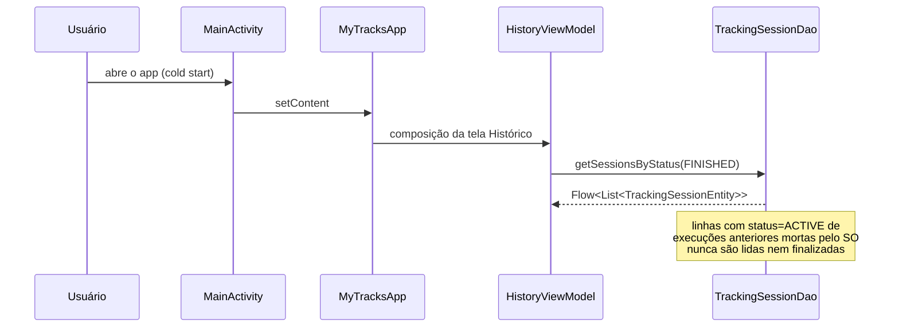
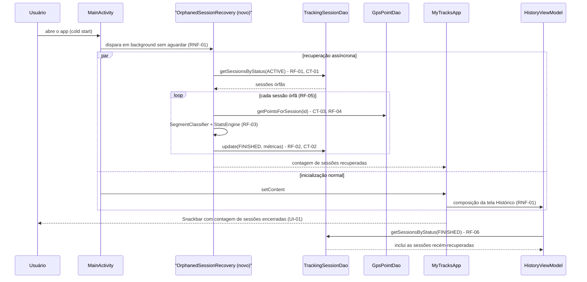

# SPEC: orphaned-session-recovery

## Metadata
- Source: developer description via /plan
- Service: my-tracks-app (Android/Kotlin/Compose, single module `app/`)
- Tier: standard
- Version: 1.0
- Architecture references: `AGENTS.md`, `docs/agents/architecture.md`, `docs/agents/domain_rules.md`

## Context

The app persists a `TrackingSessionEntity` with `status = ACTIVE` the moment a session starts,
*before* any GPS point is collected (`SessionControllerImpl.startSession`, verified at
`app/src/main/java/com/mytracksapp/domain/session/SessionControllerImpl.kt:89-100`). The only
code path that ever transitions a session to `FINISHED` is `SessionControllerImpl.stopSession`
(verified at `SessionControllerImpl.kt:103-125`), invoked exclusively from the user tapping
"Finalizar" in `TrackingScreen` (`ui/navigation/AppNavigation.kt:446-452`). If the OS kills the
process while a session is `ACTIVE` (e.g. MIUI's aggressive background-process killer — cited
verbatim in the confirmed summary), `stopSession` never runs: the row stays `ACTIVE` forever, and
`HistoryViewModel` only ever queries `SessionStatus.FINISHED` rows (verified at
`ui/history/HistoryViewModel.kt:108`), so the interrupted session — and every GPS point already
collected for it — becomes permanently invisible in the app's own UI even though the data is
intact in Room.

Per `docs/agents/architecture.md` (manual composition-root, no DI framework: `MainActivity.kt`
constructs `AppDatabase`/`TrackingSessionDao`/`GpsPointDao`/`SessionControllerImpl` once and hands
them to `MyTracksApp`) and `docs/agents/domain_rules.md` ("Session stop — stop-then-finalize":
`stopSession` reads final points, then runs `SegmentClassifier.classify` +
`StatsEngine.totalDistanceMeters`/`averageSpeedMetersPerSecond`, then persists `FINISHED` via a
single whole-row `TrackingSessionDao.update`), this feature must detect every `ACTIVE` row at cold
start and run the *same* finalization math `stopSession` already runs — never a second, divergent
implementation — while never touching `GpsPointEntity` rows and never restarting collection
(explicitly out of scope, confirmed by the developer: this is a "close out cleanly" routine, not a
"resume live collection" one).

## AS IS — Estado atual

Sessões `ACTIVE` órfãs (processo encerrado pelo SO antes de `stopSession`) nunca transicionam
para `FINISHED` e por isso nunca aparecem no Histórico, pois `HistoryViewModel` só consulta
`SessionStatus.FINISHED` (verified at `HistoryViewModel.kt:108`). Os pontos GPS já coletados
permanecem intactos no banco, mas inacessíveis pela UI.

## TO BE — Estado proposto

`Recovery` (novo) roda em paralelo à inicialização normal da UI, nunca bloqueando a composição do
Histórico (RNF-01); reaproveita as mesmas leituras/escritas de DAO já existentes (CT-01/CT-02/CT-03)
e a mesma matemática de `stopSession` (RF-03), sem tocar em `GpsPointEntity` (RF-04). Ao final, a
sessão recuperada aparece no Histórico pelo mesmo caminho de consulta já usado para sessões
finalizadas manualmente (RF-06), e o usuário é avisado de forma não bloqueante (UI-01).

## Scope
- **In**: detecção de toda sessão `ACTIVE` a cada cold start do app; finalização automática
  reaproveitando a lógica de cálculo de métricas de `stopSession`; tratamento do caso sem nenhum
  ponto GPS; tratamento de múltiplas sessões órfãs simultâneas; execução assíncrona/não bloqueante;
  aviso não intrusivo ao usuário. Cobre também sessões já órfãs no banco antes desta feature
  existir — a rotina é uma consulta por `status`, não depende de quando a sessão foi criada.
- **Out**: reiniciar `LocationForegroundService` ou retomar a coleta de pontos GPS para a sessão
  recuperada (confirmado pelo desenvolvedor: "close out cleanly", não "resume live collection");
  qualquer UI para o usuário cancelar/desfazer a finalização automática; qualquer nova tela/rota;
  qualquer alteração em `GpsPointEntity` ou em suas DAOs.

## RIGID (Non-Negotiable)

### Functional Requirements

- RF-01 [Event-Driven]: QUANDO o app é aberto (cold start / criação da `Activity`), o sistema DEVE
  consultar todas as `TrackingSessionEntity` com `status = ACTIVE` (via
  `TrackingSessionDao.getSessionsByStatus(SessionStatus.ACTIVE)`, verified at
  `data/local/dao/TrackingSessionDao.kt:28`) e tratar cada uma como órfã, pois o foreground service
  de coleta não pode estar rodando nesse momento do processo.
  - AC: após um cold start, toda linha que estava `ACTIVE` antes da abertura do app passa a ter
    `status = FINISHED`; nenhuma linha nova `ACTIVE` é criada por este processo.

- RF-02 [Conditional]: SE uma sessão órfã (RF-01) não possui nenhum `GpsPointEntity` persistido
  (`GpsPointDao.getPointsForSession` retorna lista vazia, verified at
  `data/local/dao/GpsPointDao.kt:19-20`), ENTÃO o sistema DEVE finalizá-la com
  `endTimestamp = startTimestamp` e `distanceMeters = 0.0`,
  `averageSpeedMetersPerSecond = 0.0`, `movingTimeMillis = 0`, `stoppedTimeMillis = 0`, sem lançar
  exceção nem bloquear a navegação inicial do app.
  - Nota de divergência intencional: isto difere do fallback de `stopSession` para sessão sem
    pontos, que usa `clock()` (tempo atual) como `endTimestamp` (verified at
    `SessionControllerImpl.kt:113`); para a rotina de recuperação, o fallback é sempre
    `startTimestamp` da própria sessão, por exigência explícita da AC confirmada.
  - AC: dada uma sessão `ACTIVE` com zero pontos, após o cold start a linha tem `status=FINISHED`,
    `endTimestamp == startTimestamp` e as 4 métricas iguais a zero; nenhuma exceção é lançada e a
    tela inicial do app renderiza normalmente.

- RF-03 [State-Driven]: ENQUANTO finaliza uma sessão órfã (RF-01/RF-02) com pontos, o sistema DEVE
  calcular `stoppedTimeMillis`/`movingTimeMillis` via `SegmentClassifier.classify(points)` e
  `distanceMeters`/`averageSpeedMetersPerSecond` via
  `StatsEngine.totalDistanceMeters(points)`/`StatsEngine.averageSpeedMetersPerSecond(points)` —
  exatamente as mesmas funções, com os mesmos parâmetros padrão (sem override de
  `stopRadiusMeters`/`stopDurationMillis`), já usadas por `SessionControllerImpl.stopSession`
  (verified at `SessionControllerImpl.kt:110-112`) — aplicadas ao conjunto de pontos da própria
  sessão, sem qualquer modificação.
  - AC: para um mesmo conjunto fixo de pontos, os valores persistidos de
    `stoppedTimeMillis`/`movingTimeMillis`/`distanceMeters`/`averageSpeedMetersPerSecond`
    produzidos pela rotina de recuperação são numericamente idênticos aos que `stopSession`
    produziria para o mesmo conjunto de pontos.

- RF-04 [Unwanted Behavior]: a rotina de recuperação NÃO DEVE inserir, atualizar, apagar ou
  reordenar nenhuma linha `GpsPointEntity` em nenhum momento da detecção, do cálculo ou da
  finalização.
  - AC: `GpsPointDao.countForSession(sessionId)` (verified at `GpsPointDao.kt:22-23`) retorna o
    mesmo valor antes e depois da recuperação, para cada sessão recuperada; `getPointsForSession`
    retorna a mesma lista ordenada (mesmos ids, mesmos valores de campo) antes e depois.

- RF-05 [State-Driven]: ENQUANTO houver mais de uma `TrackingSessionEntity` com `status = ACTIVE`
  simultaneamente no cold start, o sistema DEVE finalizar todas na mesma passada de inicialização,
  calculando as métricas de cada uma isoladamente a partir apenas dos seus próprios pontos.
  - AC: dadas N (N ≥ 2) linhas `ACTIVE` com conjuntos de pontos distintos, após o cold start todas
    as N linhas estão `FINISHED` e cada uma reflete exclusivamente as métricas calculadas sobre os
    seus próprios pontos (nenhuma métrica de uma sessão vaza para outra).

- RF-06 [Event-Driven]: QUANDO uma sessão é finalizada pela rotina de recuperação, as telas de
  Histórico (lista) e de detalhe DEVEM exibi-la pelo mesmo caminho de consulta/renderização usado
  para uma sessão finalizada manualmente (`HistoryViewModel` consulta
  `TrackingSessionDao.getSessionsByStatus(SessionStatus.FINISHED)`, verified at
  `ui/history/HistoryViewModel.kt:108`), sem nenhum flag, rótulo ou branch de código que a
  distinga de uma sessão finalizada por `stopSession`.
  - AC: uma sessão recuperada e uma sessão finalizada manualmente com os mesmos valores de campo
    renderizam a UI idêntica (mesmo layout, mesmo texto), sem nenhum selo ou marcação de
    "recuperada" nas telas de Histórico ou de detalhe.

### UI Requirements

- UI-01 [Event-Driven]: QUANDO a rotina de recuperação finaliza uma ou mais sessões órfãs em um
  dado cold start, o sistema DEVE exibir uma notificação transitória e não bloqueante (ex.:
  Material3 `Snackbar`, já disponível como dependência do projeto — nenhum `Snackbar` é usado
  hoje em nenhuma tela, verified: nenhuma ocorrência de `Snackbar` em
  `app/src/main/java/com/mytracksapp/**`) informando que N sessão(ões) anterior(es) foram
  encerradas automaticamente porque o app foi interrompido antes da finalização manual; a
  notificação NÃO DEVE ser um diálogo bloqueante e NÃO DEVE impedir a interação com o restante do
  app.
  - AC: após um cold start que recupera N ≥ 1 sessões órfãs, uma notificação transitória e não
    modal aparece sem exigir nenhum toque do usuário, e o usuário consegue continuar navegando
    (ex.: tocar em "Histórico"/"Nova sessão" na barra inferior) enquanto ela está visível ou após
    seu desaparecimento automático; quando N = 0, nenhuma notificação é exibida.

### Contracts

- CT-01: Consulta de órfãs — `TrackingSessionDao.getSessionsByStatus(SessionStatus.ACTIVE): Flow<List<TrackingSessionEntity>>`
  (verified at `data/local/dao/TrackingSessionDao.kt:28`) é a única leitura usada para enumerar
  sessões órfãs; nenhum novo método de DAO é necessário para esta consulta.
- CT-02: Escrita de finalização — `TrackingSessionDao.update(session: TrackingSessionEntity): Unit`
  (verified at `data/local/dao/TrackingSessionDao.kt:19-20`), um `@Update` de linha inteira, é a
  única escrita usada para persistir o estado `FINISHED` de uma sessão recuperada — o mesmo método
  que `SessionControllerImpl.stopSession` usa (verified at `SessionControllerImpl.kt:115`).
- CT-03: Leitura de pontos — `GpsPointDao.getPointsForSession(sessionId: String): Flow<List<GpsPointEntity>>`
  (verified at `data/local/dao/GpsPointDao.kt:19-20`), ordenada ascendentemente por `timestamp`, é
  a única leitura usada para obter os pontos de uma sessão para cálculo de métricas — nunca
  alterada (RF-04).

### Non-Functional Requirements

- RNF-01: a rotina de recuperação DEVE executar em uma coroutine/dispatcher de background e NÃO
  DEVE ser aguardada (não pode bloquear) pela composição inicial da tela de Histórico nem pela
  renderização do primeiro frame do app após o cold start.
  - AC: a primeira composição da tela de Histórico e sua consulta já existente
    `getSessionsByStatus(FINISHED)` (`HistoryViewModel.kt:108`) prosseguem independentemente da
    conclusão da rotina de recuperação; um teste instrumentado que atrase indefinidamente a rotina
    (ex.: DAO fake lento) ainda permite que a tela de Histórico renderize e seja utilizável.

## FLEXIBLE (Implementation Suggestions)

- Extrair o bloco de finalização de `SessionControllerImpl.stopSession` (linhas 110-124 —
  `SegmentClassifier.classify` + `StatsEngine` + `trackingSessionDao.update(existing.copy(...))`)
  para uma função interna compartilhada (ex.: `finalizeSession(existing, points, endTimestampFallback): TrackingSessionEntity`),
  parametrizada apenas no fallback de `endTimestamp` (`clock()` para `stopSession`, `startTimestamp`
  para a recuperação — RF-02), em vez de duplicar a lógica em uma segunda classe, conforme sugerido
  no contexto adicional do desenvolvedor.
- Nova classe Android-free (mesmo estilo de `SessionControllerImpl`: sem `Context`, testável com
  DAOs fake em `app/src/test`), ex. `domain/session/OrphanedSessionRecovery.kt`, recebendo
  `TrackingSessionDao`/`GpsPointDao` e reutilizando a função extraída acima.
- Construção e disparo seguindo o padrão de composição manual já existente: instanciar em
  `MainActivity.onCreate` junto aos demais objetos (`AppDatabase`, DAOs, `SessionControllerImpl`),
  lançando em um `CoroutineScope`/`lifecycleScope` próprio — sem bloquear `setContent`.
- Propagar o resultado (contagem de sessões recuperadas) para a árvore Compose via um
  `StateFlow<Int>`/estado simples passado a `MyTracksApp`, consumido por um `LaunchedEffect` que
  aciona um `SnackbarHostState` — o `Scaffold` raiz em `ui/navigation/AppNavigation.kt:215-299`
  hoje não declara `snackbarHost`; adicioná-lo é a mudança mínima necessária para UI-01. O ponto
  exato de disparo (coroutine em `MainActivity.onCreate` vs. `LaunchedEffect(Unit)` dentro de
  `MyTracksApp`) é uma decisão de implementação — ambas satisfazem RNF-01 — a ser resolvida no
  planejamento, não nesta SPEC.
- Não conectar `LocationServiceController`/`LocationForegroundService` a este fluxo em nenhuma
  hipótese (fora de escopo, ver seção Scope).
- Testar a nova classe no mesmo estilo de `SessionControllerTest` (fakes em memória, sem
  Robolectric/instrumentação), incluindo um caso com múltiplas sessões `ACTIVE` (RF-05) e um caso
  sem pontos (RF-02).

## Acceptance Criteria Summary

| ID | Criterion | Testable? |
|----|-----------|-----------|
| RF-01 | Toda sessão `ACTIVE` no cold start é finalizada (`FINISHED`) | Sim |
| RF-02 | Sessão órfã sem pontos: `endTimestamp=startTimestamp`, métricas zeradas, sem exceção | Sim |
| RF-03 | Métricas recalculadas com `StatsEngine`/`SegmentClassifier`, idênticas a `stopSession` | Sim |
| RF-04 | Nenhum `GpsPointEntity` é inserido/alterado/apagado/reordenado | Sim |
| RF-05 | Múltiplas sessões `ACTIVE` recuperadas na mesma passada, métricas isoladas | Sim |
| RF-06 | Sessão recuperada aparece no Histórico/detalhe pelo mesmo caminho de uma sessão manual | Sim |
| UI-01 | Notificação transitória e não bloqueante quando N ≥ 1 sessões são recuperadas | Sim |
| RNF-01 | Rotina roda em background e não bloqueia a composição inicial do Histórico | Sim |
