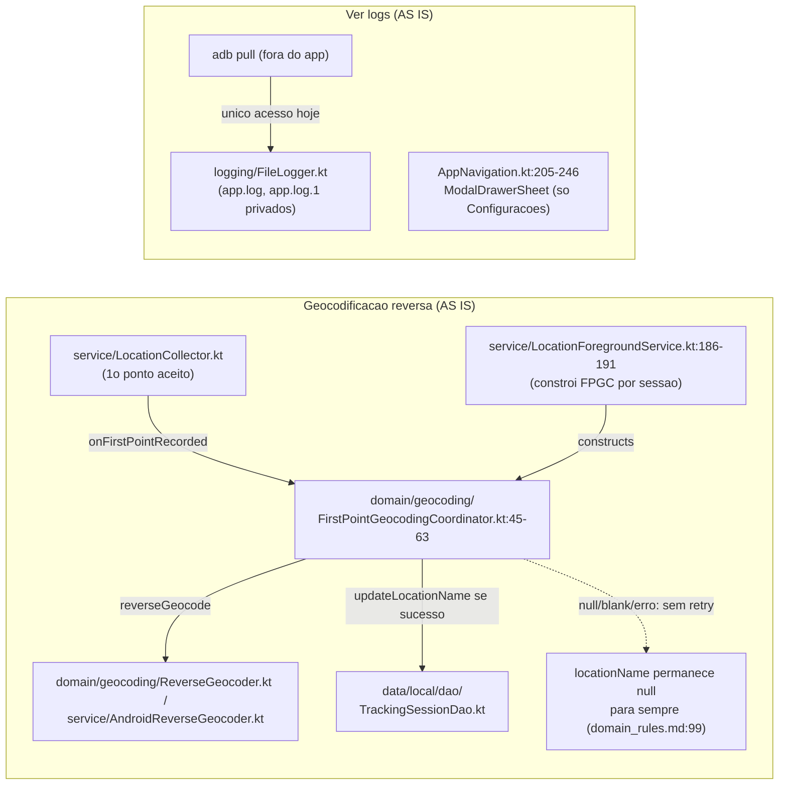
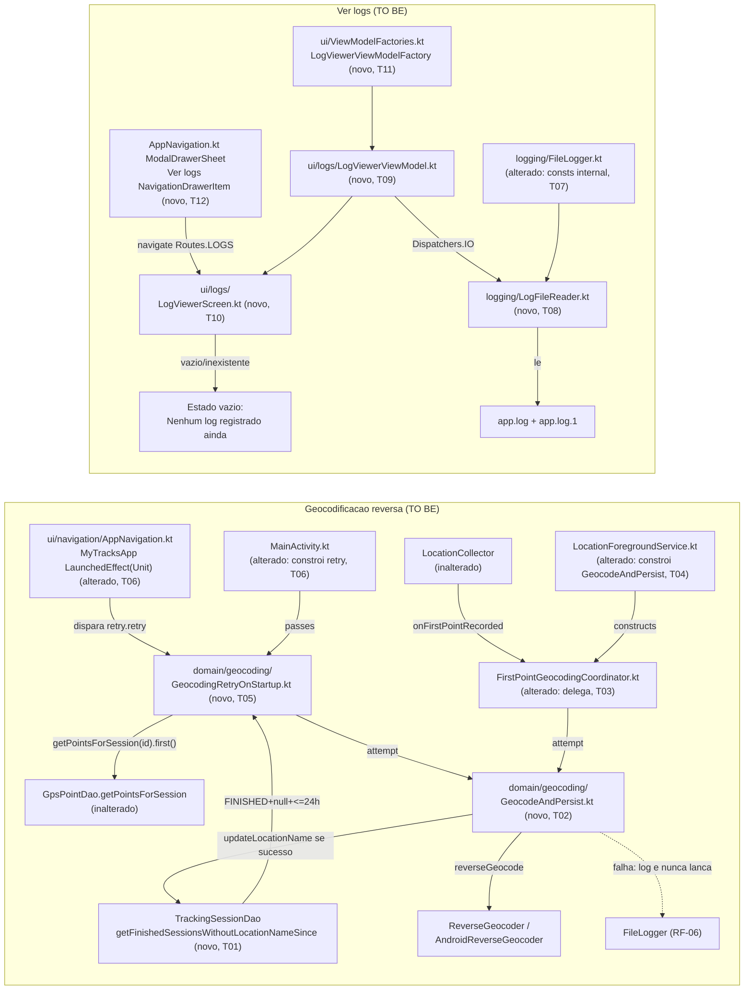

# Implementation Plan

## Request Summary
- Objective: (A) add a startup-triggered, fire-and-forget retry of reverse geocoding for
  `FINISHED` sessions with `locationName == null` within a 24h window of `startTimestamp`,
  extracting the existing geocode-attempt-and-persist logic out of
  `FirstPointGeocodingCoordinator` so it is shared with the new retry path; (B) add a read-only
  "Ver logs" screen reachable from the drawer, showing `FileLogger`'s `app.log`/`app.log.1`
  content read off the main thread, with an empty-state message.
- Scope:
  - In: DAO query for eligible sessions; shared `GeocodeAndPersist` extraction; new
    `GeocodingRetryOnStartup` orchestrator wired into `MyTracksApp`'s existing cold-start trigger;
    new `LogFileReader` + `LogViewerViewModel`/`LogViewerScreen` + drawer item + `Routes.LOGS`.
  - Out: WorkManager/AlarmManager scheduling, manual "retry" button, any new DB column/migration,
    share/export/delete of the log file, any behavior change for sessions that already have a
    `locationName`.
- Tier: standard
- Architecture references: `AGENTS.md`, `docs/agents/architecture.md`, `docs/agents/domain_rules.md`,
  `docs/agents/tech_stack.md`, `docs/agents/coding_guidelines.md` (all provided, all read)

## AS IS — Componentes impactados

A geocodificação hoje ocorre no máximo uma vez, disparada por `LocationCollector` no primeiro
ponto GPS aceito de uma sessão ativa; qualquer falha/`null`/blank deixa `locationName` como `null`
permanentemente (`docs/agents/domain_rules.md:93-99`). `FileLogger` já grava `app.log`/`app.log.1`
(`FileLogger.kt:36-41`), mas os nomes de arquivo são `private` e não há nenhuma tela no app para
lê-los — o menu sanduíche tem apenas "Configurações" (`AppNavigation.kt:221-245`).

## TO BE — Componentes propostos

`GeocodingRetryOnStartup` (T05) roda a partir de um `LaunchedEffect(Unit)` irmão do já existente em
`MyTracksApp` (T06), filtra via a nova query de `TrackingSessionDao` (T01) e reusa `GeocodeAndPersist`
(T02) — a mesma lógica para a qual `FirstPointGeocodingCoordinator` passa a delegar (T03/T04),
eliminando a duplicação exigida por RF-03. O item "Ver logs" (T12) leva a `LogViewerScreen` (T10),
alimentada por `LogViewerViewModel` (T09/T11) que lê `app.log`/`app.log.1` via `LogFileReader` (T08)
em background, nunca travando a UI.

## Tasks

### T01 — New `TrackingSessionDao` query for retry-eligible sessions
- **Files**: `app/src/main/java/com/mytracksapp/data/local/dao/TrackingSessionDao.kt`
- **Change**: Add `suspend fun getFinishedSessionsWithoutLocationNameSince(status: SessionStatus, sinceTimestamp: Long): List<TrackingSessionEntity>` with `@Query("SELECT * FROM tracking_sessions WHERE status = :status AND locationName IS NULL AND startTimestamp >= :sinceTimestamp")`. One-shot `suspend` (not `Flow`), per FLEXIBLE — this is a single startup scan, not a live-observed list. No entity/schema change: reuses existing `status`/`locationName`/`startTimestamp` columns (RNF-02).
- **Covers**: RF-01, RF-04, RF-05, RNF-02
- **Tests**: `app/src/androidTest/java/com/mytracksapp/data/local/TrackingSessionDaoTest.kt` — add cases: (1) a `FINISHED`/`locationName=null`/`startTimestamp = now-1h` row is returned; (2) a `FINISHED`/`locationName=null`/`startTimestamp = now-25h` row is NOT returned (RF-04); (3) a `FINISHED`/`locationName="X"`/any `startTimestamp` row is NOT returned (RF-05); (4) an `ACTIVE` row with `locationName=null` and recent `startTimestamp` is NOT returned.
- **Risk**: Low — additive query, no migration, `AppDatabase` stays at schema version 2.
- **Dependencies**: none

### T02 — Extract shared `GeocodeAndPersist` (RF-03's single implementation)
- **Files**: `app/src/main/java/com/mytracksapp/domain/geocoding/GeocodeAndPersist.kt` (new)
- **Change**: New Android-free class, constructor-injected `reverseGeocoder: ReverseGeocoder`,
  `trackingSessionDao: TrackingSessionDao`, `logger: Logger = FileLogger` (mirrors
  `FirstPointGeocodingCoordinator`'s existing constructor shape, per FLEXIBLE). Exposes
  `suspend fun attempt(sessionId: String, latitude: Double, longitude: Double): Boolean` that:
  (1) `runCatching { reverseGeocoder.reverseGeocode(latitude, longitude) }` — on exception, logs
  `WARN` via `logger` (tag `GeocodeAndPersist`) and treats as no result (RF-06's "ReverseGeocoder
  exception" case); (2) a `null`/blank result is treated identically to a failure — no persistence
  call, returns `false`; (3) a non-blank result is persisted via
  `trackingSessionDao.updateLocationName`; a persistence exception is caught, logged at `ERROR`
  (RF-06's "TrackingSessionDao persistence exception" case), and swallowed — never rethrown;
  returns `true` only on a successful persist. This function must never throw to its caller
  (mirrors `ReverseGeocoder`'s and `Logger.log`'s own "never throws" contracts).
- **Covers**: RF-03, RF-06
- **Tests**: `app/src/test/java/com/mytracksapp/domain/geocoding/GeocodeAndPersistTest.kt` (new) —
  migrate the 5 behavior cases currently in `FirstPointGeocodingCoordinatorTest.kt` (successful
  geocode persists once; `ReverseGeocoder` exception → zero persists, no propagated exception, one
  logged `WARN`/`ERROR` entry; `null`/blank result → zero persists; `updateLocationName` exception →
  logged and swallowed, `attempt` returns `false`) using the same `FakeReverseGeocoder`/
  `FakeTrackingSessionDao`/`FakeLogger` pattern (per-file inline fakes, `docs/agents/coding_guidelines.md` #3).
- **Risk**: Medium — this becomes the single source of truth for RF-03's behavior; a regression here
  affects both the existing first-point path and the new retry path. Mitigated by migrating the
  existing coordinator's already-passing test cases verbatim onto this class.
- **Dependencies**: none

### T03 — Refactor `FirstPointGeocodingCoordinator` to delegate to `GeocodeAndPersist`
- **Files**: `app/src/main/java/com/mytracksapp/domain/geocoding/FirstPointGeocodingCoordinator.kt`
- **Change**: Replace the constructor's `reverseGeocoder`/`trackingSessionDao`/`logger` params with
  a single `geocodeAndPersist: GeocodeAndPersist` param. `onFirstPointRecorded` becomes
  `coroutineScope.launch { geocodeAndPersist.attempt(sessionId, latitude, longitude) }` — same
  fire-and-forget shape, same "returns before the attempt resolves" contract (RNF-01), now with
  zero duplicated geocode/persist logic (RF-03's "no second copy" AC).
- **Covers**: RF-03
- **Tests**: `app/src/test/java/com/mytracksapp/domain/geocoding/FirstPointGeocodingCoordinatorTest.kt`
  (update) — rewrite to construct `FirstPointGeocodingCoordinator` with a real `GeocodeAndPersist`
  backed by the same per-file fakes (`docs/agents/coding_guidelines.md` #3: "fake the DAO/interface,
  not the domain class"), and keep asserting the externally observable contract only: successful
  geocode still results in exactly one `updateLocationName` call; `onFirstPointRecorded` still
  returns before the suspend function completes (RNF-01 timing assertion, unchanged). This becomes a
  thin delegation/wiring test — the detailed failure-mode cases now live in `GeocodeAndPersistTest.kt`
  (T02), so RF-03's "no second copy of this behavior" AC also holds at the test level.
- **Risk**: Low — behavior-preserving refactor; risk is purely mechanical (constructor signature
  change ripples to T04's call site).
- **Dependencies**: T02

### T04 — Update `LocationForegroundService` wiring for the new `GeocodeAndPersist`/`FirstPointGeocodingCoordinator` shape
- **Files**: `app/src/main/java/com/mytracksapp/service/LocationForegroundService.kt`
- **Change**: In `onStartCommand`'s per-session-start block (`LocationForegroundService.kt:186-191`),
  construct `val geocodeAndPersist = GeocodeAndPersist(reverseGeocoder, trackingSessionDao)` and pass
  it into `FirstPointGeocodingCoordinator(geocodeAndPersist, serviceScope)` per T03's new signature.
  Purely mechanical wiring update — no change to when/how geocoding is triggered for the first-point
  path.
- **Covers**: RF-03
- **Tests**: No new automated test — no existing test exercises `LocationForegroundService.onStartCommand`'s
  internal wiring (confirmed: no test file references `FirstPointGeocodingCoordinator`/`geocodingCoordinator`
  besides `FirstPointGeocodingCoordinatorTest.kt`). Coverage relies on T02/T03's unit tests
  (same classes, same call shape) plus manual/code-review verification of this call site.
- **Risk**: Medium — untested at this exact call site; a typo here would only surface at runtime.
  Mitigated by keeping the change purely mechanical (construct-and-pass, no new logic) and by code
  review against T03's new constructor signature.
- **Dependencies**: T03

### T05 — New `GeocodingRetryOnStartup` orchestrator
- **Files**: `app/src/main/java/com/mytracksapp/domain/geocoding/GeocodingRetryOnStartup.kt` (new)
- **Change**: Android-free class (mirrors `OrphanedSessionRecovery`'s style/testability), constructor:
  `trackingSessionDao: TrackingSessionDao`, `gpsPointDao: GpsPointDao`, `geocodeAndPersist: GeocodeAndPersist`,
  `logger: Logger = FileLogger`, `now: () -> Long = System::currentTimeMillis` (clock-injection for
  deterministic 24h-window unit tests, per FLEXIBLE/`SessionControllerImpl` convention). Exposes
  `suspend fun retry(): Int`:
  1. `val eligible = trackingSessionDao.getFinishedSessionsWithoutLocationNameSince(SessionStatus.FINISHED, now() - 86_400_000L)` (T01's query — RF-01/RF-04/RF-05 enforced structurally by the query predicate).
  2. For each eligible session, in its own `try`/`catch` (catch-and-continue, same isolation pattern
     as `OrphanedSessionRecovery.recover()` — one bad row must not abort the batch or crash cold
     start): read `gpsPointDao.getPointsForSession(session.id).first()` (already ASC-ordered by the
     DAO's existing query, RF-02), take the first point (smallest `timestamp`); if none exists, log a
     `WARN` ("no GPS points found for session") and skip; otherwise call
     `geocodeAndPersist.attempt(session.id, point.latitude, point.longitude)` (RF-03's shared logic,
     which already handles RF-06's failure logging internally).
  3. On any exception escaping step 2 (e.g. `GpsPointDao` throwing), log `ERROR` and continue to the
     next session (RF-06).
  4. Returns the count of sessions for which `attempt` returned `true`.
- **Covers**: RF-01, RF-02, RF-04, RF-05, RF-06
- **Tests**: `app/src/test/java/com/mytracksapp/domain/geocoding/GeocodingRetryOnStartupTest.kt` (new,
  JVM, same in-memory `TrackingSessionDao`/`GpsPointDao` fake style as
  `OrphanedSessionRecoveryTest.kt`) — cases: eligible session (FINISHED, null name, within 24h) gets
  geocoded and persisted (RF-01); a session with N>1 points is geocoded using the smallest-timestamp
  point (RF-02); a session with `startTimestamp = now-25h` is never geocoded, no `ReverseGeocoder`
  invocation recorded (RF-04); a session with a non-null `locationName` is left byte-identical, no
  `updateLocationName` call (RF-05); a `GpsPointDao` that throws for one session logs the failure and
  still processes the remaining eligible sessions, no propagated exception (RF-06); `retry()` returns
  the correct count.
- **Risk**: Medium — 24h boundary math and multi-session isolation are the two most likely correctness
  bugs; mitigated by injectable `now: () -> Long` for deterministic boundary tests and by mirroring
  `OrphanedSessionRecovery`'s already-proven catch-and-continue shape.
- **Dependencies**: T01, T02

### T06 — Wire `GeocodingRetryOnStartup` into the app's cold-start path
- **Files**: `app/src/main/java/com/mytracksapp/MainActivity.kt`,
  `app/src/main/java/com/mytracksapp/ui/navigation/AppNavigation.kt`
- **Change**: In `MainActivity.onCreate`, construct `val reverseGeocoder = AndroidReverseGeocoder(applicationContext)`,
  `val geocodeAndPersist = GeocodeAndPersist(reverseGeocoder, trackingSessionDao)`, and
  `val geocodingRetryOnStartup = GeocodingRetryOnStartup(trackingSessionDao, gpsPointDao, geocodeAndPersist)`;
  pass it as a new `geocodingRetryOnStartup: GeocodingRetryOnStartup` parameter to `MyTracksApp`. In
  `AppNavigation.kt`'s `MyTracksApp`, add a sibling `LaunchedEffect(Unit) { geocodingRetryOnStartup.retry() }`
  next to the existing `orphanedSessionRecovery.recover()` effect (FLEXIBLE explicitly sanctions "the
  existing `LaunchedEffect(Unit)` block ... or a sibling `LaunchedEffect(Unit)`") — independent of
  `recoveredCount`'s state, its result is not surfaced to any UI (SPEC has no UI requirement for the
  retry's outcome), so no snackbar/state wiring is added for it.
- **Covers**: RF-01, RNF-01
- **Tests**: `app/src/androidTest/java/com/mytracksapp/ui/navigation/GeocodingRetryOnStartupWiringTest.kt`
  (new, same direct-composable pattern as `OrphanedSessionRecoverySnackbarTest.kt`) — a
  `GeocodingRetryOnStartup` backed by a hang-forever `TrackingSessionDao` double (never completes)
  proves `MyTracksApp`'s first composition (the default History screen) still renders immediately
  (RNF-01: "0ms of synchronous blocking"); a second case with a seeded eligible session proves
  `retry()` is actually invoked from this trigger point (e.g. via a call-counting fake).
- **Risk**: Medium — `MyTracksApp`'s signature change ripples to every existing caller/test that
  constructs it directly (must confirm no other test file calls `MyTracksApp(...)` without the new
  param — grep confirms only `MainActivity.kt` and androidTest files under `ui/navigation/` do so;
  each must be updated to pass a `GeocodingRetryOnStartup` instance).
- **Dependencies**: T05

### T07 — Widen `FileLogger`'s file-name constants to `internal`
- **Files**: `app/src/main/java/com/mytracksapp/logging/FileLogger.kt`
- **Change**: Change `LOG_DIR_NAME`, `LOG_FILE_NAME`, `BACKUP_FILE_NAME` from `private const val` to
  `internal const val` (same visibility already used for `MAX_LOG_FILE_SIZE_BYTES`), so `LogFileReader`
  (T08) can resolve the exact same file names without duplicating the `"logs"`/`"app.log"`/`"app.log.1"`
  string literals. Non-behavioral — no change to `init`/`log`/`rotate`'s logic.
- **Covers**: RF-07, RF-08 (supporting change — avoids drift between the writer and the new reader)
- **Tests**: No new test — `FileLoggerTest.kt`'s existing assertions are unaffected by a visibility-only
  change; re-run it as regression coverage.
- **Risk**: Low — visibility widening only, single module (`internal` is module-wide, not package-scoped).
- **Dependencies**: none

### T08 — New `LogFileReader`
- **Files**: `app/src/main/java/com/mytracksapp/logging/LogFileReader.kt` (new)
- **Change**: New class, no constructor args, exposing
  `suspend fun read(logsDir: File): String = withContext(Dispatchers.IO) { ... }` that: resolves
  `File(logsDir, FileLogger.BACKUP_FILE_NAME)` and `File(logsDir, FileLogger.LOG_FILE_NAME)`; returns
  the backup's full text (if it exists) concatenated with the active file's full text (if it exists),
  in that order (RF-08's chronological-ascending concatenation); returns `""` if neither file exists
  (feeds UI-03's empty state). The entire read happens inside `withContext(Dispatchers.IO)`
  structurally — RF-07/RNF-03 hold regardless of the caller's own dispatcher.
- **Covers**: RF-07, RF-08, RNF-03
- **Tests**: `app/src/test/java/com/mytracksapp/logging/LogFileReaderTest.kt` (new, plain JVM,
  `java.io.File.createTempFile`/temp directory — no Robolectric needed, this class never touches
  `Context`) — cases: both files present with distinct known content → result starts with the
  backup's content and ends with the active file's content, nothing omitted (RF-08's exact AC);
  only `app.log` present → only its content is returned; neither present → `""` returned (feeds
  UI-03).
- **Risk**: Low — plain file I/O, no schema/DB involvement; a theoretical race with `FileLogger`'s
  in-progress rotation is cosmetic only (best-effort display, not a correctness-critical read) — see
  Risks table.
- **Dependencies**: T07

### T09 — New `LogViewerViewModel`
- **Files**: `app/src/main/java/com/mytracksapp/ui/logs/LogViewerViewModel.kt` (new)
- **Change**: `data class LogViewerUiState(val isLoading: Boolean = true, val content: String = "")`.
  `class LogViewerViewModel(private val logsDir: File, private val logFileReader: LogFileReader = LogFileReader())`
  extends `ViewModel`; on `init`, launches on `viewModelScope` (which defaults to `Dispatchers.Main.immediate`
  — the actual file read still happens on `Dispatchers.IO` inside `LogFileReader.read`, per RF-07) to
  call `logFileReader.read(logsDir)`, wrapped in `runCatching` (an unreadable/corrupt file must not
  crash the screen — mirrors UI-03's "does not crash" AC for the missing-file case) and publish the
  result into a `MutableStateFlow<LogViewerUiState>` exposed as `uiState: StateFlow<LogViewerUiState>`.
- **Covers**: RF-07
- **Tests**: `app/src/test/java/com/mytracksapp/ui/logs/LogViewerViewModelTest.kt` (new,
  `kotlinx-coroutines-test`, plain JVM with a real `LogFileReader` against a temp dir, same style as
  T08's test) — cases: files with content → `uiState.content` reflects the combined text once loading
  completes; no files → `uiState.content` is empty and `isLoading` becomes `false` without throwing.
- **Risk**: Low — thin state-holder over T08's already-tested reader.
- **Dependencies**: T08

### T10 — New `LogViewerScreen`
- **Files**: `app/src/main/java/com/mytracksapp/ui/logs/LogViewerScreen.kt` (new)
- **Change**: `object LogViewerScreenTestTags { const val SCREEN = "log_viewer_screen"; const val LOG_CONTENT = "log_viewer_content"; const val EMPTY_MESSAGE = "log_viewer_empty_message" }`
  (per-screen TestTags convention, `docs/agents/coding_guidelines.md` #4). `@Composable fun LogViewerScreen(viewModel: LogViewerViewModel, modifier: Modifier = Modifier)`
  collects `uiState`; while `!isLoading && content.isBlank()`, renders only the empty-state `Text`
  ("Nenhum log registrado ainda", per FLEXIBLE's suggested copy) tagged `EMPTY_MESSAGE` (UI-03);
  otherwise renders the log content in a `Text` with `fontFamily = FontFamily.Monospace`,
  `fontSize = 12.sp` (smaller than `SettingsScreen.kt`'s 15sp body rows, per UI-02's AC) inside
  `Modifier.fillMaxWidth().verticalScroll(rememberScrollState())` (+ `.horizontalScroll(rememberScrollState())`
  per the FLEXIBLE long-stack-trace suggestion), tagged `LOG_CONTENT` (UI-02). No button/icon/menu
  item for edit/delete/share is added anywhere in this composable (UI-04).
- **Covers**: UI-02, UI-03, UI-04
- **Tests**: `app/src/androidTest/java/com/mytracksapp/ui/logs/LogViewerScreenTest.kt` (new, Compose
  UI test, same `createComposeRule()` + direct-composable-with-fakes pattern as other screen tests) —
  cases: non-blank content → `LOG_CONTENT` node is displayed with the expected text, `EMPTY_MESSAGE`
  node absent; blank/no content → `EMPTY_MESSAGE` node displayed with the expected copy, `LOG_CONTENT`
  absent, no crash (UI-03's fresh-install AC); assert no node exists matching a share/delete/edit
  content-description or icon (UI-04). Note: exact rendered font family/size (UI-02's "monospace,
  smaller than 15sp") is asserted via code review of the `TextStyle`/`fontSize` literals rather than
  a semantics-tree query — Compose's UI-testing API does not expose resolved `TextStyle` metrics
  through `SemanticsNode` (see Risks).
- **Risk**: Low — presentation-only, read-only screen; the font-metrics testing gap above is a known
  Compose testing limitation, not a functional risk.
- **Dependencies**: T09

### T11 — `LogViewerViewModelFactory`
- **Files**: `app/src/main/java/com/mytracksapp/ui/ViewModelFactories.kt`
- **Change**: Add `class LogViewerViewModelFactory(private val logsDir: File) : ViewModelProvider.Factory`
  following the exact `require(modelClass.isAssignableFrom(...))` shape of every other factory in this
  file (`docs/agents/coding_guidelines.md` #1 — manual composition, no DI framework).
- **Covers**: (supports UI-01/CT-01's wiring — no RIGID id of its own)
- **Tests**: Exercised transitively by T10's `LogViewerScreenTest.kt` and T12's navigation test — no
  standalone factory test, consistent with every other `*ViewModelFactory` in this file (none has one).
- **Risk**: Low — mechanical, same shape as 5 existing factories.
- **Dependencies**: T09

### T12 — Wire `Routes.LOGS` + `LogsRoute` + "Ver logs" drawer item
- **Files**: `app/src/main/java/com/mytracksapp/ui/navigation/AppNavigation.kt`
- **Change**: Add `const val LOGS = "logs"` to `Routes` (CT-01). Add a private `@Composable fun LogsRoute()`
  that resolves `val context = LocalContext.current`, builds
  `viewModel(factory = LogViewerViewModelFactory(File(context.filesDir, "logs")))` (mirrors
  `SessionDetailRoute`'s existing `File(context.filesDir, "exports")` pattern — no `Context` leaks into
  the ViewModel itself), and renders `LogViewerScreen(viewModel = viewModel)`. Register
  `composable(Routes.LOGS) { LogsRoute() }` in the `NavHost`. Add
  `const val DRAWER_LOGS_ITEM = "app_nav_drawer_logs_item"` to `AppNavigationTestTags`. Add a second
  `NavigationDrawerItem` to `MyTracksApp`'s `ModalDrawerSheet`, immediately after the existing
  "Configurações" item, reusing the identical `shape = PillShape`,
  `colors = NavigationDrawerItemDefaults.colors(...)` triple, and `.padding(horizontal = 12.dp, vertical = 4.dp)`
  modifier pattern (UI-01's exact styling requirement), labeled "Ver logs", `onClick` closes the
  drawer and navigates `navController.navigate(Routes.LOGS) { launchSingleTop = true }`.
- **Covers**: UI-01, CT-01
- **Tests**: `app/src/androidTest/java/com/mytracksapp/ui/navigation/AppNavigationLogsDrawerTest.kt`
  (new, same direct-`MyTracksApp`-composable pattern as `OrphanedSessionRecoverySnackbarTest.kt`) —
  opens the drawer, taps the `DRAWER_LOGS_ITEM` node, asserts the drawer closes and the
  `LogViewerScreenTestTags.SCREEN` node becomes displayed (UI-01's AC: "tapping it closes the drawer
  and navigates to the new log-viewer route").
- **Risk**: Medium — this is the third task to touch `AppNavigation.kt` (after T06); executed last in
  its own phase specifically to avoid a merge conflict with T06's `MyTracksApp` signature/effect
  change (see Execution Phases).
- **Dependencies**: T10, T11, T06

## Execution Phases
| Phase | Tasks | Parallel-safe? |
|-------|-------|----------------|
| 1 | T01, T02, T07 | Yes — distinct files, no dependencies among them |
| 2 | T03, T05, T08 | Yes — each depends only on Phase 1, distinct files (`FirstPointGeocodingCoordinator.kt`, `GeocodingRetryOnStartup.kt`, `LogFileReader.kt`) |
| 3 | T04, T06, T09 | Yes — each depends only on Phase 2, distinct files (`LocationForegroundService.kt`; `MainActivity.kt`+`AppNavigation.kt`; `LogViewerViewModel.kt`) |
| 4 | T10, T11 | Yes — both depend only on T09, distinct files (`LogViewerScreen.kt`, `ViewModelFactories.kt`) |
| 5 | T12 | No — single task; must run after T06 (Phase 3) and T10/T11 (Phase 4) since all three touch `AppNavigation.kt` |

## Risks
| Risk | Blast radius | Mitigation | Rollback |
|------|-------------|------------|----------|
| `GeocodeAndPersist` extraction (T02) introduces a behavioral regression shared by both the existing first-point path and the new retry path | Both geocoding call sites (session creation UX + retry) | Migrate `FirstPointGeocodingCoordinatorTest.kt`'s existing passing cases verbatim onto `GeocodeAndPersistTest.kt` before deleting them from the coordinator test (T02/T03) | Revert T02-T04 as a unit; `FirstPointGeocodingCoordinator` reverts to its current inline implementation |
| 24h-window boundary math (T01's query + T05's `now() - 86_400_000L`) is off by one, over- or under-including sessions | Sessions near the 24h edge silently never retried (RF-04 violation) or retried too eagerly | `now: () -> Long` clock injection (T05) + dedicated boundary test cases in `TrackingSessionDaoTest.kt` (T01) and `GeocodingRetryOnStartupTest.kt` (T05) | Fix the query predicate/comparison; no data migration needed (RNF-02, no schema touched) |
| `MyTracksApp`'s new `geocodingRetryOnStartup` parameter (T06) breaks every existing direct caller (`MainActivity.kt`, androidTest files that construct `MyTracksApp(...)` directly) | Compile-time break across `ui/navigation/` tests | Grep-confirmed caller list before T06; each caller updated in the same task | Revert T06; `MainActivity`/tests return to the prior signature |
| `LocationForegroundService.kt`'s wiring update (T04) has zero dedicated automated test at that exact call site | A typo/mis-wire only surfaces at runtime on a real device/emulator session | Change kept purely mechanical (construct-and-pass, no new logic); code review against T03's new constructor | Revert T04; re-inline the pre-T02 constructor call |
| Three tasks (T06, T10/T11-adjacent T12) touch `AppNavigation.kt` | Merge conflicts / lost edits if run out of order | Explicit phase ordering (T06 in Phase 3, T12 alone in Phase 5) enforces sequential edits | Revert the specific phase's commit; file returns to its prior phase's state |
| `LogFileReader` (T08) reads `app.log`/`app.log.1` while `FileLogger.log`'s `synchronized` rotation is mid-flight on another thread | Displayed log content could show a partially-rotated/truncated view for one read | Cosmetic-only: the log viewer is best-effort display, not a data-integrity-critical path; RF-08's ordering AC is still satisfied on any single consistent read | No rollback needed — re-opening the screen re-reads current state |
| Compose UI testing cannot assert resolved `TextStyle`/`fontSize` from the semantics tree (T10) | UI-02's exact "monospace, <15sp" AC is verified by code review, not an automated UI-test assertion | Explicit literal `FontFamily.Monospace`/`12.sp` in `LogViewerScreen.kt`, reviewed against `SettingsScreen.kt`'s 15sp body rows | N/A — documentation/testing-strategy gap, not a code risk |

## Open Questions
- UI-01 does not fix an icon for the "Ver logs" drawer item (only shape/colors/position match
  "Configurações"). T12 assumes `Icons.Filled.Description` (available via the already-present
  `material-icons-extended` dependency) as a reasonable "log/document" icon — confirm at
  implementation time, or ask the developer for a preferred icon.
- CT-01 ("a new navigation route is added to `Routes`") is an internal Compose Navigation
  destination, not a REST/gRPC/async interface — `docs/agents/api_contracts.md` explicitly
  documents this repo as having no HTTP/gRPC/async surface at all. No `openapi.yaml`/`service.proto`/
  `asyncapi.yaml` is applicable; CT-01 is covered by T12's `Routes.LOGS` addition and this plan's
  traceability instead of a separate contract artifact (see "Contracts emitted" note below).
- `GeocodingRetryOnStartup.retry(): Int`'s exact return semantics (count of successful persists vs.
  count of sessions scanned) is a FLEXIBLE suggestion, not RIGID. T05 implements it as "count of
  sessions successfully persisted", mirroring `OrphanedSessionRecovery.recover()`'s "count
  successfully finalized" semantics — confirm this matches developer expectations if the return
  value is ever surfaced to UI in a follow-up.
- No verbatim build/test/lint command is documented anywhere in this repo (`AGENTS.md` section 1:
  "none found" for all four). This plan cannot specify how the developer should run the new/updated
  test files listed per task — they must be run via whatever Gradle/Android Studio invocation the
  developer already uses locally.

## Assumptions
- `GeocodeAndPersist` and `GeocodingRetryOnStartup` are placed in `domain/geocoding/` (not
  `domain/session/`) since both concern geocoding orchestration specifically, per the FLEXIBLE
  suggestion's own preference ("e.g. `GeocodeAndPersist`" / "`domain/session/` or `domain/geocoding/`").
- `LogFileReader` takes a pre-resolved `logsDir: File` (not `Context`), matching the existing
  `SessionDetailRoute.onExport` pattern (`File(context.filesDir, "exports")`) of resolving
  `Context.filesDir`-relative paths inside the `ui/navigation` route composable rather than inside
  the ViewModel/reader — keeps `Context` out of `ui/logs/LogViewerViewModel.kt` entirely.
- Widening `FileLogger`'s `LOG_DIR_NAME`/`LOG_FILE_NAME`/`BACKUP_FILE_NAME` from `private` to
  `internal` (T07) is treated as non-behavioral and safe, since `internal` in a single-module Gradle
  project is visible across all packages in `app` — no behavior of `FileLogger.init`/`log`/`rotate`
  changes.
- [UNVERIFIED] `Icons.Filled.Description` exists in the `material-icons-extended` version pinned in
  `gradle/libs.versions.toml` — verify at implementation time; if absent, fall back to any other
  document/log-shaped icon already used elsewhere in `ui/theme`/`ui/*`.
- No new `TrackingSessionEntity`/`GpsPointEntity` field, `AppDatabase` schema version bump, or Room
  migration is introduced anywhere in this plan (RNF-02) — confirmed by inspecting T01 (query-only
  change) and every other task (no `@Entity`/`AppDatabase.kt` edit appears in the task list above).
