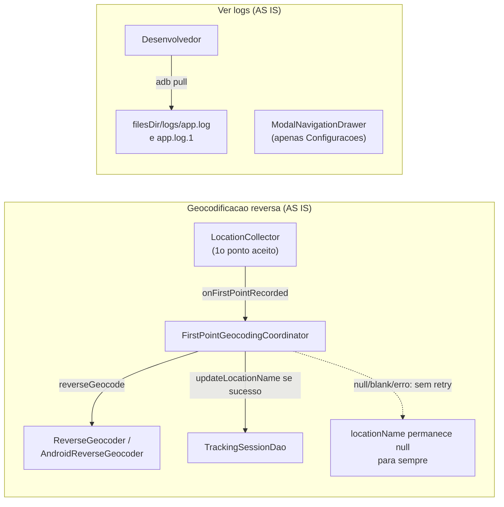
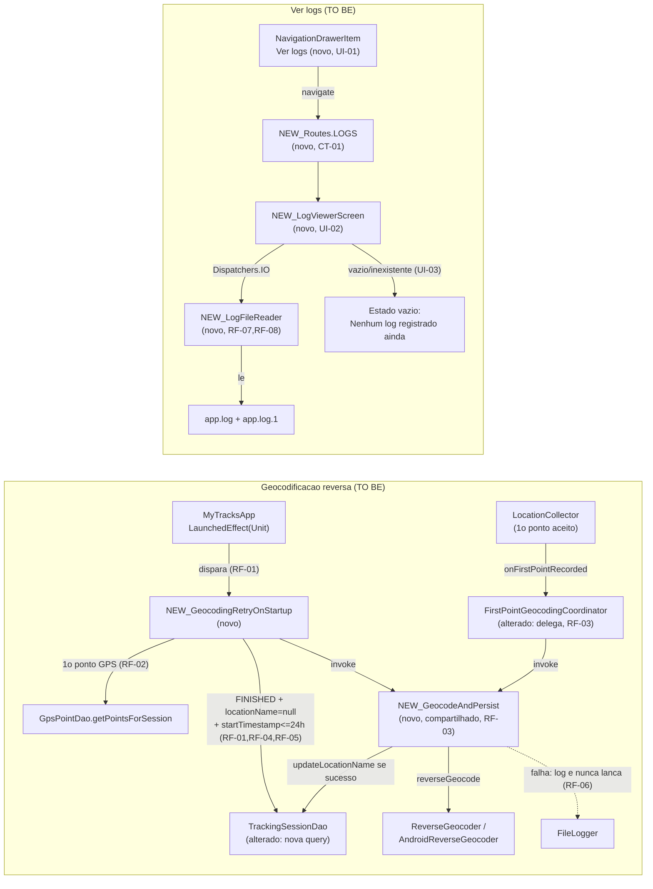

# SPEC: startup-geocoding-retry-and-log-viewer

## Metadata
- Source: developer description via /plan
- Service: my-tracks-app (single-module Android app, `com.mytracksapp`)
- Tier: standard
- Version: 1.0
- Architecture references: `AGENTS.md`, `docs/agents/architecture.md`, `docs/agents/domain_rules.md`, `docs/agents/tech_stack.md`, `docs/agents/coding_guidelines.md`

## Context

Two independent features bundled into one plan at the user's request:

**(A) Startup geocoding retry.** Today, reverse geocoding of a session's starting point is
best-effort and **at most once**: `FirstPointGeocodingCoordinator.onFirstPointRecorded`
(`app/src/main/java/com/mytracksapp/domain/geocoding/FirstPointGeocodingCoordinator.kt:45-63`)
fires exactly once per session, when the first GPS point is accepted, and any `null`/blank
result or exception permanently leaves `TrackingSessionEntity.locationName` as `null` — there is
"no retry path anywhere in the codebase" (`docs/agents/domain_rules.md:99`). That prior rule was
recorded as RF-03 of the `history-settings-redesign` feature ("nenhuma nova tentativa
automática"). **This SPEC supersedes that specific rule for the narrow case of a retry triggered
once on app startup**, for `FINISHED` sessions still missing a `locationName`, within a fixed
24-hour window of their `startTimestamp`; every other aspect of that prior feature (single
first-point attempt during an active session, no manual retry button, no scheduling beyond app
open) is unchanged.

**(B) "Ver logs" screen.** `FileLogger` (`app/src/main/java/com/mytracksapp/logging/FileLogger.kt`)
already writes every log line to `<filesDir>/logs/app.log`, rotating to `<filesDir>/logs/app.log.1`
once the active file reaches `MAX_LOG_FILE_SIZE_BYTES` (1,048,576 bytes, `FileLogger.kt:41`). There
is currently **no in-app way to view this file** — the only way to inspect it today is `adb pull
<filesDir>/logs/app.log` from a connected host machine. This feature adds a read-only in-app
viewer reachable from the existing hamburger/drawer menu.

Both features share the same trigger point for part (A): `MyTracksApp`'s `LaunchedEffect(Unit)`
(`app/src/main/java/com/mytracksapp/ui/navigation/AppNavigation.kt:187-189`), which already
fire-and-forgets `orphanedSessionRecovery.recover()` on every cold app open, and both graft onto
the existing drawer for part (B) (`AppNavigation.kt:205-246`).

## AS IS — Estado atual

A geocodificação hoje é tentada exatamente uma vez, no primeiro ponto GPS aceito de uma sessão
ativa; qualquer falha ou resultado vazio deixa `locationName` como `null` permanentemente, sem
nenhum caminho de nova tentativa. O menu sanduíche hoje só tem "Configurações" — o log do
`FileLogger` só é visível via `adb pull` fora do app.

## TO BE — Estado proposto

`NEW_GeocodingRetryOnStartup` (RF-01/RF-02/RF-04/RF-05) roda no mesmo `LaunchedEffect(Unit)` de
`MyTracksApp`, filtra sessões elegíveis e reusa `NEW_GeocodeAndPersist` (RF-03) — a mesma lógica
que `FirstPointGeocodingCoordinator` passa a delegar, eliminando a duplicação. Um novo item de
menu "Ver logs" (UI-01) leva a `NEW_LogViewerScreen` (UI-02/UI-03) via uma nova rota (CT-01), que
lê `app.log`/`app.log.1` em background (RF-07/RF-08) sem nunca travar a UI.

## Scope
- **In**: fire-and-forget retry de geocodificação reversa no startup para sessões `FINISHED` com
  `locationName == null` dentro de uma janela fixa de 24h; extração da lógica de geocodificação
  compartilhada entre o caminho original e o novo retry; item "Ver logs" no drawer; tela Compose
  somente leitura exibindo `app.log`/`app.log.1` com leitura em background.
- **Out**: WorkManager/AlarmManager ou qualquer agendamento além do evento de abrir o app; botão
  manual de "tentar novamente" geocodificação; nova coluna/migração no banco de dados; compartilhar,
  exportar ou apagar o arquivo de log pela UI; qualquer mudança de comportamento para sessões que já
  têm `locationName` preenchido.

## RIGID (Non-Negotiable)

### Functional Requirements

- RF-01 [Event-Driven]: WHEN the app is launched (the same `LaunchedEffect(Unit)` in `MyTracksApp`
  that already invokes `orphanedSessionRecovery.recover()`, verified at
  `app/src/main/java/com/mytracksapp/ui/navigation/AppNavigation.kt:187-189`), the system SHALL
  asynchronously query for `TrackingSessionEntity` rows where `status == FINISHED`,
  `locationName == null`, and `startTimestamp >= (now - 86_400_000)` (24h fixed window, no user
  configuration), without blocking app launch or the UI.
  - AC: Given a `FINISHED` session with `locationName = null` and `startTimestamp` within the last
    24h, launching the app causes that session's id to appear in the retry scan's query result,
    on a coroutine that never blocks `MyTracksApp`'s first composition.

- RF-02 [Event-Driven]: WHEN a session is selected by RF-01, the system SHALL fetch that session's
  first GPS point ordered by `timestamp ASC`, using `GpsPointDao.getPointsForSession` (verified at
  `app/src/main/java/com/mytracksapp/data/local/dao/GpsPointDao.kt:19`).
  - AC: Given a selected session with N ≥ 1 stored GPS points, the retry mechanism reads exactly
    the point with the smallest `timestamp` value for that session id.

- RF-03 [Conditional]: The system SHALL extract the "attempt reverse geocode via
  `ReverseGeocoder`; treat a `null`/blank result identically to a failure; persist via
  `TrackingSessionDao.updateLocationName` only on a non-blank success" behavior — currently
  implicit inside `FirstPointGeocodingCoordinator.onFirstPointRecorded` (verified at
  `app/src/main/java/com/mytracksapp/domain/geocoding/FirstPointGeocodingCoordinator.kt:45-63`) —
  into one shared, reusable function/class. Both `FirstPointGeocodingCoordinator`'s existing call
  path and RF-01's new startup-retry call path SHALL invoke that same shared implementation; the
  logic SHALL NOT be duplicated.
  - AC: Exactly one production source location implements the "geocode attempt +
    null/blank-as-failure + persist-on-success" behavior; both call sites reference it — code
    review confirms no second copy of this behavior exists anywhere in the diff.

- RF-04 [Unwanted Behavior]: IF a `FINISHED` session's `startTimestamp` is older than 24h before
  the retry-scan's current time, THEN the system SHALL NOT include that session in any retry
  attempt, now or on any future app launch.
  - AC: Given a `FINISHED` session with `locationName = null` and `startTimestamp = now - 25h`,
    after app launch that session's `locationName` remains `null`, and no `ReverseGeocoder`
    invocation is recorded for its id.

- RF-05 [Unwanted Behavior]: IF a session's `locationName` is already non-null, THEN the retry
  mechanism SHALL NOT read, geocode, or overwrite it, regardless of `startTimestamp`.
  - AC: Given a `FINISHED` session with a non-null `locationName`, after app launch that session's
    `locationName` value is byte-for-byte unchanged, and no `updateLocationName` call is made for
    its id.

- RF-06 [Unwanted Behavior]: IF any step of the retry path fails (no signal, `ReverseGeocoder`
  exception, `TrackingSessionDao` persistence exception), THEN the system SHALL log the failure via
  `FileLogger` (verified at `app/src/main/java/com/mytracksapp/logging/FileLogger.kt`) and SHALL
  NOT throw an uncaught exception or surface any UI-visible error (dialog/snackbar/toast).
  - AC: Given a fake `ReverseGeocoder` that throws for a given session's coordinates, after the
    retry runs, `FileLogger`'s active log file contains one new WARN/ERROR line referencing that
    failure, the app does not crash, and no UI-visible error appears.

- RF-07 [State-Driven]: WHILE the log-viewer screen is open, the system SHALL read the content of
  `app.log` and, if present, the backup `app.log.1` (verified at
  `app/src/main/java/com/mytracksapp/logging/FileLogger.kt:37-38`) entirely on a background
  dispatcher (`Dispatchers.IO` or equivalent coroutine context), never on the main/UI thread.
  - AC: Given an `app.log` file at `FileLogger.MAX_LOG_FILE_SIZE_BYTES` (1,048,576 bytes, verified
    at `app/src/main/java/com/mytracksapp/logging/FileLogger.kt:41`), opening the log-viewer screen
    never performs a blocking file-read call inside the screen's `@Composable` function body, and
    the screen renders without an ANR.

- RF-08 [Conditional]: IF `app.log.1` exists on disk, THEN the log-viewer's displayed content SHALL
  be the concatenation of `app.log.1`'s full content followed by `app.log`'s full content
  (chronological ascending order — the backup holds strictly older entries than the active file,
  per `FileLogger`'s rotate-then-truncate behavior, verified at
  `app/src/main/java/com/mytracksapp/logging/FileLogger.kt:96-103`); IF `app.log.1` does not exist,
  THEN only `app.log`'s content SHALL be displayed.
  - AC: Given both files exist with distinct, known content, the rendered text starts with
    `app.log.1`'s content and ends with `app.log`'s content, in that order, with nothing omitted.

### UI Requirements

- UI-01 [Event-Driven]: WHEN the user opens the drawer/menu sanduíche, the system SHALL display a
  "Ver logs" `NavigationDrawerItem` inside `MyTracksApp`'s `ModalDrawerSheet` (verified at
  `app/src/main/java/com/mytracksapp/ui/navigation/AppNavigation.kt:205-246`), in the same visual
  style/position pattern as the existing "Configurações" item (same shape, same
  `NavigationDrawerItemDefaults.colors`, same icon-then-label row layout, placed immediately after
  it).
  - AC: The drawer content contains exactly one new `NavigationDrawerItem` beyond today's
    "Configurações", labeled "Ver logs"; tapping it closes the drawer and navigates to the new
    log-viewer route; its modifiers reuse the same shape/colors/padding pattern as the
    "Configurações" item.

- UI-02 [Event-Driven]: WHEN the log-viewer screen is composed, the system SHALL render the log
  content (per RF-07/RF-08) inside a full-width, small, monospace-font text component that is
  vertically scrollable (and, per the horizontal-scroll suggestion for long stack-trace lines, see
  FLEXIBLE).
  - AC: The log-viewer screen's text component's modifier chain includes a full-width constraint
    and a vertical-scroll modifier; its rendered font family is monospace and its font size is
    smaller than the app's default body text size (15sp, per `SettingsScreen.kt`'s body rows).

- UI-03 [State-Driven]: WHILE the combined content of `app.log`/`app.log.1` is empty or neither
  file exists, the system SHALL display an empty-state message (e.g. "Nenhum log registrado
  ainda") instead of the log-text component.
  - AC: Given neither `app.log` nor `app.log.1` exists on disk (fresh install before
    `FileLogger.init` ever wrote a line), opening the log-viewer screen shows the empty-state
    message and does not crash.

- UI-04 [Unwanted Behavior]: The log-viewer screen SHALL NOT expose any control to edit, delete, or
  share the log content.
  - AC: The log-viewer screen's composable tree contains no button/icon/menu item wired to a
    delete, edit, or share (`Intent.ACTION_SEND`) action.

### Contracts

- CT-01: A new navigation route is added to `Routes` (verified object at
  `app/src/main/java/com/mytracksapp/ui/navigation/AppNavigation.kt:108-117`) resolving to the
  new read-only log-viewer screen. The exact route string constant/name is an implementation
  detail (see FLEXIBLE) — not frozen here since it does not exist in the codebase yet.

### Non-Functional Requirements

- RNF-01: The startup geocoding retry scan and its per-session geocode attempts SHALL add 0ms of
  synchronous blocking time to `MyTracksApp`'s composition or the `NavHost`'s first frame —
  implemented as a fire-and-forget coroutine launch, same pattern as
  `orphanedSessionRecovery.recover()`'s existing `LaunchedEffect(Unit)` (verified at
  `app/src/main/java/com/mytracksapp/ui/navigation/AppNavigation.kt:187-189`), never awaited by any
  UI-blocking code path.
- RNF-02: This feature SHALL NOT introduce a `AppDatabase` schema version bump, a new Room
  migration, or a new column on `TrackingSessionEntity`/`GpsPointEntity` — `AppDatabase.kt` is at
  schema version 2 with `fallbackToDestructiveMigration` and no migrations directory; any version
  bump wipes local session/GPS data (verified at `AGENTS.md:44`). The existing `startTimestamp`
  column is the only cutoff criterion used by RF-01/RF-04.
- RNF-03: Reading `app.log`/`app.log.1` (files up to `FileLogger.MAX_LOG_FILE_SIZE_BYTES` =
  1,048,576 bytes, verified at `app/src/main/java/com/mytracksapp/logging/FileLogger.kt:41`) SHALL
  execute inside a `Dispatchers.IO` (or equivalent) coroutine context, structurally preventing any
  main-thread blocking regardless of file size up to that rotation limit.

## FLEXIBLE (Implementation Suggestions)

- Extract RF-03's shared behavior into a small class/function in `domain/geocoding/` (e.g.
  `GeocodeAndPersist`), constructor-injected with `ReverseGeocoder` + `TrackingSessionDao` +
  `logger: Logger = FileLogger`, mirroring `FirstPointGeocodingCoordinator`'s existing constructor
  shape (`domain/` stays Android-framework-free per `docs/agents/architecture.md`'s layer table).
  `FirstPointGeocodingCoordinator.onFirstPointRecorded` and the new startup-retry class both call
  into it.
- New Android-free class in `domain/session/` or `domain/geocoding/` (e.g.
  `GeocodingRetryOnStartup`), constructed with `TrackingSessionDao`, `GpsPointDao`, the shared
  RF-03 helper, and a `now: () -> Long` supplier — mirrors `SessionControllerImpl`'s
  clock-injection-for-testability convention so the 24h window is unit-testable without real
  wall-clock waits. Exposes a single `suspend fun retry(): Int` mirroring
  `OrphanedSessionRecovery.recover(): Int`'s shape.
- New `TrackingSessionDao` query, e.g.
  `getFinishedSessionsWithoutLocationNameSince(sinceTimestamp: Long): List<TrackingSessionEntity>`
  (suspend one-shot, not `Flow`, since this is a single startup scan) — method name/shape is a
  suggestion, not RIGID.
- Wire the new retry class into `MyTracksApp`'s existing `LaunchedEffect(Unit)` block (the one
  already running `orphanedSessionRecovery.recover()`) or a sibling `LaunchedEffect(Unit)`;
  construct it once in `MainActivity.onCreate()` alongside `orphanedSessionRecovery`, following the
  manual composition-root convention (`docs/agents/coding_guidelines.md` #1, no DI framework).
- New `ui/logs/LogViewerScreen.kt` + `LogViewerViewModel.kt`, plus a `LogViewerViewModelFactory` in
  `ui/ViewModelFactories.kt`, following the existing per-screen ViewModel + Factory convention
  (`docs/agents/coding_guidelines.md` #1); add a `LogViewerScreenTestTags` object per
  `docs/agents/coding_guidelines.md` #4 (every screen exposes stable test tags).
- A small reader helper (e.g. `LogFileReader` in `logging/`) that reads
  `context.filesDir/logs/app.log`/`app.log.1` on `Dispatchers.IO`, so `LogViewerScreen`/its
  ViewModel perform no direct file I/O inside `ui/` (keeps persistence out of the `ui/` layer per
  `docs/agents/architecture.md`'s layer-responsibilities table).
- Suggested route constant: `Routes.LOGS = "logs"`; suggested drawer test tag:
  `AppNavigationTestTags.DRAWER_LOGS_ITEM`.
- Suggested font: Compose `FontFamily.Monospace` at ~12sp (smaller than the 15sp body text used
  throughout `SettingsScreen.kt`).
- For long stack-trace lines, additionally wrap the text block in
  `Modifier.horizontalScroll(rememberScrollState())` alongside the vertical scroll.
- Suggested empty-state copy: "Nenhum log registrado ainda".

## Acceptance Criteria Summary

| ID | Criterion | Testable? |
|----|-----------|-----------|
| RF-01 | Retry scan on app launch finds eligible FINISHED/null-locationName/within-24h sessions, non-blocking | Yes |
| RF-02 | Retry fetches the first GPS point (min timestamp) per eligible session | Yes |
| RF-03 | Single shared geocode-attempt-and-persist implementation reused by both call paths | Yes |
| RF-04 | Sessions older than 24h are never retried, permanently | Yes |
| RF-05 | Sessions with non-null `locationName` are never touched | Yes |
| RF-06 | Retry failures are logged via `FileLogger`, never thrown or shown to the user | Yes |
| RF-07 | Log file(s) read entirely off the main thread | Yes |
| RF-08 | `app.log.1` (if present) precedes `app.log` in displayed content | Yes |
| UI-01 | "Ver logs" drawer item added, styled/positioned like "Configurações" | Yes |
| UI-02 | Log content shown full-width, small monospace font, vertically scrollable | Yes |
| UI-03 | Empty/missing log shows an empty-state message, no crash | Yes |
| UI-04 | No edit/delete/share control on the log-viewer screen | Yes |
| CT-01 | New route added to `Routes` for the log-viewer screen | Yes |
| RNF-01 | Retry adds 0ms synchronous blocking to app launch | Yes |
| RNF-02 | No schema version bump / new column / migration introduced | Yes |
| RNF-03 | Log file reads run on `Dispatchers.IO`, never the main thread | Yes |
