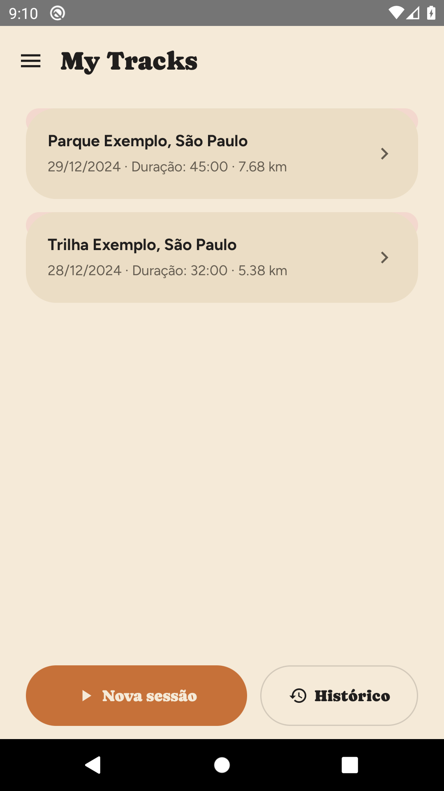
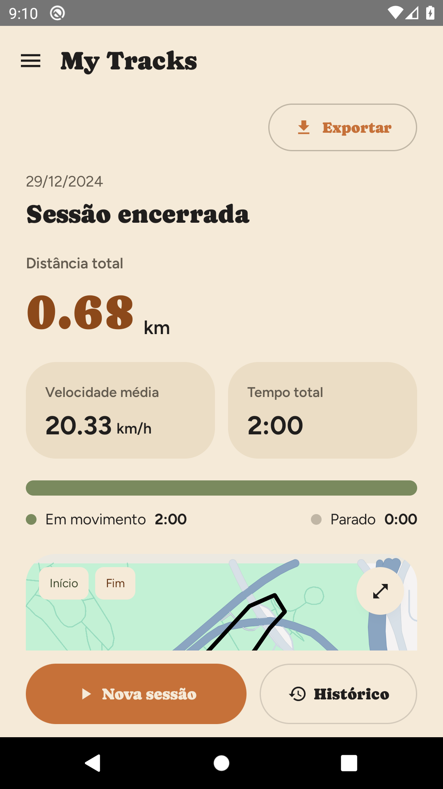
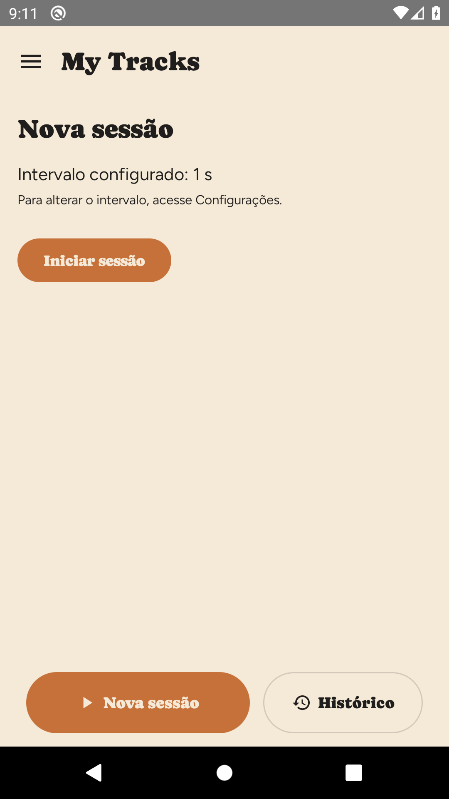
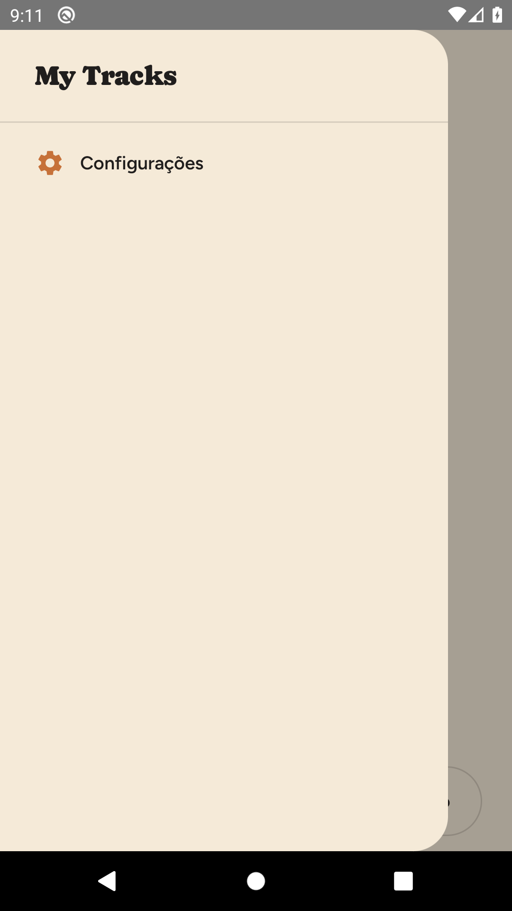
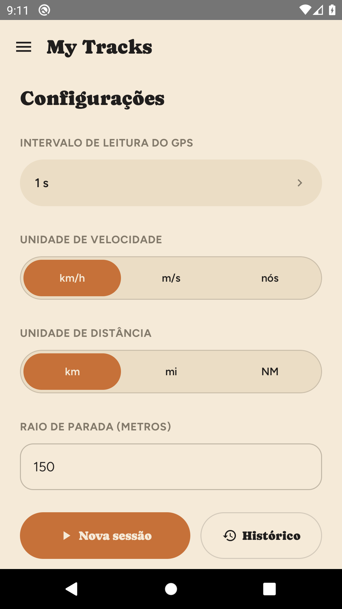

# My Tracks

[](https://github.com/denisgmarques/my-tracks-app/actions/workflows/android-ci.yml)

Protótipo Android nativo (Kotlin + Jetpack Compose) de rastreamento de GPS. A ideia original: registrar a posição em intervalos configuráveis (1s a 180s) e ver na prática como isso se comporta — precisão, consumo de bateria, comportamento em segundo plano — antes de decidir em cima de qual caso de uso vale a pena construir de verdade (regata/vela, corrida/pedal, ou um app para prestadores de serviço que precisam registrar deslocamento).

## Screenshots

| Histórico | Detalhe da sessão | Nova sessão |
|---|---|---|
|  |  |  |

| Menu | Configurações |
|---|---|
|  |  |

> As telas acima usam **dados sintéticos de exemplo** (São Paulo, nomes de local fictícios) gerados só para ilustrar a documentação — não são trilhas reais de nenhum usuário.

## Funcionalidades

- Seleção de intervalo de amostragem do GPS: 10 valores fixos, de 1 a 180 segundos.
- Coleta em foreground service, respeitando as restrições de background location do Android 10+ (API 29+).
- Cálculo de distância total, velocidade instantânea/média, e classificação automática de tempo parado vs. em movimento (raio e duração configuráveis).
- Mapa ao vivo (Google Maps SDK) com a rota percorrida, pontos de início/fim e marcadores nos locais onde o app detectou uma parada.
- Nome do local por sessão via geocodificação reversa (best-effort — funciona só quando há sinal de rede no início da sessão; a coleta de GPS em si nunca depende disso).
- Exportação da sessão em GPX ou CSV, no formato configurado como padrão.
- Histórico de sessões com swipe-to-delete, e opção de limpar todo o histórico.
- Configurações: unidade de velocidade (km/h, m/s, nós), unidade de distância (km, milhas, milhas náuticas), precisão do GPS (alta precisão vs. equilíbrio com bateria), manter a tela ativa durante a sessão.
- Recuperação automática de sessões "órfãs": se o sistema operacional matar o app no meio de uma sessão (comum em fabricantes com gerenciamento agressivo de bateria, como a MIUI), a sessão é fechada automaticamente com os dados já coletados na próxima vez que o app for aberto — nenhum ponto de GPS é perdido ou descartado.

## Stack

- **Kotlin** 2.0 + **Jetpack Compose** (Material3) — UI declarativa, sem XML.
- **Room** — persistência local (sessões + pontos GPS).
- **DataStore Preferences** — configurações do usuário.
- **Google Play Services** (`FusedLocationProviderClient`) — coleta de localização.
- **Google Maps SDK for Android** — renderização do mapa e da rota.
- **Navigation Compose** — navegação entre telas.
- minSdk 29 (Android 10) · compileSdk/targetSdk 34.
- Sem framework de injeção de dependência — composição manual a partir de `MainActivity.kt` (ver `AGENTS.md`/`docs/agents/architecture.md` para os detalhes).

## Como rodar o projeto

### Pré-requisitos

- [Android Studio](https://developer.android.com/studio) (ou apenas o Android SDK + linha de comando) com o SDK da API 34 instalado.
- JDK 17.
- Um dispositivo físico ou emulador com Android 10 (API 29) ou superior.
- Uma chave de API do **Google Maps SDK for Android** (gratuita, veja abaixo) — sem ela o app funciona normalmente (coleta, histórico, configurações), só o mapa não renderiza os tiles.

### 1. Clonar o repositório

```bash
git clone https://github.com/denisgmarques/my-tracks-app.git
cd my-tracks-app
```

### 2. Configurar a chave do Google Maps

Crie (ou edite) o arquivo `local.properties` na raiz do projeto — ele **nunca é commitado** (está no `.gitignore`) — e adicione:

```properties
sdk.dir=/caminho/para/o/Android/Sdk
MAPS_API_KEY=SUA_CHAVE_AQUI
```

Passo a passo completo de como gerar e restringir a chave: [`docs/setup/google-maps-api-key.md`](docs/setup/google-maps-api-key.md).

Sem essa chave, o build funciona normalmente com uma chave placeholder — o app roda e todas as outras telas funcionam, apenas o mapa fica sem os tiles visuais.

### 3. Build e execução

Pelo Android Studio: abra a pasta do projeto e rode normalmente (▶️) num emulador ou dispositivo.

Pela linha de comando:

```bash
./gradlew assembleDebug
adb install -r app/build/outputs/apk/debug/app-debug.apk
```

### 4. Rodar os testes

```bash
# Testes unitários (JVM, sem emulador)
./gradlew test

# Testes instrumentados (precisa de um emulador/dispositivo conectado)
./gradlew connectedAndroidTest
```

O projeto tem mais de 160 testes automatizados (unitários + instrumentados), cobrindo desde cálculos de distância/velocidade/classificação de parada até fluxos completos de UI (Compose) e um teste end-to-end que roda o ciclo completo de uma sessão sobre um banco de dados real.

## CI

Todo push/PR para `main` roda automaticamente (veja [`.github/workflows/android-ci.yml`](.github/workflows/android-ci.yml)):

1. **Testes unitários** (`./gradlew test`)
2. **Build do APK debug** (publicado como artefato do workflow)
3. **Testes instrumentados** num emulador Android 10 (API 29) hospedado pelo próprio GitHub Actions

## Estrutura do projeto

```
app/src/main/java/com/mytracksapp/
├── ui/            # Telas Compose + ViewModels (tracking, history, newsession, settings, export, navigation, theme)
├── domain/        # Lógica de negócio pura (session, stats, export, geocoding, model) — testável sem Android
├── data/          # Room (local/) e DataStore (settings/)
├── service/       # Foreground service de GPS e adaptadores Android-específicos
└── permission/    # Verificação de permissão de localização
```

Documentação mais detalhada (arquitetura, modelo de dados, regras de domínio, convenções de código) está em [`AGENTS.md`](AGENTS.md) e [`docs/agents/`](docs/agents/) — gerada automaticamente a partir do código implementado.

## Sobre o design

O design visual ("Organic" — terracota + sage, tipografia Caprasimo/Figtree) partiu de um handoff em [`design_handoff_my_tracks/`](design_handoff_my_tracks/) e foi implementado nativamente em Compose (ver `app/src/main/java/com/mytracksapp/ui/theme/`).

## Contexto do protótipo

Este é um projeto exploratório: o objetivo principal era validar na prática o comportamento de diferentes intervalos de amostragem de GPS (bateria, precisão, usabilidade) antes de comprometer a arquitetura com um caso de uso específico. Por isso decisões como "qual formato de exportação", "qual unidade padrão" ou "quais 10 valores de intervalo" existem como configurações abertas, em vez de hardcoded para um único público-alvo.
